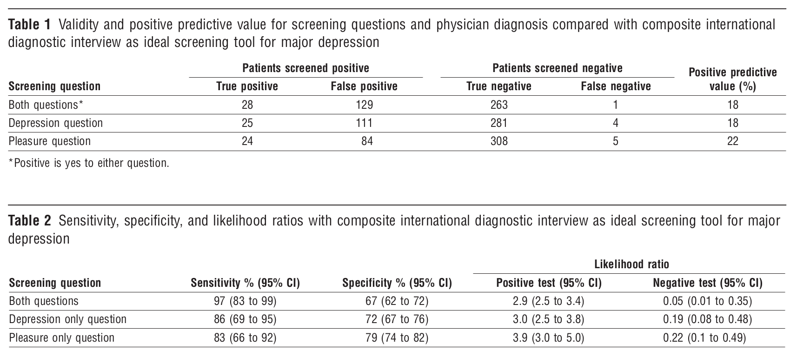
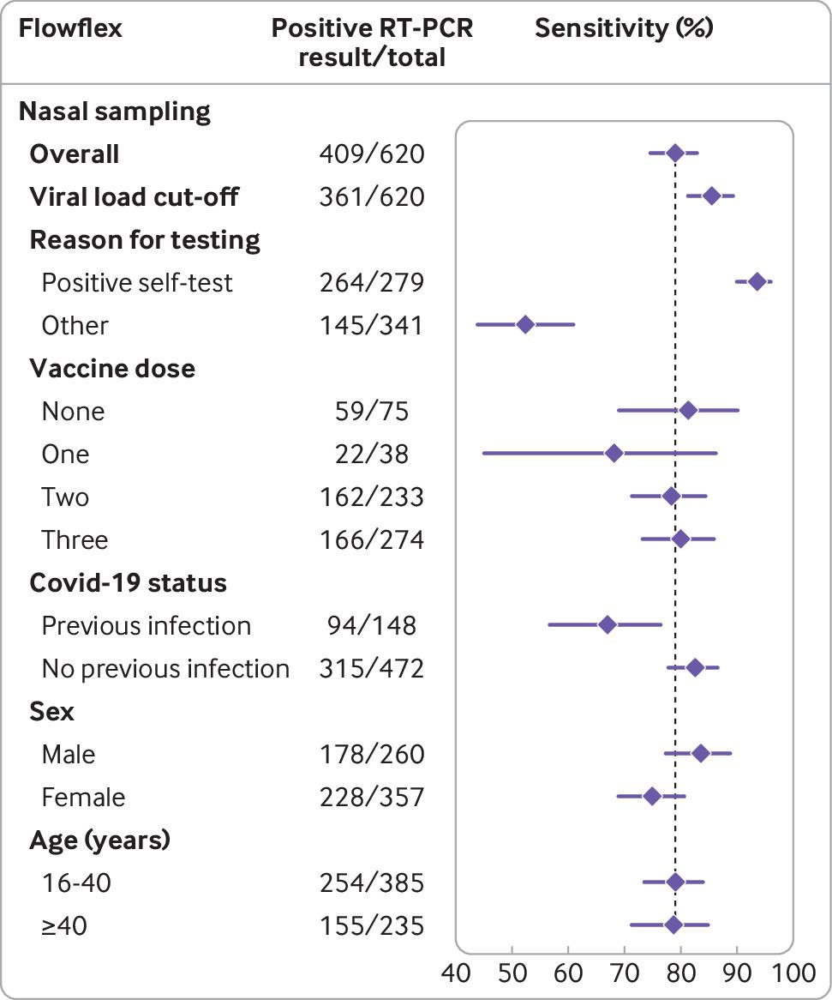

# Binary diagnostic tests 


## Diagnostic accuracy studies

   A binary *diagnostic test* classifies individuals
in diseased or non-diseased. Examples include:

-  Diagnosis of breast cancer using mammography
-  Diagnosis of cervical cancer using pap smear screening
-  Diagnosis of prostate cancer using prostate-specific antigen (PSA) screening

Continuous diagnostic tests (such as the actual PSA measurement) are often 
  dichotomized  to a binary test using a suitable threshold.


### Study designs
  
  The study design determines the selection of study subjects from a population:


  -  *Case-control design*: A diagnostic test is applied to
    a {sample} of diseased and
    non-diseased individuals with *fixed sample size* for both groups.
  -  *Cohort design*: A diagnostic test is applied to a sample of
    subjects from the population of interest; the true disease status
    (*gold standard*) is also ascertained
    (*verification*).

  We also consider the design of studies comparing two diagnostic tests:


  -  *Unpaired design*: Every study subject is
    tested with only one test.
  -  *Paired design*: Every study subject is
    tested with both tests.

### Test integrity
  Knowledge of the true disease status of the individual must not influence the assessment of the diagnostic test. For example, a radiologist might view a mammogram from a woman with known breast cancer with more suspicion for its showing cancer. This is a risk of *bias*. *Blinding* helps to alleviate this problem, meaning:
  

  -  The person who applies the diagnostic test must not know
    the true disease status.
  -  The person who determines the true disease status must not
 know the test result.
  


  
  
```{r prepdata-mammo, echo = FALSE, message = FALSE}
  library(biostatUZH)
  library(reporttools)
  ci.p <- function(y, n, level=0.95, digits = 1){
   p <- y/n
        
     se.p <- sqrt(p*(1-p)/n)
     c <- qnorm(1-((1-level)/2))
     l <- p - c*se.p
     u <- p + c*se.p
     ci <- displayCI(c(l, u)*100, digit = digits-2, text = "english")
     p.print <- round(p, digits = digits)*100#, digits = digits, nsmall = digits)
     list(p.print, ci)
    }

    ci.lr <- function(y.num, n.num, y.den, n.den, level=0.95, digits = 3){
     p.num <- y.num/n.num
     p.den <- y.den/n.den
     lr <- p.num/p.den

     se.log.lr <- sqrt((1-p.num)/(n.num*p.num) + (1-p.den)/(n.den*p.den))
     c <- qnorm(1-((1-level)/2))
     ef <- exp(c*se.log.lr)
     l <- lr/ef
     u <- lr*ef
     ci <- c(l, lr, u)
     names(ci) <- c("lower", "LR", "upper")
     ci.format <- displayCI(c(l,u), digit = digits-2, text = "english")
     lr.print <- round(lr, digits = digits)#, digits = digits, nsmall = digits)
     ef.print <- format(ef, digits = digits-1-as.numeric(lr<1), nsmall=digits-1-as.numeric(lr<1))#, digits = digits, nsmall = digits)
     res <- list(lr.print, ci.format, ef.print, ci)
     names(res) <- c("LR", "CI", "EF", "ci")
     return(res)
    }

    tp <- 629
    fp <- 3885
    tn <- 117744
    fn <- 97

    mat <- matrix(c(tn, fn, fp, tp), byrow = TRUE, ncol = 2)
    mat <- cbind(mat, apply(mat, 1, sum))
    mat <- rbind(mat, apply(mat, 2, sum))

    sens.ci <- ci.p(tp, tp+fn, digits = 3)
    sens <- tp/(tp+fn)
    spec.ci <- ci.p(tn, tn+fp, digits = 3)
    spec <- tn/(tn+fp)

    #prev <- c(0.5, 0.1, 0.01)#c(0.75, 0.25, 0.05) # im buch 1/22
    prev <- c(0.006, 0.01, 0.045, 0.1)#c(0.75, 0.25, 0.05) # im buch 1/22
    ppv <- format(sens*prev/(sens*prev + (1-spec)*(1-prev))*100, digits = 1)
    npv <- format(spec*(1-prev)/(spec*(1-prev) + (1-sens)*prev)*100, digits = 1)
    print.prev <- format(prev*100, digits = 2)

    chance.prev.pos <- prev/(1-prev)
    chance.prev.neg <- (1-prev)/prev
    LRpos <- sens/(1-spec)
    LRneg <- (1-sens)/spec
    DOR <- LRpos/LRneg

    ## LRpos.print <- round(LRpos, digits = digits)
    ## LRneg.print <- round(LRneg, digits = digits)
    chance.nachtest.pos <- LRpos*chance.prev.pos
    chance.nachtest.neg <- LRneg*chance.prev.pos

    LRpos <- ci.lr(tp, tp+fn, fp, tn+fp, digits = 3)
    LRneg <- ci.lr(fn, tp+fn, tn, tn+fp, digits = 4)

    digits <- 2
    digits2 <- 1
    ## LRpos.print <- round(LRpos[[1]], digits = digits)
    ## LRneg.print <- round(LRneg[[1]], digits = digits)

    const <- 100

    format.bigmark <- function(...)
      {
        format(..., big.mark = "'")
      }
```

::: {.example}
The *Million Women Study* (MW Study) is a cohort study of women’s health
analysing data from more than one million women aged 50 and over.
`r format.bigmark(sum(c(tp, fp, fn, tn)))` `r const` women between 50 and
64 years underwent a mammography and have been followed-up for a year to
determine whether or not they have been diagnosed with breast cancer,
confirmed via histology. The results are summarized in Table \@ref(tab:MWS-2x2).
:::


```{r MWS-2x2, echo = FALSE}
library(knitr)
# Example data for mat
rownames(mat) <- c("negative", "positive", "Total")
colnames(mat) <- c("no", "yes", "Total")

# Function to format numbers with big marks
format.bigmark <- function(x) format(x, big.mark = ",", scientific = FALSE)

# Create a data frame from the matrix for use with kable
table_data <- data.frame(
  Test_result = c("negative", "positive", "Total"),
  no = c(format.bigmark(mat[1,1]), format.bigmark(mat[2,1]), format.bigmark(mat[3,1])),
  yes = c(format.bigmark(mat[1,2]), format.bigmark(mat[2,2]), format.bigmark(mat[3,2])),
  Total = c(format.bigmark(mat[1,3]), format.bigmark(mat[2,3]), format.bigmark(mat[3,3]))
)

# Use kable to create the table
kable(table_data, caption = "2 × 2 table for the Million Women Study.", col.names = c("Test result", "no", "yes", "Total"))
```


## Measures of diagnostic accuracy

We use the following notation for binary diagnostic  tests:

\begin{eqnarray*}
    D & = & \left\{ \begin{array}{ll} 1 & \mbox{diseased} \\ 0 &
    		\mbox{non-diseased} \end{array} \right.
\end{eqnarray*}

\begin{eqnarray*}
  Y & = & \left\{ \begin{array}{ll} 1 & \mbox{test positive for disease} \\ 0 &
    	\mbox{test negative for disease} \end{array} \right.
\end{eqnarray*}

Table \@ref(tab:notation) introduces our notation for the counts from a
simple diagnostic accuracy study with sample size $n$.

    
```{r notation, echo = FALSE}
# Define the table data
table_data <- data.frame(
  Description = c("$Y=0$", "$Y=1$", "Total"),
  D0 = c("True negatives ($tn$)", "False positives ($fp$)", "$n_0$"),
  D1 = c("False negatives ($fn$)", "True positives ($tp$)", "$n_1$"),
  Total = c("$n^{-}$", "$n^{+}$", "$n$")
)

# Create the table using kable
kable(table_data, 
      col.names = c("", "$D=0$", "$D=1$", "Total"),
      caption = "Notation for binary diagnostic accuracy study.",
      escape = FALSE)  # escape = FALSE to render LaTeX syntax

```
    

### Sensitivity and specificity

:::{.definition}

The *sensitivity* of a binary test is defined as

\begin{equation}
 \text{Sens} = \Pr(Y=1 \given D=1).
\end{equation}

The *specificity* of a binary test is defined as

\begin{equation*}
  \text{Spec} = \Pr(Y=0 \given D=0).
\end{equation*}

:::


In the MW Study, the following estimates are obtained from Table \@ref(tab:MWS-2x2):

\begin{eqnarray}
\mbox{Sens} &=& \displaystyle\frac{{tp}}{{tp}+{fn}} = \displaystyle\frac{`r tp`}{`r format.bigmark(tp+fn)`} = `r sens.ci[[1]]`\%\\
\mbox{Spec} &=& \displaystyle\frac{{tn}}{{tn}+{fp}} = \displaystyle\frac{`r format.bigmark(tn)`}{`r format.bigmark(tn+fp)`} = `r spec.ci[[1]]`\%
\end{eqnarray}

  
  
                                                      
:::{.definition}
*Youden's index* is defined as

\begin{equation}
J = \mbox{Sens} + \mbox{Spec} - 1
(\#eq:Youden)
\end{equation}

:::

In the MW study, we obtain $J=`r round(sens.ci[[1]]/100, 3)` +
`r round(spec.ci[[1]]/100, 3)` - 1
= `r round(sens.ci[[1]]/100+spec.ci[[1]]/100-1, 2)`$. A categorization of
*test quality* based on Youden's index is shown in Table \@ref(tab:quality):

```{r quality, echo = FALSE}
# Define the table data
table_data <- data.frame(
  `Youden's Index` = c("$J=1$", "$0<J<1$", "$J=0$", "$J<0$"),
  `Test quality` = c("perfect", "useful", "useless", "harmful")
)

# Create the table using kable
kable(table_data, 
      col.names = c("Youden's Index", "Test quality"),
      caption = "Categorization of test quality based on Youden's index.",
      escape = FALSE)  # escape = FALSE to render LaTeX syntax

```


-  A perfect test ($J=1$) must have both Sens $=$ 1 and Spec  $=$ 1.
-  A useless test ($J=0$) has Sens  = 1 - Spec, so the probability of a positive test is the same for  diseased and  non-diseased individuals:
\begin{eqnarray*}
\mbox{Sens} & = & \Pr(Y=1 \given D=1) \\
& = & 1 - \mbox{Spec} \\
& = & 1 - \Pr(Y=0 \given D=0) \\
& = & \Pr(Y=1 \given D=0).
\end{eqnarray*}
-  A harmful test can be made useful by *relabelling*
test results $Y=1$ to $Y=0$ and vice versa.

### Predictive values
Test accuracy can also be described with *predictive values*.

:::{.definition}
The *positive predictive value* is defined as

\begin{equation*}
\mbox{PPV} = \Pr(D=1 \given Y=1).
\end{equation*}

The *negative predictive value* is defined as

\begin{equation*}
\mbox{NPV} = \Pr(D=0 \given Y=0).
\end{equation*}

:::

Predictive values can be directly estimated in a cohort design, such as the MW study shown in Table \@ref(tab:MWS-2x2):

\begin{eqnarray*}
  \mbox{PPV} &=& \displaystyle\frac{{tp}}{{tp}+{fp}} = 629/`r format.bigmark(4514)` = `r round(629/4514*100, 1)`\% \\
  \mbox{NPV} &=& \displaystyle\frac{{tn}}{{tn}+{fn}} = `r format.bigmark(117744)`/`r format.bigmark(117841)` = `r round(117744/117841*100, 1)`\%
\end{eqnarray*}

This assumes that the observed *disease prevalence*

\begin{eqnarray*}
{\mbox{Prev}} = n_1/n = 726/`r format.bigmark(122355)` &=& \, \, `r round(726/122355*100, 1)`\%
\end{eqnarray*}

in the study sample is representative for the underlying population.


Predictive values can also be calculated for other values of the prevalence.
In general, any disease prevalence can be specified. Then,

\begin{eqnarray*}
\mbox{PPV} & = & \frac{\mbox{Sens} \cdot \mbox{Prev}}{\mbox{Sens} \cdot \mbox{Prev} + (1-\mbox{Spec}) \cdot (1-\mbox{Prev})} \\
\mbox{NPV} & = & \frac{\mbox{Spec} \cdot (1-\mbox{Prev})}{\mbox{Spec} \cdot (1-\mbox{Prev}) + (1-\mbox{Sens}) \cdot \mbox{Prev}}
\end{eqnarray*}

as the transition from *pre-test probability* of disease (the prevalence) to *post-test probabilities* of disease ($\mbox{PPV}$ and $\mbox{NPV}$) after observing a positive respectively negative test result.

:::{.example}
Application in the Million Women Study. Cancer Research UK\footnote{(https://www.cancerresearchuk.org)} report a breast cancer prevalence of 4.5\% for 59-year old British women. The corresponding predictive values are shown in the third row of Table \@ref(tab:MWS-predvalues). The positive predictive value is only 56\% whereas the negative predictive value is 99\%.
:::


Table  \@ref(tab:MWS-predvalues) gives predictive values also for other values of the prevalence. PPV increases with increasing prevalence and NPV decreases with increasing prevalence.


```{r MWS-predvalues, echo = FALSE}

# Function to format percentages

format.percent <- function(x) paste0(x, "%")
# Create a data frame with the required data
table_data <- data.frame(
  Prevalence = format.percent(print.prev),
  PPV = format.percent(ppv),
  NPV = format.percent(npv)
)

# Highlight the third prevalence value in red
table_data$Prevalence[3] <- paste0("<span style='color:red;'>", table_data$Prevalence[3], "</span>")


# Create the table using kable
kable(table_data, 
      col.names = c("Prevalence", "PPV", "NPV"),
      caption = "Predictive values in the Million Women Study for different prevalences.",
      escape = FALSE)  # escape = FALSE to render LaTeX syntax
```


```{summary, label = PPV_sum}
     -  Predictive values depends on sensitivity, specificity and prevalence.
    -  PPV can be low even if sensitivity and specificity are high.
     -  Direct calculation of PPV and NPV from the $2 \times 2$ table
assumes that the disease prevalence is representative.

```

### Likelihood ratios
Likelihood ratios are an alternative way for summarizing the accuracy of diagnostic tests.

:::{.definition}
The *positive likelihood ratio* is defined as

\begin{equation*}
\mbox{LR}^+ = \frac{\mbox{Sens}}{1-\mbox{Spec}}.

\end{equation*}

The *negative likelihood ratio* is defined as

\begin{equation*}
\mbox{LR}^- = \frac{1-\mbox{Sens}}{\mbox{Spec}}.
\end{equation*}
:::


Likelihood ratios summarise how many times more (or less) likely
patients with the disease are to have a particular test result ($\mbox{LR}^+$ for a positive result, $\mbox{LR}^-$ for a negative result) than
patients without the disease.  They do not depend on disease
prevalence.  Likelihood ratios are ratios of probabilities.

Useful tests have $\mbox{LR}^+ > 1$ and
$\mbox{LR}^- < 1$.
Likelihood ratios above 10 and below 0.1 are considered to
provide strong evidence to rule in or rule out
diagnoses respectively [@SN_LR].


In the MW study we obtain:
\begin{align*}
\mbox{{LR}}^+ =
\frac{`r as.numeric(sens.ci[[1]])`\%}{`r 100-as.numeric(spec.ci[[1]])`\%}
= {`r round(LRpos[[1]], digits = 1)`} \ &\mbox{ and }
\mbox{{LR}}^- =
\frac{`r (100-as.numeric(sens.ci[[1]]))`\%}{`r as.numeric(spec.ci[[1]])`\%}
= {`r round(LRneg[[1]], digits = 2)`} \approx
{1/`r round(1/LRneg[[1]], digits = 0)`}.  \end{align*}


LRs quantify the *change in disease odds* after having observed a
positive or negative test result:

\begin{eqnarray}
\frac{\mbox{PPV}}{1-\mbox{PPV}} & = & \mbox{LR}^+  \, \cdot \, \frac{\mbox{Prev}}{1-\mbox{Prev}} \\[.3cm]
\frac{1-\mbox{NPV}}{\mbox{NPV}} & = & \mbox{LR}^- \,  \cdot \, \frac{\mbox{Prev}}{1-\mbox{Prev}} \\[.3cm]
\mbox{ Posterior odds}  & = & \mbox{ Likelihood ratio} \, \cdot \, \mbox{Prior odds} \nonumber
\end{eqnarray}

The odds on the left-hand side can be easily back-transformed to probabilities as
\[
 \mbox{Odds } \omega = \frac{\pi}{1-\pi} \qquad \mbox{ Probability } \pi=\frac{\omega}{1+\omega}
\]


```{r, echo = FALSE }
tp <- 629
fp <- 3885
tn <- 117744
fn <- 97

sens <- tp / (tp + fn)
spec <- tn / (tn + fp)
prev <- 0.045 #1 / 22

ppv <- sens * prev / (sens * prev + ((1 - spec) * (1 - prev)))
npv <- spec * (1 - prev)/(spec * (1 - prev)+((1 - sens) * prev))

LRp <- sens / (1 - spec)
LRn <- (1 - sens) / spec

postOddsp <- LRp * prev / (1 - prev)
postOddsn <- LRn * prev / (1 - prev)
```


Figure \@ref(fig:updating) is an example of Bayesian updating with likelihood ratios. The prior odds of 1 to 21 correspond to a prevalence of 4.5\%.
A positive test results in posterior odds
\[
  \frac{1}{21} \cdot  \frac{27}{1} =   \frac{27}{21} .
\]
This corresponds to a predictive value of
\[
  \frac{27/21}{1+27/21} = \frac{27}{21+27} = \frac{27}{48} = `r round(27/48*100)`\%.
\]


```{r updating, fig.cap = "Bayesian updating with likelihood ratios", echo = FALSE}
formatLR <- function(x, y)
    return(paste(x, " to ", y, sep=""))
LRp <- 27
LRn <- 1/7
postOddsp <- 27/21
postOddsn <- 1/147
par(mar = c(1, 1, 1, 1) * 0)
plot(0, 0, xlim = c(-2, 10), ylim = c(0, 10), type = "n", xlab = "", ylab = "", axes = FALSE)
text(1.5, 9, "Prevalence")
text(7, 9, "Prior Odds")
text(7, 8.5, as.character(formatLR(1, 21)))
##text(7, 8.5, round(prev/(1-prev), 3))
text(1.5, 5, "Test Result")
text(1.5, 4.5, "(Likelihood Ratio)")
text(6, 5, "positive")
tmp <- round(LRp, 1)
tmp <- as.character(formatLR(27, 1))
#text(6, 4.5, substitute("LR"^"+"*"" == tmp, list(tmp = tmp)))
text(6, 4.5, substitute(tmp, list(tmp = tmp)))
##text(6, 4.5, substitute("LR"^"+"*"" == tmp, list(tmp = tmp)))
text(8, 5, "negative")
tmp <- round(LRn, 3)
tmp <- as.character(formatLR(1, 7))
text(8, 4.5, substitute(tmp, list(tmp = tmp)))
##text(8, 4.5, substitute("LR"^"-"*"" == tmp, list(tmp = tmp)))
text(1.5, 1, "Predictive Value")
text(7, 1, "Posterior Odds")
text(5, 0.5, as.character(formatLR(27, 21)))
text(9, 0.5, as.character(formatLR(1, 147)))
## text(5, 0.5, round(postOddsp, 2))
## text(9, 0.5, round(postOddsn, 3))
lines(rep(4, 2), c(0, 10), lty = 2, col = 1)
plot.lines <- function(slope){
     y <- c(8, 5.5, 4, 1)
     intercept <- 7
     neg <- intercept + slope * (8 - y)
     pos <- intercept - slope * (8 - y)
     lines(c(neg[1], neg[2]), c(y[1], y[2]), col = 1, lty = 1)
     lines(c(pos[1], pos[2]), c(y[1], y[2]), col = 1, lty = 1)
     arrows(neg[3], y[3], neg[4], y[4], col = 1, lty = 1)
     arrows(pos[3], y[3], pos[4], y[4], col = 1, lty = 1)
}
plot.lines(0.275)
```

### Diagnostic odds ratio

:::{.definition}
The *diagnostic odds ratio*

\begin{equation*}
\mbox{DOR}
=  \frac{\Pr(D=1 \given Y=1)/\Pr(D=0 \given Y=1)}{\Pr(D=1 \given Y=0)/\Pr(D=0 \given Y=0)}
\end{equation*}

is a single indicator of test performance.
:::


It can be calculated as
\[
\mbox{DOR}  =  \frac{\mbox{LR}^+}{\mbox{LR}^-} = \frac{tp \cdot tn}{fp \cdot fn}
\]
In the MW study we obtain
\[
 \mbox{DOR}  =  \frac{`r round(LRpos[[1]], digits = 1)`}
      {`r round(LRneg[[1]], digits = 2)`} \, = \,
      `r round(DOR, digits = 1)`.
\]

Figure \@ref(fig:DOR-dep) illustrates that the same DOR can be achieved by
very different combinations of sensitivity and specificity.

```{r DOR-dep, fig.cap = "Dependence of diagnostic odds ratios on sensitivity and specificity.", echo = FALSE }
sens <- spec <- seq(0.5, 0.99, 0.01) ## c(.5,.6,.7,.8,.9, .95)
DOR <- matrix(NA, nrow=length(sens), ncol=length(spec))
for(i in 1:length(sens))
    for(j in 1:length(spec))
        DOR[i,j] <- (sens[i]/(1-spec[j])/(1-sens[i])*spec[j])
## rownames(DOR) <- as.character(sens)
## colnames(DOR) <- as.character(spec)
## library(xtable)
## eps <- 0.0001
## print(xtable(DOR+eps, digits=1, align="r|rrrrrr"), add.to.row=list(pos=list(-1),   command=c(
##    " \\multicolumn{1}{c}{Sensitivity} & \\multicolumn{6}{c}{Specificity}  \\\\ \\hline"
##     )))
par(las=0)
filled.contour(sens, spec, log10(DOR), xlab="sensitivity", ylab="specificity",
               key.axes=axis(4, at=seq(0, 4, by = 1), labels=c("1", "10", "100", "1000", "10000")))
##               levels=log(c(1,3,10,30,100,300,1000, 3000, 10000)))

##               key.axes=5)
title("Contour plot of DOR")
```


```{summary}


     -  \alert{Likelihood Ratios} depend on both sensitivity and specificity:
\begin{eqnarray*}
\alert{\mbox{positive LR: }} & \mbox{LR}^+ = & \frac{\mbox{Sensitivity}}{1-\mbox{Specificity}}   \\[.3cm]
\alert{\mbox{negative LR: }} & \mbox{LR}^- = & \frac{1-\mbox{Sensitivity}}{\mbox{Specificity}}
\end{eqnarray*}

      -  They quantify the change in disease odds after having observed a positive or negative test result.
        \small -  Useful tests have $\mbox{LR}^+>1$
          and $\mbox{LR}^-<1$ and therefore
          $\mbox{DOR} = \mbox{LR}^+ / \mbox{LR}^- > 1$.

```


## Confidence intervals for measures of diagnostic accuracy


```{r, echo  = FALSE}
 x <- tp
 n <- tp + fn
 pihat <- x/n
 se <- sqrt(pihat*(1-pihat)/n)
 wald <- pihat + 1.96*c(-1,1)*se
 library(biostatUZH)
 w1 <- wilson(x,n)
```


 Up to now we have estimated population parameters with the corresponding sample quantites. For example, *proportions* $p$ are estimates of
 *probabilities* $\pi$.
 Such estimates should be reported together with a *confidence interval* (CI), to reflect the sample size of the study.
 *Confidence intervals* give a plausible range for the underlying
   population values and convey the effects of {sampling variation}.
 *Non-sampling errors*, such as *biases* in study design,
     conduct, or analysis, are not controlled for.

 There are different methods to compute a CI for

 -  proportions (e.g. sensitivity, specificity)
 -  ratios of proportions (e.g. likelihood ratios)

Details how to construct confidence intervals  can be found in Appendix \@ref(app:CI).
 
### Proportions

:::{.example}
 Screening for depression in primary care with two verbally asked questions: cross sectional study [@arroll], see Figure \@ref(fig:arroll).
:::
           
```{r arroll, fig.cap = "Reporting of diagnostic accuracy measures with confidence intervals in Arrol", echo = FALSE}

```


:::{.example #covid}
 Accuracy of Covid-19 Home-Testing Kits [@Schuit2022], see Figure \@ref(fig:schuit).
:::

```{r schuit, fig.cap = "Sensitivities with 95% confidence intervals for the Flexflow rapid antigen test."}

```


#### Wald confidence interval

The *standard error* of a {proportion} $p=x/n$ is
    \[
    \SE(p) = \sqrt{\frac{p \, (1-p)}{n}}.
    \]
This defines the 95\% *error term* $\mbox{ET}_{95}= 1.96 \cdot \SE(p)$.
The *(additive) Wald confidence interval*
at level 95\%    has limits
    \[
    p - \mbox{ET}_{95} \mbox{ and } p + \mbox{ET}_{95}.
    \]
This confidence interval
follows the ``add/subtract'' construction, because the error term is
added to respectively subtracted from the estimate $p$.
The factor 1.96 has to be replaced by
    the appropriate standard normal quantile for other confidence levels:

```{r echo=TRUE}
gamma <- c(0.9, 0.95, 0.99)
print(qnorm((1+gamma)/2))
```


#### Wilson confidence interval
It is usually better to use the *Wilson* confidence interval, in particular if $n$ is small or $p$ is close to 0 or 1.
  
Advantages are:

-  Wilson has better *empirical coverage* than Wald, see Figure \@ref(fig:coverage).
-  No *overshoot*: The limits of Wilson CIs are never outside the unit interval, no need to truncate.


In the MW study we obtain for sensitivity:
```{r wald, echo=T}
library(biostatUZH)
(wald(x=629, n=726))
(wilson(x=629, n=726))
```

The \code{R} function \code{prop.test()} without continuity correction also produces a Wilson CI:
```{r echo=TRUE}
prop.test(x=629, n=726, correct=FALSE)$conf.int
```


```{r coverage, echo = FALSE, fig.cap = "Empirical coverage of Wald and Wilson confidence intervals with confidence level $95%$ and sample size $n=50$.", echo = FALSE, message = FALSE }
 source("code/settings.R")

 par(mfrow=c(1,2), las=1, pty="s")
 # Szenario festlegen:
 n1 = 50
 x1 = 0:n1
 x1.wald <- x1
 x1.wald[1] <- 0.5
 x1.wald[n1+1] <- 49.5

 prob = 0.95 # confidence level?
 q = qnorm(1-(1-prob)/2)
 ygrenzen = c(0.8, 1) # y-Skala?
 q.onesided = qnorm(prob)
 q.wald =  c(q.onesided, rep(q, 49), q.onesided)


 ## Wald-Intervalle berechnen
 se = sqrt(x1.wald/n1*(1-x1.wald/n1)/n1)
 wald.lower = x1/n1 - q.wald*se
 wald.upper = x1/n1 + q.wald*se
 wald.lower <- ifelse (wald.lower <= 0, 0, wald.lower)
 wald.upper <- ifelse (wald.upper >= 1, 1, wald.upper)
 ## wald.lower[c(n1 + 1, n1 + 1)] = 1 - q^2/(q^2+n1)
 ## wald.upper[c(1, n1 + 1)] = q^2/(q^2+n1)

 plot.coverage(cbind(wald.lower, wald.upper), ylim = ygrenzen, smooth = 0.05, main="Wald")

 ## Wilson-Intervalle for pi berechnen
 pseudo.est = ( x1 + q^2 / 2 ) / ( n1 + q^2 )
 pseudo.se = sqrt( x1/n1*(1 - x1/n1) / n1 + q^2 / n1 /(4*n1) ) / (1 + q^2 / n1)
 wilson.lower = pseudo.est - q*pseudo.se
 wilson.upper = pseudo.est + q*pseudo.se
 ## plotten
 plot.coverage(cbind(wilson.lower, wilson.upper), ylim = ygrenzen, smooth = 0.05, main="Wilson")

 legend("bottomright", col=c("darkgrey", "black"), lty=1, lwd=2, legend=c("exact","smoothed"), cex=0.7)
```


#### Other confidence intervals
 Here is an artificial example for $x=1$ successes out of $n=10$ trials.
```{r echo=TRUE}
 (res <- confIntProportion(x=1, n=10))
```
 Note: Lower limit % $`r round(-res$CIs[1,3]+2*res$p,4)`$
 of Wald interval is truncated to 0.


### Likelihood ratios{#sec:CIforLR}
                                  
  Likelihood ratios are by definition positive quantities. To avoid
  overshoot, confidence intervals are therefore constructed on the
  log-scale. The 95\%-Wald confidence interval for the log positive
  likelihood ratio $\SE(\log {\mbox{LR}}^+)$, for example, takes the
  form
  \[
  \SE(\log {\mbox{LR}}^+) - 1.96 \cdot \SE(\SE(\log {\mbox{LR}}^+)) \mbox{ and } \SE(\log {\mbox{LR}}^+) + 1.96 \cdot \SE(\SE(\log {\mbox{LR}}^+)).
  \]
  Note that log always refers to the natural logarithm in this lecture.
  Back-transformation to the original scale gives a 95\% (multiplicative)
  Wald confidence
  interval for the positive likelihood ratio ${\mbox{LR}}^+$ with limits:
  \[
    {\mbox{LR}}^+/\EF_{.95} \mbox{ and } {\mbox{LR}}^+ \cdot \EF_{.95}
  \]
  where
  $$\EF_{.95} =\exp\left\{1.96 \cdot \SE(\log {\mbox{LR}}^+)\right\}$$
  is called the 95\% *error factor* (EF). This confidence interval
  follows the "multiply/divide" construction, because the estimate is
  multiplied respectively divided by the error factor. There are many
  other confidence intervals in biostatistics that are of the
  "multiply/divide" type, for example confidence intervals for risk ratios, odds ratios and
  hazard ratios. The original Wald interval follows a ``plus/minus''
  construction, because a certain factor is added respectively
  subtracted from the estimate to obtain the confidence interval limits.


  The exact procedure how to calculate a 95\% confidence interval for a
  likelihood ratio is as follows, compare Table \@ref(tab:notation) for notation:

  1.  Calculate standard error on log scale:
  \begin{eqnarray*}
  \SE(\log {\mbox{LR}}^+) & = & \sqrt{\frac{1}{{fp}}-\frac{1}{n_0} +\frac{1}{{tp}}-\frac{1}{n_1}} \\
  \SE(\log {\mbox{LR}}^-) & = & \sqrt{\frac{1}{{tn}}-\frac{1}{n_0} +\frac{1}{{fn}}-\frac{1}{n_1}} \\
  \end{eqnarray*}
  2.  Compute 95\% *error factor* (EF), {\it e.g.}
  3.  The 95\% confidence interval for ${\mbox{LR}}^+$ then has limits
  $${\mbox{LR}}^+/\EF_{.95} \mbox{ and } {\mbox{LR}}^+ \cdot \EF_{.95}$$


```{summary}

      -  \alert{Additive Wald CI} has limits
          \begin{eqnarray*}
            & \mbox{Estimate} - \mbox{Error Term} & \mbox{ and } \\
            & \mbox{Estimate} + \mbox{Error Term} &
          \end{eqnarray*}\vspace{-.5cm}
        -  \alert{Multiplicative Wald CI} has limits
         \begin{eqnarray*}
            & \mbox{Estimate} \, \, / \, \, \mbox{Error Factor} & \mbox{ and } \\
            & \mbox{Estimate} \, \cdot \, \mbox{Error Facor} &
         \end{eqnarray*}\vspace{-.5cm}
       -  Error Term (ET) and Error Factor (EF) depend on
          confidence level and standard error of (log) estimate.

```


### Diagnostic odds ratio

  The confidence interval for the diagnostic odds ratio is also of
  "multiply/divide" type, again compare Table \@ref(tab:notation) for
  notation.

  -  Calculate standard error on log scale:

  \begin{eqnarray*}
  \SE(\log {\mbox{DOR}}) & = & \sqrt{\frac{1}{{tp}}+\frac{1}{fp}+\frac{1}{{tn}}+\frac{1}{fn}} \\
  \end{eqnarray*}
  -  Compute 95\% *error factor* (EF):
  $$\EF_{.95} =\exp\left\{1.96 \cdot \SE(\log {\mbox{DOR}})\right\}$$
  -  The 95\% confidence interval for ${\mbox{DOR}}$ then has limits
  $${\mbox{DOR}}/\EF_{.95} \mbox{ and } {\mbox{DOR}} \cdot \EF_{.95}$$


  R-code:

```{r echo=T}
  library(biostatUZH)
  res <- confIntDiagnostic(tp=629, fp=3885, tn=117744, fn=97, cohort=TRUE)
print(format(res, scientific=FALSE))
```

  Alternative Computation with library(epiR):
```{r, echo = FALSE, message = FALSE}
  dat <- as.table(matrix(c(629,3885,97,117744), nrow = 2, byrow = TRUE))
  colnames(dat) <- c("Dis+","Dis-")
  rownames(dat) <- c("Test+","Test-")
```

```{r echo=TRUE, message = FALSE}
  library(epiR)
  epi.tests(dat)
```
The apparent prevalence is $\Pr(Y=1)$, the true prevalence is $\Pr(D=1)$

### Predictive values
 
If the study follows a cohort design, then confidence intervals can be computed for PPV, NPV and disease prevalence directly from the data.  This is what the function `epi.tests()` always computes. The function `confIntDiagnostic()` also computes CIs for PPV and NPV for a pre-specified prevalence {\tt pr}. This approach is based on

  -  The limits of a confidence interval for $\mbox{{LR}}^+$
     (resp. $\mbox{{LR}}^-$) are computed as described in Section
      \@ref(sec:CIforLR).
  -  Multiplication with ${\mbox{Prev}}/({1-\mbox{Prev}})$ gives the limits of
      a confidence interval for ${\mbox{PPV}/(1-\mbox{PPV})}$ resp. ${(1-\mbox{NPV})/\mbox{NPV}}$ according to  equation \eqref{eq:PPVBayes} resp. \eqref{eq:NPVBayes}.
    -  Confidence intervals for $\mbox{PPV}$ resp. $\mbox{NPV}$ can be obtained by the usual transformation of the limits obtained in 2. to the  probability scale.


:::{.example}
Million Women Study continued: predictive values for prevalence $4.5\%$.
:::

```{r}
confIntDiagnostic(tp=629, fp=3885, tn=117744, fn=97, pr=.045)
```


## Comparing two diagnostic tests

The accuracy of two tests $A$ and $B$ can be compared with ratios of probabilities or ratios of likelihood ratios. These ratios are equal to 1 (the *reference value*), if there is no difference.

:::{.definition}
  The *relative sensitivity* of test $A$ vs. test $B$ is
  $$\mbox{rSens} = \mbox{Sens}_A / \mbox{Sens}_B$$
  and the *relative specificity* is
  $$\mbox{rSpec} = \mbox{Spec}_A / \mbox{Spec}_B.$$
  The *relative positive likelihood ratio* of test $A$ vs. test $B$ is
  $$\mbox{rLR}^+ = \mbox{LR}^+_A / \mbox{LR}^+_B$$
  and the *relative negative likelihood ratio* is
  $$\mbox{rLR}^- = \mbox{LR}^-_A / \mbox{LR}^-_B.$$
:::

Standard errors and confidence intervals are also available, but the study design (unpaired or paired) has to be taken into account.
 

:::{.example CVS}
  Data from a (hypothetical) randomized unpaired study of chorionic villus sampling (CVS) versus early amniocentesis (EA) for fetal abnormality.
:::

  
```{r, twotests, echo = FALSE}
knitr::kable(
  cbind(
    c(" ", "Y=0", "Y=1", "Total"),
    c("D=1", 6, 116, 122),
    c("D=0", 4844, 34, 4878),
    c(" ", 4765, 111, 4876)
  ),
  align = c("l", "r", "r", "r"),
  caption = "Contingency table for two diagnostic tests in an unpaired study design."
)
```
  

  From the data shown in Table \@ref(tab:twotests) we can read off

 - $\mbox{Sens}=116/122=`r round(116/(116+6)*100,1)`$\%
  and $\mbox{Spec}=4844/4878=`r round(4844/(4844+34)*100,1)`$\% for EA and
 -
  $\mbox{Sens}=111/124=`r round(111/(111+13)*100,1)`$\%
  and $\mbox{Spec}=4765/4876=`r round(4765/(4765+111)*100,1)`$\% for CVS

Hence
  \begin{eqnarray*}
  \mbox{rSens} & = & `r round(116/(116+6)*100,1)`\%/`r round(111/(111+13)*100,1)`\%
  = `r round(116/(116+6)/(111/(111+13)),2)`\\
  \mbox{rSpec}  & = & `r round(4844/(4844+34)*100,1)`\%/`r round(4765/(4765+111)*100,1)`\%
  = `r round(4844/(4844+34)/(4765/(4765+111)),2)`
  \end{eqnarray*}
  <!-- %% We can easily obtain a joint 95\%-confidence region for (rTPF, -->
  <!-- %% rFPF):  (0.98, 1.15) $\times$ (0.20, 0.47) based on the -->
  <!-- %% univariate 97.5\%-confidence intervals. -->

```{r echo=F}
  sens.ea <- 116/(116+6)
  spec.ea <- 4844/(4844+34)
  lr.p.ea <- sens.ea/(1-spec.ea)
  lr.m.ea <- (1-sens.ea)/spec.ea


  sens.cvs <- 111/(111+13)
  spec.cvs <- 4765/(4765+111)
  lr.p.cvs <- sens.cvs/(1-spec.cvs)
  lr.m.cvs <- (1-sens.cvs)/spec.cvs

  rlr.p <- lr.p.ea/lr.p.cvs
  rlr.m <- lr.m.ea/lr.m.cvs
```


```{r echo=T}
fetAb.tp <- c(116, 111)
fetAb.fp <- c(34, 111)
fetAb.tn <- c(4844, 4765)
fetAb.fn <- c(6, 13)

print(confIntIndependentDiagnostic(tp=fetAb.tp, fp=fetAb.fp,
                                   tn=fetAb.tn, fn=fetAb.fn))
```

There is some evidence for differences between the two diagnostic
tests in Specificity and LR$^+$, since the corresponding confidence intervals do not include the reference value 1.


:::{.example CASS}
Comparing paired samples: the CASS Study.

-  Paired data: Each subject performs both tests.
-  Example: Exercise stress test (EST) and determination of chest pain history (CPH) for patients with suspected coronary heart disease.
:::

-  Paired data is best described with separate tables for diseased (\texttt{Dis}) and non-diseased (\texttt{nonDis}) patients.


```{r echo=FALSE}
Dis <- as.table(matrix(c(25, 183, 29, 786), ncol=2, byrow=T))
nonDis <- as.table(matrix(c(151, 176, 46, 69), ncol=2, byrow=T))
colnames(Dis) <- colnames(nonDis) <- c("CPH-", "CPH+")
rownames(Dis) <- rownames(nonDis) <- c("EST-", "EST+")
```

```{r echo=TRUE}
print(Dis)
print(nonDis)
```


```{r echo=T}
# Estimates for CPH vs. EST
print(confIntPairedDiagnostic(diseased=Dis, nonDiseased=nonDis))
```

The reference value 1 is not included in all four confidence intervals, so
there is evidence for differences between the two diagnostic tests in all accuracy measures.


## References

@bland discusses sensitivity
and specificity in Chapter 20.6 and standard errors and confidence
intervals for a proportion in Chapter 8.4. Likelihood ratios are
discussed in @SN_LR.  A comprehensive account of statistical
aspects of binary diagnostic tests can be found in @pepe (Chapter 2).
@altman discuss the relevant confidence intervals
in Chapter 6 and 10.

@arroll is an example of a study where the methods from this chapter are used 
in practice. The "Statistics Notes" by Douglas G. Altman and Martin Bland, 
and sometimes also other co-authors, discuss these methods in a concise and 
practical way. For this chapter, these are @SN_Sens, @SN_PPV, and @SN_LR.

                           
