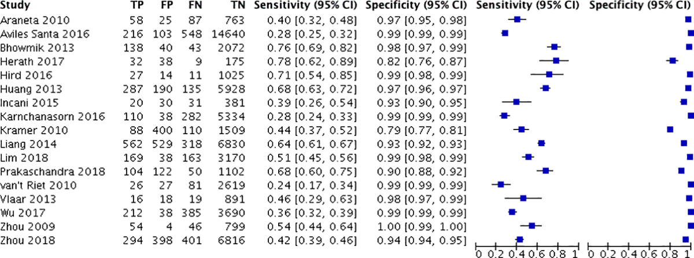

# Binary diagnostic tests {#binDiag}


## Diagnostic accuracy studies

A binary *diagnostic test* categorizes individuals
as either diseased or non-diseased. Examples of diagnostic 
tests include mammography for the diagnosis of breast cancer, 
pap smear screening for the diagnosis of cervical cancer, and 
prostate-specific antigen (PSA) screening for the diagnosis of prostate cancer. 
*Continuous diagnostic tests* (such as the actual PSA measurements) are often 
dichotomized to binary tests using a suitable threshold, see 
Chapter \@ref(contDiag).

### Study designs

The study design determines the selection of study subjects from a population.
In a *case-control design*, a diagnostic test is applied to a sample of diseased
and non-diseased individuals, with a fixed sample size for both groups. 
In a *cohort design*, a diagnostic test is applied to a sample of subjects 
from the population of interest, and the true disease status
is also ascertained using a reference test, the *gold standard*. 

The design of studies comparing two diagnostic tests is also considered. In an
*unpaired design*, each study subject is tested with only one of the two tests. 
In contrat, each study subject is tested with both tests in a *paired design*.

### Test integrity

Knowledge of the true disease status of the individual must not 
influence the assessment of the diagnostic test. For example, if a radiologist 
is aware that a woman has breast cancer, 
they may scrutinize her mammogram more closely for signs of cancer, 
introducing a potential *bias*. In order to address this issue, *blinding*
should be used. This means that the person who applies the diagnostic test 
must not know the true disease status, and the person who determines 
the true disease status (using a reference/gold standard test)
must not know the test result. 

  
```{r prepdata-mammo, echo = FALSE, message = FALSE}
  library(biostatUZH)
  library(reporttools)
  ci.p <- function(y, n, level=0.95, digits = 1){
   p <- y/n
        
     se.p <- sqrt(p*(1-p)/n)
     c <- qnorm(1-((1-level)/2))
     l <- p - c*se.p
     u <- p + c*se.p
     ci <- displayCI(c(l, u)*100, digit = digits-2, text = "english")
     p.print <- round(p, digits = digits)*100#, digits = digits, nsmall = digits)
     list(p.print, ci)
    }

    ci.lr <- function(y.num, n.num, y.den, n.den, level=0.95, digits = 3){
     p.num <- y.num/n.num
     p.den <- y.den/n.den
     lr <- p.num/p.den

     se.log.lr <- sqrt((1-p.num)/(n.num*p.num) + (1-p.den)/(n.den*p.den))
     c <- qnorm(1-((1-level)/2))
     ef <- exp(c*se.log.lr)
     l <- lr/ef
     u <- lr*ef
     ci <- c(l, lr, u)
     names(ci) <- c("lower", "LR", "upper")
     ci.format <- displayCI(c(l,u), digit = digits-2, text = "english")
     lr.print <- round(lr, digits = digits)#, digits = digits, nsmall = digits)
     ef.print <- format(ef, digits = digits-1-as.numeric(lr<1), nsmall=digits-1-as.numeric(lr<1))#, digits = digits, nsmall = digits)
     res <- list(lr.print, ci.format, ef.print, ci)
     names(res) <- c("LR", "CI", "EF", "ci")
     return(res)
    }

    tp <- 629
    fp <- 3885
    tn <- 117744
    fn <- 97

    mat <- matrix(c(tn, fn, fp, tp), byrow = TRUE, ncol = 2)
    mat <- cbind(mat, apply(mat, 1, sum))
    mat <- rbind(mat, apply(mat, 2, sum))

    sens.ci <- ci.p(tp, tp+fn, digits = 3)
    sens <- tp/(tp+fn)
    spec.ci <- ci.p(tn, tn+fp, digits = 3)
    spec <- tn/(tn+fp)

    #prev <- c(0.5, 0.1, 0.01)#c(0.75, 0.25, 0.05) # im buch 1/22
    prev <- c(0.006, 0.01, 0.045, 0.1)#c(0.75, 0.25, 0.05) # im buch 1/22
    ppv <- format(sens*prev/(sens*prev + (1-spec)*(1-prev))*100, digits = 1)
    npv <- format(spec*(1-prev)/(spec*(1-prev) + (1-sens)*prev)*100, digits = 1)
    print.prev <- format(prev*100, digits = 2)

    chance.prev.pos <- prev/(1-prev)
    chance.prev.neg <- (1-prev)/prev
    LRpos <- sens/(1-spec)
    LRneg <- (1-sens)/spec
    DOR <- LRpos/LRneg

    ## LRpos.print <- round(LRpos, digits = digits)
    ## LRneg.print <- round(LRneg, digits = digits)
    chance.nachtest.pos <- LRpos*chance.prev.pos
    chance.nachtest.neg <- LRneg*chance.prev.pos

    LRpos <- ci.lr(tp, tp+fn, fp, tn+fp, digits = 3)
    LRneg <- ci.lr(fn, tp+fn, tn, tn+fp, digits = 4)

    digits <- 2
    digits2 <- 1
    ## LRpos.print <- round(LRpos[[1]], digits = digits)
    ## LRneg.print <- round(LRneg[[1]], digits = digits)

    const <- 100

    format.bigmark <- function(...)
      {
        format(..., big.mark = "'")
      }
```

::: {.example #mws}
The *Million Women Study* (MW Study) is a cohort study of women’s health
analysing data from more than one million women aged 50 and over [@MWS].
`r format.bigmark(sum(c(tp, fp, fn, tn)))` `r const` women between 50 and
64 years underwent a mammography and have been followed-up for a year to
determine whether or not they have been diagnosed with breast cancer,
confirmed via histology (the gold standard). The results are summarized in Table \@ref(tab:MWS-2x2).
:::


```{r MWS-2x2, echo = FALSE}
library(knitr)
library(kableExtra)
# Example data for mat
rownames(mat) <- c("negative", "positive", "Total")
colnames(mat) <- c("no", "yes", "Total")

# Function to format numbers with big marks
format.bigmark <- function(x) format(x, big.mark = ",", scientific = FALSE)

# Create a data frame from the matrix for use with kable
table_data <- data.frame(
  Test_result = c("negative", "positive", "Total"),
  no = c(format.bigmark(mat[1,1]), format.bigmark(mat[2,1]), format.bigmark(mat[3,1])),
  yes = c(format.bigmark(mat[1,2]), format.bigmark(mat[2,2]), format.bigmark(mat[3,2])),
  Total = c(format.bigmark(mat[1,3]), format.bigmark(mat[2,3]), format.bigmark(mat[3,3]))
)


# Use kable to create the table
# kable(table_data, caption = "2 × 2 table for the Million Women Study.", col.names = c("Test result", "no", "yes", "Total"))

kable(table_data, label = NA, caption = "2 × 2 table for the Million Women Study.", col.names = c("Mammography", "no", "yes", "Total")) %>%
  kable_styling() %>%
  add_header_above(c("Breast Cancer" = 4))
```


## Measures of diagnostic accuracy

The following notation is used for binary diagnostic tests:

\begin{eqnarray*}
    D & = & \left\{ \begin{array}{ll} 1 & \mbox{diseased} \\ 0 &
    		\mbox{non-diseased} \end{array} \right.
\end{eqnarray*}

\begin{eqnarray*}
  Y & = & \left\{ \begin{array}{ll} 1 & \mbox{test positive for disease} \\ 0 &
    	\mbox{test negative for disease} \end{array} \right.
\end{eqnarray*}

Table \@ref(tab:notation) introduces our notation for the counts from a
simple diagnostic accuracy study with total sample size $n$.

    
```{r notation, echo = FALSE}
# Define the table data
table_data <- data.frame(
  Description = c("$Y=0$", "$Y=1$", "Total"),
  D0 = c("True negatives ($tn$)", "False positives ($fp$)", "$n_0$"),
  D1 = c("False negatives ($fn$)", "True positives ($tp$)", "$n_1$"),
  Total = c("$n^{-}$", "$n^{+}$", "$n$")
)

# Create the table using kable
kable(table_data, 
      col.names = c("", "$D=0$", "$D=1$", "Total"),
      caption = "Notation for binary diagnostic accuracy study.",
      escape = FALSE)  # escape = FALSE to render LaTeX syntax

```
    

### Sensitivity and specificity

:::{.definition}

The *sensitivity* of a binary test is defined as

\begin{equation}
 \text{Sens} = \Pr(Y=1 \given D=1), 
\end{equation}

that is, the probability of correctly identifying study subjects 
*with* a specific disease. 

The *specificity* of a binary test is defined as

\begin{equation*}
  \text{Spec} = \Pr(Y=0 \given D=0),
\end{equation*}

that is, the probability of correctly identifying study subjects 
*without* a specific disease. 

:::


In the MW Study (Example \@ref(exm:mws)), the following estimates
for the sensitivity and specificity are obtained 
from Table \@ref(tab:MWS-2x2):

\begin{eqnarray}
\mbox{Sens} &=& \displaystyle\frac{{tp}}{{tp}+{fn}} = \displaystyle\frac{`r tp`}{`r format.bigmark(tp+fn)`} = `r sens.ci[[1]]`\% \mbox{ and} \\
\mbox{Spec} &=& \displaystyle\frac{{tn}}{{tn}+{fp}} = \displaystyle\frac{`r format.bigmark(tn)`}{`r format.bigmark(tn+fp)`} = `r spec.ci[[1]]`\% .
\end{eqnarray}

  
  
                                                      
:::{.definition}
*Youden's index* is defined as

\begin{equation}
J = \mbox{Sens} + \mbox{Spec} - 1 . 
(\#eq:Youden)
\end{equation}

:::

In the MW study (Example \@ref(exm:mws)), we obtain $J=`r round(sens.ci[[1]]/100, 3)` +
`r round(spec.ci[[1]]/100, 3)` - 1
= `r round(sens.ci[[1]]/100+spec.ci[[1]]/100-1, 2)`$. A categorization of
*test quality* based on Youden's index is shown in Table \@ref(tab:quality):

```{r quality, echo = FALSE}
# Define the table data
table_data <- data.frame(
  `Youden's Index` = c("$J=1$", "$0<J<1$", "$J=0$", "$J<0$"),
  `Test quality` = c("perfect", "useful", "useless", "harmful")
)

# Create the table using kable
kable(table_data, 
      col.names = c("Youden's Index", "Test quality"),
      caption = "Categorization of test quality based on Youden's index.",
      escape = FALSE)  # escape = FALSE to render LaTeX syntax

```


A perfect test ($J=1$) must have both Sens $=$ 1 and Spec  $=$ 1.
A useless test ($J=0$) has Sens  = 1 - Spec, 
so the probability of a positive test is the same for  diseased and 
non-diseased individuals:
\begin{eqnarray*}
\mbox{Sens} & = & \Pr(Y=1 \given D=1) \\
& = & 1 - \mbox{Spec} \\
& = & 1 - \Pr(Y=0 \given D=0) \\
& = & \Pr(Y=1 \given D=0).
\end{eqnarray*}

A harmful test can be made useful by *relabelling*
test results $Y=1$ to $Y=0$ and vice versa.

### Predictive values
The accuracy of a diagnostic test can also be described with *predictive values*.

:::{.definition}
The *positive predictive value* is defined as

\begin{equation*}
\mbox{PPV} = \Pr(D=1 \given Y=1), 
\end{equation*}

that is, the probability that a study subject with a positive test 
result actually has the disease. 

The *negative predictive value* is defined as

\begin{equation*}
\mbox{NPV} = \Pr(D=0 \given Y=0), 
\end{equation*}

that is, the probability that a study subject with a positive test 
result actually does not have the disease. 
:::

Predictive values can be directly estimated in a cohort design, such as the
MW study shown in Example \@ref(exm:mws):

\begin{eqnarray*}
  \mbox{PPV} &=& \displaystyle\frac{{tp}}{{tp}+{fp}} = 629/`r format.bigmark(4514)` = `r round(629/4514*100, 1)`\% \mbox{ and} \\
  \mbox{NPV} &=& \displaystyle\frac{{tn}}{{tn}+{fn}} = `r format.bigmark(117744)`/`r format.bigmark(117841)` = `r round(117744/117841*100, 1)`\%.
\end{eqnarray*}

This assumes that the observed *disease prevalence*

\begin{eqnarray*}
{\mbox{Prev}} = n_1/n = 726/`r format.bigmark(122355)` &=& \, \, `r round(726/122355*100, 1)`\%
\end{eqnarray*}

in the study sample is representative for the underlying population.


Predictive values can also be calculated for other values of the prevalence.
In general, any disease prevalence can be specified. Then,

\begin{eqnarray*}
\mbox{PPV} & = & \frac{\mbox{Sens} \cdot \mbox{Prev}}{\mbox{Sens} \cdot \mbox{Prev} + (1-\mbox{Spec}) \cdot (1-\mbox{Prev})} \mbox{ and} \\
\mbox{NPV} & = & \frac{\mbox{Spec} \cdot (1-\mbox{Prev})}{\mbox{Spec} \cdot (1-\mbox{Prev}) + (1-\mbox{Sens}) \cdot \mbox{Prev}}
\end{eqnarray*}

as the transition from *pre-test probability* of disease (the prevalence) 
to *post-test probabilities* of disease ($\mbox{PPV}$ and $\mbox{NPV}$) 
after observing a positive, respectively negative, test result.
Table  \@ref(tab:MWS-predvalues) gives predictive values in the MW study
also for other values of the prevalence. 
As the prevalence increases, 
the PPV increases, while the NPV decreases.

:::{.example #mws name="continued"}
Cancer Research UK\footnote{(https://www.cancerresearchuk.org)}
report a breast cancer prevalence of 4.5\% for 59-year old British women. 
The corresponding predictive values are shown in the third row of Table 
\@ref(tab:MWS-predvalues): the positive predictive value is only 56\% whereas 
the negative predictive value is 99\%.
:::


```{r MWS-predvalues, echo = FALSE}

# Function to format percentages

format.percent <- function(x) paste0(x, "%")
# Create a data frame with the required data
table_data <- data.frame(
  Prevalence = format.percent(print.prev),
  PPV = format.percent(ppv),
  NPV = format.percent(npv)
)

# Highlight the third prevalence value in red
table_data$Prevalence[3] <- paste0("<span style='color:red;'>", table_data$Prevalence[3], "</span>")


# Create the table using kable
kable(table_data, 
      col.names = c("Prevalence", "PPV", "NPV"),
      caption = "Predictive values in the Million Women Study for different prevalences.",
      escape = FALSE)  # escape = FALSE to render LaTeX syntax
```


```{summary, label = PPV_sum}
     -  Predictive values depends on sensitivity, specificity and prevalence.
    -  PPV can be low even if sensitivity and specificity are high.
     -  Direct calculation of PPV and NPV from the $2 \times 2$ table
assumes that the disease prevalence is representative.

```

### Likelihood ratios
Likelihood ratios are an alternative way for summarizing the accuracy of diagnostic tests.

:::{.definition}
The *positive likelihood ratio* is defined as

\begin{equation*}
\mbox{LR}^+ = \frac{\mbox{Sens}}{1-\mbox{Spec}} \mbox{ and}

\end{equation*}

the *negative likelihood ratio* as

\begin{equation*}
\mbox{LR}^- = \frac{1-\mbox{Sens}}{\mbox{Spec}}.
\end{equation*}
:::


Likelihood ratios summarise how many times more (or less) likely
study subjects with the disease are to have a particular test result 
($\mbox{LR}^+$ for a positive result, $\mbox{LR}^-$ for a negative result) than
study subjects without the disease.
In contrast to predictive values, they do not depend on disease
prevalence.  Likelihood ratios are ratios of probabilities.

Useful tests have $\mbox{LR}^+ > 1$ and
$\mbox{LR}^- < 1$.
Likelihood ratios above 10 and below 0.1 are considered to
provide strong evidence to rule in or rule out
diagnoses respectively [@SN_LR].


In the MW study (Example \@ref(exm:mws)) we obtain:
\begin{align*}
\mbox{LR}^+ =
\frac{`r as.numeric(sens.ci[[1]])`\%}{`r 100-as.numeric(spec.ci[[1]])`\%}
= {`r round(LRpos[[1]], digits = 1)`} \ &\mbox{ and }
\mbox{LR}^- =
\frac{`r (100-as.numeric(sens.ci[[1]]))`\%}{`r as.numeric(spec.ci[[1]])`\%}
= {`r round(LRneg[[1]], digits = 2)`} \approx
{1/`r round(1/LRneg[[1]], digits = 0)`}.  \end{align*}


LRs quantify the *change in disease odds* after having observed a
positive or negative test result:

\begin{eqnarray}
(\#eq:PPVBayes)
\frac{\mbox{PPV}}{1-\mbox{PPV}} & = & \mbox{LR}^+  \, \cdot \, \frac{\mbox{Prev}}{1-\mbox{Prev}} \mbox{ and} \\[.3cm]
(\#eq:NPVBayes)
\frac{1-\mbox{NPV}}{\mbox{NPV}} & = & \mbox{LR}^- \,  \cdot \, \frac{\mbox{Prev}}{1-\mbox{Prev}} \\[.3cm]
\mbox{ Posterior odds}  & = & \mbox{ Likelihood ratio} \, \cdot \, \mbox{Prior odds}. \nonumber
\end{eqnarray}

The odds on the left-hand side can be easily back-transformed to probabilities as
\[
 \mbox{Odds } \omega = \frac{\pi}{1-\pi} \qquad \mbox{ Probability } \pi=\frac{\omega}{1+\omega} .
\]


```{r, echo = FALSE }
tp <- 629
fp <- 3885
tn <- 117744
fn <- 97

sens <- tp / (tp + fn)
spec <- tn / (tn + fp)
prev <- 0.045 #1 / 22

ppv <- sens * prev / (sens * prev + ((1 - spec) * (1 - prev)))
npv <- spec * (1 - prev)/(spec * (1 - prev)+((1 - sens) * prev))

LRp <- sens / (1 - spec)
LRn <- (1 - sens) / spec

postOddsp <- LRp * prev / (1 - prev)
postOddsn <- LRn * prev / (1 - prev)
```


Figure \@ref(fig:updating) gives an example of Bayesian updating with likelihood ratios. The prior odds of 1 to 21 correspond to a prevalence of 4.5\%.
A positive test results in posterior odds
\[
  \frac{1}{21} \cdot  \frac{27}{1} =   \frac{27}{21} .
\]
This corresponds to a predictive value of
\[
  \frac{27/21}{1+27/21} = \frac{27}{21+27} = \frac{27}{48} = `r round(27/48*100)`\%.
\]


```{r updating, fig.cap = "Bayesian updating with likelihood ratios.", echo = FALSE}
formatLR <- function(x, y)
    return(paste(x, " to ", y, sep=""))
LRp <- 27
LRn <- 1/7
postOddsp <- 27/21
postOddsn <- 1/147
par(mar = c(1, 1, 1, 1) * 0)
plot(0, 0, xlim = c(-2, 10), ylim = c(0, 10), type = "n", xlab = "", ylab = "", axes = FALSE)
text(1.5, 9, "Prevalence")
text(7, 9, "Prior Odds")
text(7, 8.5, as.character(formatLR(1, 21)))
##text(7, 8.5, round(prev/(1-prev), 3))
text(1.5, 5, "Test Result")
text(1.5, 4.5, "(Likelihood Ratio)")
text(6, 5, "positive")
tmp <- round(LRp, 1)
tmp <- as.character(formatLR(27, 1))
#text(6, 4.5, substitute("LR"^"+"*"" == tmp, list(tmp = tmp)))
text(6, 4.5, substitute(tmp, list(tmp = tmp)))
##text(6, 4.5, substitute("LR"^"+"*"" == tmp, list(tmp = tmp)))
text(8, 5, "negative")
tmp <- round(LRn, 3)
tmp <- as.character(formatLR(1, 7))
text(8, 4.5, substitute(tmp, list(tmp = tmp)))
##text(8, 4.5, substitute("LR"^"-"*"" == tmp, list(tmp = tmp)))
text(1.5, 1, "Predictive Value")
text(7, 1, "Posterior Odds")
text(5, 0.5, as.character(formatLR(27, 21)))
text(9, 0.5, as.character(formatLR(1, 147)))
## text(5, 0.5, round(postOddsp, 2))
## text(9, 0.5, round(postOddsn, 3))
lines(rep(4, 2), c(0, 10), lty = 2, col = 1)
plot.lines <- function(slope){
     y <- c(8, 5.5, 4, 1)
     intercept <- 7
     neg <- intercept + slope * (8 - y)
     pos <- intercept - slope * (8 - y)
     lines(c(neg[1], neg[2]), c(y[1], y[2]), col = 1, lty = 1)
     lines(c(pos[1], pos[2]), c(y[1], y[2]), col = 1, lty = 1)
     arrows(neg[3], y[3], neg[4], y[4], col = 1, lty = 1)
     arrows(pos[3], y[3], pos[4], y[4], col = 1, lty = 1)
}
plot.lines(0.275)
```

### Diagnostic odds ratio

:::{.definition}
The *diagnostic odds ratio*

\begin{equation*}
\mbox{DOR}
=  \frac{\Pr(D=1 \given Y=1)/\Pr(D=0 \given Y=1)}{\Pr(D=1 \given Y=0)/\Pr(D=0 \given Y=0)}
\end{equation*}

is a single indicator of test performance.
It is defined as the ratio of the odds of a positive test result in 
individuals with the disease to the odds of a positive test result in
individuals without the disease. A higher DOR indicates better diagnostic
accuracy, with the test more effectively distinguishing between those with 
and without the disease. 
```{r}
# check definition
```

:::


It can be calculated as
\[
\mbox{DOR}  =  \frac{\mbox{LR}^+}{\mbox{LR}^-} = \frac{tp \cdot tn}{fp \cdot fn}.
\]

In the MW study (Example \@ref(exm:mws)) we obtain
\[
 \mbox{DOR}  =  \frac{`r round(LRpos[[1]], digits = 1)`}
      {`r round(LRneg[[1]], digits = 2)`} \, = \,
      `r round(DOR, digits = 1)`.
\]

Figure \@ref(fig:DOR-dep) illustrates that the same DOR can be achieved by
very different combinations of sensitivity and specificity.

```{r DOR-dep, fig.cap = "Dependence of diagnostic odds ratios on sensitivity and specificity.", echo = FALSE }
sens <- spec <- seq(0.5, 0.99, 0.01) ## c(.5,.6,.7,.8,.9, .95)
DOR <- matrix(NA, nrow=length(sens), ncol=length(spec))
for(i in 1:length(sens))
    for(j in 1:length(spec))
        DOR[i,j] <- (sens[i]/(1-spec[j])/(1-sens[i])*spec[j])
## rownames(DOR) <- as.character(sens)
## colnames(DOR) <- as.character(spec)
## library(xtable)
## eps <- 0.0001
## print(xtable(DOR+eps, digits=1, align="r|rrrrrr"), add.to.row=list(pos=list(-1),   command=c(
##    " \\multicolumn{1}{c}{Sensitivity} & \\multicolumn{6}{c}{Specificity}  \\\\ \\hline"
##     )))
par(las=0)
filled.contour(sens, spec, log10(DOR), xlab="sensitivity", ylab="specificity",
               key.axes=axis(4, at=seq(0, 4, by = 1), labels=c("1", "10", "100", "1000", "10000")))
##               levels=log(c(1,3,10,30,100,300,1000, 3000, 10000)))

##               key.axes=5)
title("Contour plot of DOR")
```


```{summary}


     -  \alert{Likelihood Ratios} depend on both sensitivity and specificity:
\begin{eqnarray*}
\alert{\mbox{positive LR: }} & \mbox{LR}^+ = & \frac{\mbox{Sensitivity}}{1-\mbox{Specificity}}   \\[.3cm]
\alert{\mbox{negative LR: }} & \mbox{LR}^- = & \frac{1-\mbox{Sensitivity}}{\mbox{Specificity}}
\end{eqnarray*}

      -  They quantify the change in disease odds after having observed a positive or negative test result.
        \small -  Useful tests have $\mbox{LR}^+>1$
          and $\mbox{LR}^-<1$ and therefore
          $\mbox{DOR} = \mbox{LR}^+ / \mbox{LR}^- > 1$.

```


## Confidence intervals for measures of diagnostic accuracy


```{r, echo  = FALSE}
 x <- tp
 n <- tp + fn
 pihat <- x/n
 se <- sqrt(pihat*(1-pihat)/n)
 wald <- pihat + 1.96*c(-1,1)*se
 library(biostatUZH)
 w1 <- wilson(x,n)
```

So far, we have estimated population parameters using corresponding
sample quantities. For instance, *sample proportions* (p) are used to estimate *probabilities*
($\pi$).
These estimates should be reported with a confidence interval 
(CI) to account for the sample size of the study. 
*Confidence intervals* provide a plausible range for the true population values 
and indicate the impact of sampling variation.
However, they do not account for non-sampling errors, such as biases arising
from study design, conduct, or analysis.

There are different methods to compute a CI for proportions 
(e.g. sensitivity, specificity) and ratios (e.g. likelihood ratios)
Details how to construct confidence intervals  can be found in Appendix
\@ref(confint).
 
### Proportions

:::{.example #diabetes}

@Kaur2020 performed a systematic review to assess the diagnostic 
accuracy of screening tests for early detection of type 2 diabetes and 
prediabetes in previously undiagnosed adults. 
Figure \@ref(fig:diabetes) shows the numbers of true 
positives, false positives, false negatives, true 
negatives, sensitivity and specificity (with 95\% CI) of 17 studies 
using HBA1c 6.5\% for detecting diabetes.
:::
           
```{r diabetes, fig.cap = "Forest plot of HbA1c 6.5\\% for detecting diabetes [@Kaur2020_fig].", echo = FALSE}

```


#### Wald confidence interval

The *standard error* of a proportion $p=x/n$ is
    \[
    \SE(p) = \sqrt{\frac{p \, (1-p)}{n}}.
    \]
    
The 95\% *error term* is defined as $\mbox{ET}_{95}= 1.96 \cdot \SE(p)$.
The *(additive) Wald confidence interval*
at level 95\%  then  has limits
    \[
    p - \mbox{ET}_{95} \mbox{ and } p + \mbox{ET}_{95}.
    \]
    
This confidence interval
follows the "add/subtract" construction, because the error term is
added to, respectively subtracted from, the estimate $p$.
The factor 1.96 has to be replaced by
the appropriate standard normal quantile for other confidence levels. 
This can be done using the following code: 

```{r echo=TRUE}
gamma <- c(0.9, 0.95, 0.99) # confidence levels
print(qnorm((1+gamma)/2)) # factor
```


#### Wilson confidence interval
It is usually better to use the *Wilson* confidence interval, in particular 
if $n$ is small or $p$ is close to 0 or 1.
The Wilson interval has better *empirical coverage* than the Wald interval,
as shown in Figure \@ref(fig:coverage). 
Additionally, the Wilson confidence interval does not have overshoot issues:
its limits are always within the unit interval, eliminating the need for truncation.


```{r coverage, echo = FALSE, fig.cap = "Empirical coverage of Wald and Wilson confidence intervals with confidence level $95\\%$ and sample size $n=50$.", echo = FALSE, message = FALSE }
 source("code/settings.R")

 par(mfrow=c(1,2), las=1, pty="s")
 # Szenario festlegen:
 n1 = 50
 x1 = 0:n1
 x1.wald <- x1
 x1.wald[1] <- 0.5
 x1.wald[n1+1] <- 49.5

 prob = 0.95 # confidence level?
 q = qnorm(1-(1-prob)/2)
 ygrenzen = c(0.8, 1) # y-Skala?
 q.onesided = qnorm(prob)
 q.wald =  c(q.onesided, rep(q, 49), q.onesided)


 ## Wald-Intervalle berechnen
 se = sqrt(x1.wald/n1*(1-x1.wald/n1)/n1)
 wald.lower = x1/n1 - q.wald*se
 wald.upper = x1/n1 + q.wald*se
 wald.lower <- ifelse (wald.lower <= 0, 0, wald.lower)
 wald.upper <- ifelse (wald.upper >= 1, 1, wald.upper)
 ## wald.lower[c(n1 + 1, n1 + 1)] = 1 - q^2/(q^2+n1)
 ## wald.upper[c(1, n1 + 1)] = q^2/(q^2+n1)

 plot.coverage(cbind(wald.lower, wald.upper), ylim = ygrenzen, smooth = 0.05, main="Wald")

 ## Wilson-Intervalle for pi berechnen
 pseudo.est = ( x1 + q^2 / 2 ) / ( n1 + q^2 )
 pseudo.se = sqrt( x1/n1*(1 - x1/n1) / n1 + q^2 / n1 /(4*n1) ) / (1 + q^2 / n1)
 wilson.lower = pseudo.est - q*pseudo.se
 wilson.upper = pseudo.est + q*pseudo.se
 ## plotten
 plot.coverage(cbind(wilson.lower, wilson.upper), ylim = ygrenzen, smooth = 0.05, main="Wilson")

 legend("bottomright", col=c("darkgrey", "black"), lty=1, lwd=2, legend=c("exact","smoothed"), cex=0.7)
```


In the MW study (Example \@ref(exm:mws)) the Wald and Wilson 95\% confidence intervals 
are obtained using: 

```{r wald, echo=T}
library(biostatUZH)

(wald(x=629, n=726, conf.level = 0.95))
(wilson(x=629, n=726, conf.level = 0.95))
```

The `R` function `prop.test()` without continuity correction also 
produces a Wilson CI:
```{r echo=TRUE}

prop.test(x=629, n=726, correct=FALSE, conf.level = 0.95)$conf.int
```


In Example \@ref(exm:diabetes) for the first study (Arenata 2010), 
we obtain the following confidence interval for the specificity: 
```{r, echo = TRUE}
wald(x = 763, n = 763 + 25, conf.level = 0.95)
wilson(x = 763, n = 763 + 25, conf.level = 0.95)
```


#### Other confidence intervals
Other types of confidence intervals can be calculated, for example Agresti, 
Jeffreys or Clopper-Pearson. 
Here is an artificial example for $x=1$ successes out of $n=10$ trials.
```{r echo=TRUE}
 (res <- confIntProportion(x=1, n=10, conf.level = 0.95))
```
Note: Lower limit of Wald interval is truncated to 0.


### Likelihood ratios{#sec:CIforLR}
                                  
  Likelihood ratios are by definition positive quantities. To avoid
  overshoot, confidence intervals are therefore constructed on the
  log-scale. The limits of the 95\%-Wald confidence interval for the log positive
  likelihood ratio $\SE(\log {\mbox{LR}}^+)$, for example, are
  \[
  \SE(\log {\mbox{LR}}^+) - 1.96 \cdot \SE(\log {\mbox{LR}}^+) \mbox{ and } \SE(\log {\mbox{LR}}^+) + 1.96 \cdot \SE(\log {\mbox{LR}}^+).
  \]
  Note that log always refers to the natural logarithm in this document.
  Back-transformation to the original scale gives a 95\% (multiplicative)
  Wald confidence
  interval for the positive likelihood ratio ${\mbox{LR}}^+$ with limits:
  \[
    {\mbox{LR}}^+/\EF_{.95} \mbox{ and } {\mbox{LR}}^+ \cdot \EF_{.95},
    
  \]
  where
  
  $$\EF_{.95} =\exp\left\{1.96 \cdot \SE(\log {\mbox{LR}}^+)\right\}$$
  is called the 95\% *error factor* (EF). This confidence interval
  follows the "multiply/divide" construction, as the estimate is
  multiplied, respectively divided, by the error factor. There are many
  other confidence intervals in biostatistics that are of the
  "multiply/divide" type, for example confidence intervals for risk ratios,
  odds ratios and
  hazard ratios.


  The exact procedure to calculate a 95\% confidence interval for a
  likelihood ratio is as follows, see Table \@ref(tab:notation) for notation:

  1.  Calculate standard error on the log scale:
  \begin{eqnarray*}
  \SE(\log {\mbox{LR}}^+) & = & \sqrt{\frac{1}{{fp}}-\frac{1}{n_0} +\frac{1}{{tp}}-\frac{1}{n_1}} \\
  \SE(\log {\mbox{LR}}^-) & = & \sqrt{\frac{1}{{tn}}-\frac{1}{n_0} +\frac{1}{{fn}}-\frac{1}{n_1}} \\
  \end{eqnarray*}
  
  2.  Compute 95\% *error factor* (EF)
  
  3.  The 95\% confidence interval for ${\mbox{LR}}^+$ then has limits
  $${\mbox{LR}}^+/\EF_{.95} \mbox{ and } {\mbox{LR}}^+ \cdot \EF_{.95}$$


```{summary}

      -  \alert{Additive Wald CI} has limits
          \begin{eqnarray*}
            & \mbox{Estimate} - \mbox{Error Term} & \mbox{ and } \\
            & \mbox{Estimate} + \mbox{Error Term} &
          \end{eqnarray*}\vspace{-.5cm}
        -  \alert{Multiplicative Wald CI} has limits
         \begin{eqnarray*}
            & \mbox{Estimate} \, \, / \, \, \mbox{Error Factor} & \mbox{ and } \\
            & \mbox{Estimate} \, \cdot \, \mbox{Error Facor} &
         \end{eqnarray*}\vspace{-.5cm}
       -  Error Term (ET) and Error Factor (EF) depend on
          confidence level and standard error of (log) estimate.

```


### Diagnostic odds ratio

  The confidence interval for the diagnostic odds ratio is also of the
  "multiply/divide" type, again see Table \@ref(tab:notation) for
  notation. The steps are: 

  1. Calculate the standard error on the log scale:

  \begin{eqnarray*}
  \SE(\log {\mbox{DOR}}) & = & \sqrt{\frac{1}{{tp}}+\frac{1}{fp}+\frac{1}{{tn}}+\frac{1}{fn}} \\
  \end{eqnarray*}
  
  2.  Compute the 95\% *error factor* (EF):
  $$\EF_{.95} =\exp\left\{1.96 \cdot \SE(\log {\mbox{DOR}})\right\}$$
  
  3.  The 95\% confidence interval for ${\mbox{DOR}}$ then has limits
  $${\mbox{DOR}}/\EF_{.95} \mbox{ and } {\mbox{DOR}} \cdot \EF_{.95}$$


The function `biostatUZH::confIntDiagnostic()` computes the estimate and 
confidence interval of several indicators of test performance. 
For example, for the MW study (Example \@ref(exm:mws)): 
```{r echo=T}
library(biostatUZH)
res <- confIntDiagnostic(tp=629, fp=3885, tn=117744, fn=97, cohort=TRUE)
print(format(res, scientific=FALSE))
```

Alternatively, the computation can be performed with `epiR::epi.tests()`:
```{r, echo = FALSE, message = FALSE}
  dat <- as.table(matrix(c(629, 3885, 97, 117744), nrow = 2, byrow = TRUE))
  colnames(dat) <- c("Dis+", "Dis-")
  rownames(dat) <- c("Test+", "Test-")
```

```{r echo=TRUE, message = FALSE}
  library(epiR)
  epi.tests(dat)
```
The apparent prevalence corresponds to $\Pr(Y=1)$, 
and the true prevalence to $\Pr(D=1)$.

### Predictive values
 
If the study follows a cohort design, confidence intervals can be
computed for PPV, NPV and disease prevalence directly from the data.  
This is what the function `epi::epi.tests()` always computes.  The function `biostatUZH::confIntDiagnostic()` also computes CIs for PPV and NPV for 
a pre-specified prevalence. This approach is based on the following steps:

1.  The limits of a confidence interval for $\mbox{LR}^+$
     (resp. $\mbox{LR}^-$) are computed as described in Section
      \@ref(sec:CIforLR).
2.  Multiplication with ${\mbox{Prev}}/({1-\mbox{Prev}})$ gives the limits of
      a confidence interval for ${\mbox{PPV}/(1-\mbox{PPV})}$ resp. ${(1-\mbox{NPV})/\mbox{NPV}}$ according to  equation \@ref(eq:PPVBayes), resp. \@ref(eq:NPVBayes)
      
3.  Confidence intervals for $\mbox{PPV}$ resp. $\mbox{NPV}$ can be obtained by the usual transformation of the limits obtained in 2. to the  probability scale.


In the MW study (Example \@ref(exm:mws)), the predictive values for prevalence 
of $4.5\%$ are:

```{r, echo = TRUE}
confIntDiagnostic(tp=629, fp=3885, tn=117744, fn=97, pr=.045)
```


## Comparing two diagnostic tests

The accuracy of two tests $A$ and $B$
for the diagnosis of the same disease 
can be compared with ratios of probabilities or ratios of likelihood ratios.
These ratios are equal to 1 (the *reference value*), if there is no difference 
in accuracy between the two tests. 

:::{.definition}
  The *relative sensitivity* of test $A$ vs. test $B$ is
  $$\mbox{rSens} = \mbox{Sens}_A / \mbox{Sens}_B$$
  and the *relative specificity* is
  $$\mbox{rSpec} = \mbox{Spec}_A / \mbox{Spec}_B.$$
  The *relative positive likelihood ratio* of test $A$ vs. test $B$ is
  $$\mbox{rLR}^+ = \mbox{LR}^+_A / \mbox{LR}^+_B$$
  and the *relative negative likelihood ratio* is
  $$\mbox{rLR}^- = \mbox{LR}^-_A / \mbox{LR}^-_B.$$
:::

Standard errors and confidence intervals can also be computed,
but the study design (unpaired or paired) has to be taken into account
in the calculations.
 

:::{.example #CVS}
Data from a (hypothetical) randomized unpaired study of 
 early amniocentesis (EA) versus chorionic 
villus sampling (CVS) for the diagnosis 
of fetal abnormality is shown in Table \@ref(tab:twotests).
:::
  
  
```{r twotests, echo = FALSE}
library(knitr)
library(kableExtra)

# Create the data frame for the combined table
combined_data <- data.frame(
  Test = c("EA", "CVS"),
  Y0_D1 = c(6, 13),
  Y1_D1 = c(116, 111),
  Total_D1 = c(122, 124),
  Y0_D0 = c(4844, 4765),
  Y1_D0 = c(34, 111),
  Total_D0 = c(4878, 4876)
)


# Create a side-by-side table with vertical lines using kable
kable(combined_data, label = NA,
      caption = "Contingency table for two diagnostic tests in an unpaired study design.", 
      align = 'c', col.names = c("Test", "$Y=0$", "$Y=1$", "Total", "$Y=0$", "$Y=1$", "Total")) %>%
  kable_styling(full_width = FALSE) %>%
  add_header_above(c(" " = 1, "D = 1" = 3, "D = 0" = 3)) %>%
  column_spec(1, border_right = TRUE) %>%  # Vertical line after "Test" column
  column_spec(3, border_right = TRUE) %>%  # Vertical line after "$Y=1$ (D=1)" column
  column_spec(4, border_right = TRUE) %>%  # Vertical line after "Total (D=1)" column
  column_spec(7, border_right = TRUE) 
# %>%  # Final vertical line after "Total (D=0)" column
  # kable_styling(latex_options = c("hold_position"))


```


 The sensitivity and specificity are $\mbox{Sens}=116/122=`r round(116/(116+6)*100,1)`$\%
  and $\mbox{Spec}=4844/4878=`r round(4844/(4844+34)*100,1)`$\% for EA and  
  $\mbox{Sens}=111/124=`r round(111/(111+13)*100,1)`$\% and 
  $\mbox{Spec}=4765/4876=`r round(4765/(4765+111)*100,1)`$\% for CVS. 
Hence

  \begin{eqnarray*}
  \mbox{rSens} & = & `r round(116/(116+6)*100,1)`\%/`r round(111/(111+13)*100,1)`\%
  = `r round(116/(116+6)/(111/(111+13)),2)` \mbox{ and}\\
  \mbox{rSpec}  & = & `r round(4844/(4844+34)*100,1)`\%/`r round(4765/(4765+111)*100,1)`\%
  = `r round(4844/(4844+34)/(4765/(4765+111)),2)`.
  \end{eqnarray*}

```{r echo=F}
  sens.ea <- 116/(116+6)
  spec.ea <- 4844/(4844+34)
  lr.p.ea <- sens.ea/(1-spec.ea)
  lr.m.ea <- (1-sens.ea)/spec.ea


  sens.cvs <- 111/(111+13)
  spec.cvs <- 4765/(4765+111)
  lr.p.cvs <- sens.cvs/(1-spec.cvs)
  lr.m.cvs <- (1-sens.cvs)/spec.cvs

  rlr.p <- lr.p.ea/lr.p.cvs
  rlr.m <- lr.m.ea/lr.m.cvs
```

The relative sensitivity, specificity, LR$^{+}$ and LR$^{-}$, together 
with the corresponding confidence intervals, can be computer using the function 
`biostatUZH::confIntIndependentDiagnostic()`: 
```{r echo=T}
fetAb.tp <- c(116, 111)
fetAb.fp <- c(34, 111)
fetAb.tn <- c(4844, 4765)
fetAb.fn <- c(6, 13)

## T1 (EA) versus T2 (CVS)
print(confIntIndependentDiagnostic(tp=fetAb.tp, fp=fetAb.fp,
                                   tn=fetAb.tn, fn=fetAb.fn, 
                                   conf.level = 0.95))
```

There is some evidence that EA has a better specificity and LR$^+$ than CVS,
since the corresponding confidence intervals
do not include the reference value of 1.


:::{.example #paired}

@RoldaNofuentes2012 show the data of a clinical trial carried out at the 
University Clinic Hospital in Granada, Spain. In this study, two 
diagnostic tests (T1 and T2) have been applied to 548 males to detect coronary 
heart disease. The data is paired, that is, each subjects performs 
both tests.
:::

```{r echo=FALSE}
Dis <- as.table(matrix(c(36, 7, 17, 152), ncol=2, byrow=T))
nonDis <- as.table(matrix(c(290, 11, 10, 25), ncol=2, byrow=T))
colnames(Dis) <- colnames(nonDis) <- c("T2-", "T2+")
rownames(Dis) <- rownames(nonDis) <- c("T1-", "T1+")
```
The results for the diseased (`Dis`) and non-diseased (`nonDis`) males 
are as follows: 
```{r echo=TRUE}
print(Dis); print(nonDis)
```


The function `biostatUZH::confIntPairedDiagnostic()`can be used in this case: 
```{r echo=T}
# Estimates for T1 vs T2
print(confIntPairedDiagnostic(diseased=Dis, nonDiseased=nonDis, conf.level = 0.95))
```

There is some evidence that T2 performs better than T1 in terms of 
sensitivity, and that T1 performs better than T2 for LR$^{-}$, 
since the corresponding confidence intervals 
do not include the reference value of 1.

## Additional references

@bland discusses sensitivity
and specificity in Chapter 20.6 and standard errors and confidence
intervals for a proportion in Chapter 8.4. Likelihood ratios are
discussed in @SN_LR.  A comprehensive account of statistical
aspects of binary diagnostic tests can be found in @pepe (Chapter 2).
@altman discuss the relevant confidence intervals
in Chapter 6 and 10.

@arroll is an example of a study where the methods from this chapter are used 
in practice. The "Statistics Notes" by Douglas G. Altman and Martin Bland, 
and sometimes also other co-authors, discuss these methods in a concise and 
practical way. For this chapter, these are @SN_Sens, @SN_PPV, and @SN_LR.

                           
