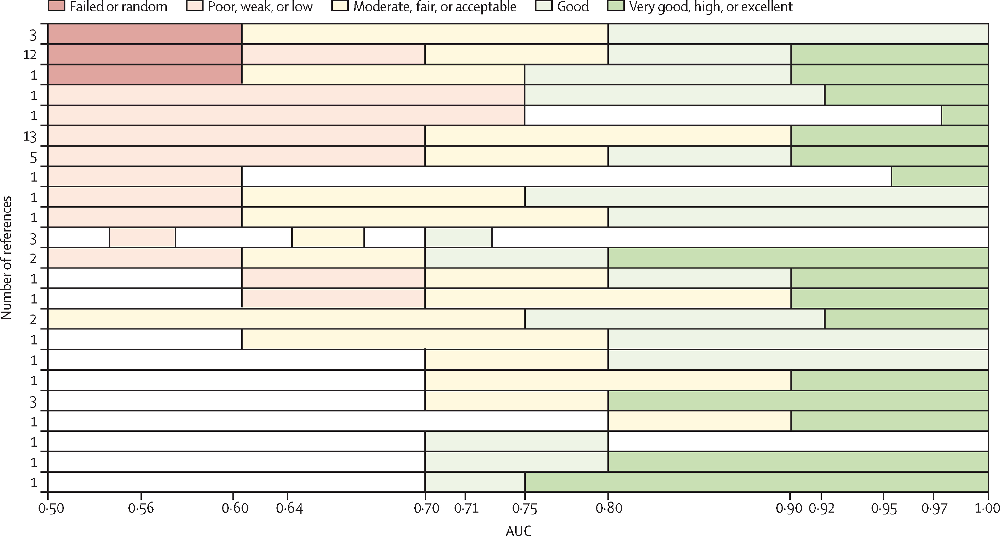

# Continuous diagnostic tests {#contDiag}

We now consider diagnostic tests that report a continuous test result.

## Diagnostic accuracy measures

### ROC curve
A threshold ("cut-off") $c$ can be used to dichotomize a continuous test result
$Y$ into positive (if $Y \geq c$) or negative (if $Y < c$). 
The sensitivity and specificity of continuous diagnostic tests
depend on the threshold $c$: 
\begin{eqnarray*}
\mbox{Sens}(c) & = & \Pr(Y \geq c \given D=1) \\
\mbox{Spec}(c) & = & \Pr(Y < c \given D=0). \\
\end{eqnarray*}

:::{.definition}
The *receiver operating characteristic curve* (ROC curve) is a plot 
of $\mbox{Sens}(c)$ versus $1-\mbox{Spec}(c)$ for all possible thresholds $c$. 
A useful test has a ROC curve above the diagonal, that is,
$\mbox{Sens}(c) + \mbox{Spec}(c) > 1$ for all thresholds $c$. 
:::


Suppose we have data from a diagnostic test performed on $n$ controls (that is, 
individuals without the disease in question) and $m$ 
cases (individuals with the disease). 
If there are  *no ties*, meaning that each observation has a unique value
with no two observations being equal, the ROC curve is a 
*step function* with vertical jumps of size $1/m$ and horizontal jumps of 
size $1/n$. If several controls or cases have the same value, then the corresponding
step size increases accordingly. If a case and a control have the same value 
then the ROC curve has  a *diagonal* line segment. 
Furthermore, the ROC curve depends solely on the ranks of the data rather than
the actual values.
This means that the relative ordering of the data points is what influences
the shape of the curve, not their specific magnitudes. 
As a result, any transformation that preserves the order of the data
will not affect the ROC curve, making it *scale-invariant*.
  
  
:::{.example #genexpr}
The gene expression data from a hypothetical study with $n=23$ controls and $m=30$ 
cases are shown in Figure \@ref(fig:genexpress).
Table \@ref(tab:genes) gives sensitivity and specificity for selected cut-offs.
:::


```{r echo=FALSE}
library(ROCR, warn.conflicts = FALSE, quietly = TRUE)
library(biostatUZH)
library("scales")

rocdata <- read.table("data/rocdata.txt", header=TRUE)
cases <- rocdata[rocdata$case==1,]$expr
controls <- rocdata[rocdata$case==0,]$expr
``` 

```{r echo=TRUE}
head(rocdata, 3)
```


```{r genexpress, echo = FALSE, fig.cap = "Continuous diagnostic test for gene expression."}
par(mfrow=c(1,2),pty="s")

boxplot(controls, cases, names=rev(c("Cases", "Controls")), 
        ylab="Gene expression", col = alpha(c("darkred", "darkgreen"), 0.75), ylim=c(0.4,2.25), las = 1)
title("Boxplot")
library(beeswarm)
beeswarm(expr ~ case, data = rocdata, method = "swarm", 
         ylab="Gene expression", xlab="", pch=16, cex=0.9, 
         ylim = c(0.4,2.25), xaxt = "n", las = 1, 
         main = "Beeswarm Plot", col = alpha(c("darkred", "darkgreen")))
axis(1, c(1, 2), rev(c("Cases", "Controls")), padj = 0.5)
```


```{r genes, results="asis"}
library(kableExtra)
pred <- prediction(rocdata$expr, rocdata$case)
perf <- performance(pred,"tpr","fpr")

fpf <- perf@"x.values"
tpf <- perf@"y.values"
cutpoint <- perf@"alpha.values"
mytable <- as.data.frame(cbind(cutpoint[[1]], tpf[[1]] * 100, (1 - fpf[[1]]) * 100))
names(mytable) <- c("Cut-off", "Sensitivity (in %)", "Specificity (in %)")

selected_rows <- mytable[c(1, 2, 3, 10, 20, 30, 40, 44, 45, 46),]
knitr::kable(selected_rows, digits = c(2, 1, 1, 1), label = NA,
      caption = "Sensitivity and specificity for selected cut-offs.", 
      align = "c", row.names = FALSE) %>%
  kable_styling(latex_options = "hold_position", position = "center")


```

Figure \@ref(fig:ROC-col) then shows the standard ROC curve. 
The right plot gives a colorized version that indicates the corresponding cut-off value as indicated in the color scale on the right. 

The following `R` code was used to produce Figure \@ref(fig:ROC-col):
```{r echo=TRUE, results='hide', fig.show='hide'}
library(ROCR)
pred <- prediction(predictions = rocdata$expr, 
                   labels = rocdata$case)
perf <- performance(pred, "tpr", "fpr")

par(mfrow = c(1, 2), pty = "s", las = 1)
plot(perf, xlab = "1-Specificity", ylab = "Sensitivity")
abline(0, 1, lty = 2)
plot(perf, colorize = TRUE, xlab = "1-Specificity", ylab = "Sensitivity")
abline(0, 1, lty = 2)
```


```{r ROC-col, fig.cap = "Empirical ROC curve, uncolorized (left) and colorized (right).", echo = FALSE }
library(ROCR)
pred <- prediction(predictions = rocdata$expr, 
                   labels = rocdata$case)
perf <- performance(pred, "tpr", "fpr")

par(mfrow = c(1, 2), pty = "s", las = 1)
plot(perf, xlab = "1-Specificity", ylab = "Sensitivity")
points(perf@x.values[[1]], perf@y.values[[1]], pch=19, cex=0.3)
abline(0, 1, lty = 2)
plot(perf, colorize = TRUE, xlab = "1-Specificity", ylab = "Sensitivity")
abline(0, 1, lty = 2)
```


### Area under the curve (AUC)
The most widely used summary measure to assess the performance of a classification 
model is the area under the ROC curve.

:::{.definition}
The *area under the curve* (AUC) is defined as

\begin{equation*}
\mbox{AUC} = \int_0^1 \mbox{ROC}(t)dt.
\end{equation*}
:::

The AUC is interpreted as the probability that the test result $Y_D$ from 
a randomly selected case is larger than the test result $Y_{\bar D}$ from 
a randomly selected control:

\[
\mbox{AUC} = \Pr(Y_D > Y_{\bar D}).
\]

A proof of this result can be found in Appendix \@ref(ROC). 
Most tests have values between 0.5 (useless test) and 1.0 (perfect test).


The $\mbox{AUC}$ can be conveniently computed based on the normalized *Mann-Whitney U-Statistic*:


```{r echo=T, warning=FALSE}
cases <- rocdata[rocdata$case==1,]$expr
controls <- rocdata[rocdata$case==0,]$expr
ncases <- length(cases)
ncontrols <- length(controls)
n.pairs <- ncases*ncontrols
(auc <- wilcox.test(x=cases, y=controls)$statistic/n.pairs)
```

```{r echo=F}
names(auc) <- ""
``` 

There is practical interest how to interpret a certain AUC value. 
@deHond2022 note that the variety in AUC labeling systems in the literature is substantial. However, some rough guidance may still be helpful for end-users, see Figure \@ref(fig:hond). Figure \@ref(fig:auc) illustrates how much two normal distributions (one for the cases and one for controls) with unit variance are apart for certain AUC values. 

```{r hond, fig.cap = "Different labelling systems of AUC from literature, taken from @deHond2022.", echo = FALSE, out.width="90%"}

```


```{r auc, fig.cap = "Normal distributions for cases and controls with unit variance and the corresponding AUC.", echo = FALSE, out.width="90%"}

plotd <- function(d=0.2){
    x <- seq(-5, 5, .1)
    y0 <- dnorm(x, mean=0, sd=1)
    y1 <- dnorm(x, mean=d, sd=1)
    matplot(x, cbind(y0, y1), type="l", col=c(1,2),
            ylab="Density", xlab="Test result", lty=1, lwd=2)
    finaltitle <- paste0("AUC = ", as.character(round(pnorm(d/sqrt(2)), 2)))
    title(finaltitle)
    legend("topleft", col=c(1,2), lty=1, legend=c("Controls", "Cases"),
           lwd=2, cex=0.575, bty="n")
}

par(mfrow=c(2,2), las=1, pty="s", mar = c(4, 3, 3, 1))
AUC <- c(6,7,8,9)/10
d <- qnorm(AUC)*sqrt(2)

plotd(d=d[1])
plotd(d=d[2])
plotd(d=d[3])
plotd(d=d[4])

```


The *standard error* $\SE({\mbox{AUC}})$ of the ${\mbox{AUC}}$ is difficult 
to compute and requires the execution of a computer program. 
The limits of a 95% Wald confidence interval for ${\mbox{AUC}}$ are:
  \begin{equation*}
  \mbox{AUC} - \mbox{ET}_{95} \mbox{ and } 
  \mbox{AUC} + \mbox{ET}_{95}, 
  \end{equation*}
  where the error term $\mbox{ET}_{95} = 1.96 \cdot \SE({\mbox{AUC}})$.


Improved confidence intervals for $\mbox{AUC}$ can be obtained with the logit transformation.
To *avoid overshoot* for diagnostic tests with high accuracy, we can use a Wald confidence interval for
\begin{eqnarray*}
  \logit {\mbox{AUC}} &=& \log \frac{{\mbox{AUC}}}{{1-\mbox{AUC}}}. %%, \mbox{ with } \\[.3cm]
 \end{eqnarray*}
The standard error of $\logit {\mbox{AUC}}$ can be calculated with the Delta method. 
The limits of the CI for $\logit {\mbox{AUC}}$ 
are back-transformed with
the inverse $\logit$ function ("expit").
A *bootstrap confidence interval* could also be used.
The Wald and logit Wald confidence intervals 
can be computed using the function `biostatUZH::confIntAUC()`
and the boostrap confidence interval using `pROC::ci.auc()`.

```{r echo=T, include=FALSE}
library(pROC)
library(biostatUZH)
```

```{r echo=T}
library(biostatUZH)
(confIntAUC(cases=cases, controls=controls, conf.level = 0.95))

# bootstrap CI
library(pROC)
(ci.auc(response=rocdata$case, 
        predictor=rocdata$expr, method="bootstrap"))
```

:::{.example}
The following simulated example illustrates overshoot, see Figure \@ref(fig:sim).
:::

```{r echo=T}
set.seed(12345)
groupsize <- 25
cases <- rnorm(n=groupsize, mean=3)
controls <- rnorm(n=groupsize, mean=0)
x <- c(cases, controls)
y <- c(rep("case", groupsize), rep("control", groupsize))
```

```{r sim, fig.cap = "Beeswarm plot (left) and ROC curve (right) of simulated example to illustrate overshoot of confidence intervals.", echo=F}
par(mfrow = c(1, 2), pty = "s", las = 1)
y <- factor(y, levels=c("control", "case"))

library(beeswarm)
beeswarm(x ~ y, method = "swarm", ylab="Sample", xlab="", pch=16, cex=1.0, 
         xaxt = "n", las = 1, col = alpha(c("darkred", "darkgreen"), 0.75), main = "Beeswarm Plot")
axis(1, c(1, 2), rev(c("Cases", "Controls")), padj = 0.5)

pred <- prediction(x, y, label.ordering=rev(c("case", "control")))
perf2 <- performance(pred,"tpr","fpr")

plot(perf2,colorize=FALSE, xlab="1-Specificity", ylab="Sensitivity", 
     main = "ROC Curve")
points(perf2@x.values[[1]], perf2@y.values[[1]], pch=19, cex=0.3)
```

In this case, the Wald CI overshoots whereas logit Wald and bootstrap CIs do not:

```{r echo=TRUE}
# function in library(biostatUZH)
(confIntAUC(cases=cases, controls=controls, conf.level = 0.95))

# bootstrap CI in library(pROC)
(ci.auc(response=y, predictor=x, method="bootstrap", conf.level = 0.95))

```


### Optimal cut-off

A simple method to derive a cut-off for a continuous 
diagnostic test is to maximize Youden's
index, see Equation \@ref(eq:Youden).  This cut-off
corresponds to the point of the ROC
curve that has maximal distance to the diagonal line.

:::{.example #PSA}
@Jen2020 conducted a study to assess the diagnostic performance of 
prostate-specific antigen (PSA) corrected for sojourn time. 
In order to maximize Youden's index, a cut-off value of 2.5 ng/ml
was chosen, for which the sensitivity was 75.3\% and 
the specificity 85.2\%. 
:::

However, this approach assumes equal importance for sensitivity and specificity 
and does not consider disease prevalence. The calculation 
of the optimal cut-off should account for the 
*cost ratio* $\mbox{Cost(fp)}/\mbox{Cost(fn)}$ between false positives and false negatives, and 
take into account the prevalence (Pre) of the disease. 

:::{.definition}
The minimize the overall cost, the *optimal cut-off* is where
a straight line with slope 

\begin{equation}
b = \frac{1-\mbox{Pre}}{\mbox{Pre}} \times {\mbox{cost ratio}}
\end{equation}

just touches the ROC curve. 
:::

To find the optimal cut-off, a straight line with slope $b$ 
is moved from the top left corner of the ROC curve, where sensitivity 
and specificity are both equal to 1.
The optimal cut-off is identified as the point where this line first
intersects the ROC curve

:::{.example #genexpr name="continued"}
For example, if $\mbox{Pre}=10\%$ and $\mbox{Cost(fp)}/\mbox{Cost(fn)}=1/10$ 
in the gene expression data example,
then $b=9/10$ and the optimal cut-off is 0.8 as shown in Figure 
\@ref(fig:cutpoint). This cut-off is also the optimal cut-off based 
on Youden's Index,  $J = 0.70 + 0.87 - 1 = 0.57$.
:::


```{r cutpoint, fig.cap = "Identification of optimal cut-off in the ROC curve for 10% and Cost(fp)/Cost(fn)=1/10.", echo=F, results='hide'}
par(pty="s", las=1)
plot(perf,colorize=FALSE, xlab="1-Specificity", ylab="Sensitivity")

mygrey <- "gray25"
for(a in seq(0.59,0.59,0.02))
    abline(a=a, b=9/10, col=mygrey, lty=2)
text(0.7, 0.8, "slope=9/10", col=mygrey)
arrows(0.45, 0.8, 0.325, 0.85, col=mygrey, cex=0.8, length=0.05)


value <- mytable[23,]
points(1-value[3]/100, value[2]/100,col=2, pch=19, cex=0.5)
text(0.2, 0.4, "Sensitivity=70%", col=2, pos=4)
text(0.2, 0.5, "Specificity=87%", col=2, pos =4)
text(0.2, 0.6, "Cut-off=0.8", col=2, pos=4)
```


## Comparing two diagnostic tests

Suppose that ${\mbox{AUC}}(A)$ and ${\mbox{AUC}}(B)$ are available
for two diagnostic tests $A$ and $B$ for the same disease.
One way to compare their accuracy is to compute the *difference in AUC*: 
$$\Delta{\mbox{AUC}}={\mbox{AUC}}(A)-{\mbox{AUC}}(B).$$
The standard error of $\Delta{\mbox{AUC}}$ can be calculated using the formula 

\begin{eqnarray*}
{\SE}(\Delta {\mbox{AUC}}) &=& 
\sqrt{{\SE}({\mbox{AUC}}(A))^2 +  {\SE}({\mbox{AUC}}(B))^2}
\end{eqnarray*}

for *unpaired samples*. 
For *paired samples*, a different formula based on 
differences of placement values should be used.
The confidence interval for unpaired, respectively paired, samples
can be calculated using `biostatUZH::confIntIndependentAUCDiff()`, 
respectively `confIntIndependentAUCDiff()`.

 
 
:::{.example}
Figure \@ref(fig:twoROCs) shows the ROC curve of two biomarkers for the 
diagnosis of pancreatic cancer [@Wieand1989]. A paired study design was used.
:::


```{r echo=TRUE}
data(wiedat2b)
nrow(wiedat2b)
head(wiedat2b)
```

```{r twoROCs, fig.cap = "ROC curves of the two biomarkers.", echo=FALSE}
data(wiedat2b)

pred1 <- prediction(wiedat2b$y1, wiedat2b$d)
pred2 <- prediction(wiedat2b$y2, wiedat2b$d)
perf1 <- performance(pred1,"tpr","fpr")
perf2 <- performance(pred2,"tpr","fpr")
par(pty="s", mfrow=c(1,1), las=1, cex.axis=0.7, cex.lab=0.9, mar=c(5, 4, 4, 2) + 0.1)
plot(perf1, colorize=FALSE, xlab="1-Specificity", ylab="Sensitivity", axes=FALSE, col=1, lwd=2, cex.axis=0.7)
plot(perf2, colorize=FALSE, xlab="1-Specificity", ylab="Sensitivity", add=TRUE, axes=FALSE, col=2, lwd=2, cex.axis=0.7)
legend("bottomright", col=c(1,2), lty=1, lwd=2, legend=c("Biomarker 1", "Biomarker 2"), cex=0.7)
``` 


The AUCs and $\Delta{\mbox{AUC}}$ with 95\% confidence intervals are:

```{r echo=TRUE}
case <- wiedat2b[,"d"]
y.cases <- wiedat2b[(case==1), c("y1","y2")]
y.controls <- wiedat2b[(case==0), c("y1","y2")]
(confIntPairedAUCDiff(y.cases, y.controls))
``` 

The confidence interval for the AUC difference does not include zero so
there is evidence that Biomarker 1 has a better classification accuracy
than Biomarker 2.


## Additional references
@bland gives a gentle introduction to ROC curves in Chapter 20.6, see also 
the Statistics Note by @SN_ROC. A comprehensive account of statistical aspects 
of ROC curves can be found in @pepe (Chapter 4 and 5). 
The methods from this chapter are used in practice, for example, in the
following studies: @turck, @cockayne, @brown, and @ikeda.
