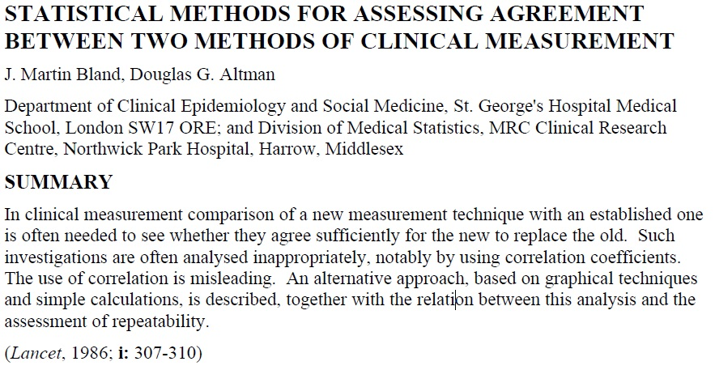

# Clinical measurement and agreement

This chapter explores the potential bias and
precision of clinical measurements, 
addressing both repeated measurements 
taken by the same observer and those taken by
different observers. It introduces key concepts such as reliability, 
repeatability, and agreement.

## Precision of clinical measurements {#sec:sameObs}
*Significant figures* inform about the precision 
 with which measurements are being reported.
They consist of all non-zero digits, zeros between 
non-zero digits, and zeros following the last non-zero after the decimal point.
Significant figures are not the same as *decimal places*,
which are all the digits after the decimal point.
The difference between the two concepts
is illustrated in Table \@ref(tab:signfigures). 
Observations should be rounded to a few significant figures
only for  *reporting*, after all the calculations 
have been done. 

```{r signfigures, echo = FALSE}
# Create the data frame with the desired values
df <- data.frame(
  `Reported measurement` = c("1.5", "0.15", "1.66", "0.0011", "0.00110"),
  `Number of significant figures` = c(2, 2, 3, 2, 3),
  `Number of decimal places` = c(1, 2, 2, 4, 5), 
  check.names = FALSE
)


# Print the table using kable
kable(df, caption = "Precision of reported measurements depends on the number of significant figures.", 
      align = "c")
```


### Measurement error

Multiple measurements of the same quantity on the same subject will typically 
differ due to *measurement error*. 
To estimate the size of measurement error, the within-subject standard deviation,
$s_w$, can be calculated. 
To do so, a set of replicate readings is needed, where each subject in the sample is 
measured more than once. The *within-subject standard deviation*,
$s_w$, can then be calculated using one-way *analysis of variance* (ANOVA).

:::{.example #pefr}
A peak flow meter is a device to measure the maximal expiration speed of a 
person (faster = "better").
The Peak Expiratory Flow Rate (PEFR) data from @bland (Chapter 20.2) 
contains 17 pairs of readings made by the same observer with a Wright Peak Flow 
Meter (in litres/min) on 17 healthy volunteers, see Figure \@ref(fig:PEFR). 
:::


```{r echo = FALSE, include = FALSE, label = PEFRinitialization}
PEFR <- read.table("data/PEFR.csv", header=TRUE, sep=",")
First <- PEFR[, "First"]
Second <- PEFR[, "Second"]
Subject <- PEFR[, "Subject"]
library(biostatUZH, warn.conflicts = FALSE, quietly = TRUE)
library(xtable, warn.conflicts = FALSE, quietly = TRUE)

source("code/displayCI.r", echo = FALSE)
source("code/BlandAltman.r", echo=FALSE)
```


```{r echo = TRUE}
head(PEFR, 12)
``` 


```{r echo=F}
measurement <- c(First, Second)
n <- length(First)
device <- rep(c("First","Second"), each=n)
subject <- as.factor(rep(1:n,2))
```  


```{r PEFR, fig.cap = "Repeated measurements of peak expiratory flow rate [@bland]", echo = F, fig.width=4.0}
my.range <- range(c(First,Second))
par(pty="s", las=1)
plot(First, Second, xlab = "First", ylab = "Second", pty = "s", pch = 19, col = 2, ylim=my.range, xlim=my.range, cex=0.7)
segments(100, 100, 700, 700, lty = 2, col = 4)

cc <- confIntCorrelation(First, Second, method = "pearson", type = "z")
```


:::{.example #sodium}
The TONE study is a randomized controlled trial aimed at determining 
whether a reduction in sodium intake can effectively control blood pressure
[@Appel1995]. @Nab2021 simulated a dataset based on the TONE study, 
containing for each participant: the sodium intake in mg measured by a 24h recall, 
a binary variable indicating whether the participant was assigned to a usual 
or sodium-lowering diet, and two measurements of sodium intake in mg
measured in urine. 
We focus here on the participants for which the two urinary measurements 
are available. The two sodium intake measurements are displayed in Figure 
\@ref(fig:sodium).
:::

```{r sodium, fig.cap="Repeated measurements of urinary sodium intake [@Nab2021]."}
library(mecor)
data(sodium)
sodium_f <- sodium[!is.na(sodium$urinary1) & !is.na(sodium$urinary2), ]
par(pty="s", las=1)
plot(sodium_f$urinary1, sodium_f$urinary2, 
     xlab = "First", ylab = "Second", pty = "s", pch = 19, 
     col = 2, cex = 0.7, 
     xlim = c(2.5, 6), ylim = c(2.5, 6))

abline(a = 0, b = 1, lty = 2, col = 4)
```


The one-way ANOVA for the PEFR date (Example \@ref(exm:pefr)) is computed as follows:
  
```{r, echo=T}
measurement <- c(First, Second)
print(n <- nrow(PEFR))
subject <- as.factor(rep(Subject, 2))

my.aov <- aov(measurement ~ subject)
summary(my.aov)
```

```{r echo=F}
sigmaw <- sqrt(summary(my.aov)[[1]][2,3])
``` 


The entry `Residuals Mean Sq` gives the within-subject variance 
$s_w^2 = `r round(sigmaw^2)`$, so the within-subject standard deviation is
$s_w = \sqrt{`r round(sigmaw^2,0)`} = {`r round(sigmaw,1)`}$ litres/min.

For the sodium data (Example \@ref(exm:sodium)), 
the within-subject standard deviation is calculated with 
the following `R`code: 

```{r, echo = TRUE}

measurement_sod <- c(sodium_f$urinary1, sodium_f$urinary2)
subject_sod <- rep(1:nrow(sodium_f), times = 2)

aov_sod <- aov(measurement_sod ~ subject_sod)
(sigmaw_sod <- sqrt(summary(aov_sod)[[1]][2,3]))
```
and so $s_w = `r round(sigmaw_sod,1)`$ mg.

It is also possible to calculate a confidence interval for the within-subject
standard deviation $s_w$ using the following `R` function:


```{r echo=TRUE}

confintSD <- function(sd, dof, level = 0.95){
  alpha <- 1 - level
  p_lower <- alpha/2
  p_upper <- 1-alpha/2
  c(lower = sqrt(dof / qchisq(p_upper, df = dof)) * sd,
    estimate = sd, 
    upper = sqrt(dof / qchisq(p_lower, df = dof)) * sd)
}

round(confintSD(sd = sigmaw, dof = 17), 1) # for PEFR data
round(confintSD(sd = sigmaw_sod, dof = nrow(sodium_f)), 2) # for sodium data


```

A simpler way to compute $s^2_w$ (which gives approximately the same result)
is based on the variance $s^2_d$ of the 
differences  `Diff` between the two measurements, \ie 
$s^2_w = s^2_d/2$.
For the PEFR data (Example \@ref(exm:pefr)), this 
gives

```{r echo=TRUE}
## compute the differences
PEFR$Diff <- PEFR[, "First"]-PEFR[, "Second"]

## variance of the differences
varDiff <- var(PEFR$Diff)

## within-subject variance is half the variance of the differences
varWithin <- varDiff/2
sw <- sqrt(varWithin)
print(round(sw, 1))
```

However, this approach cannot be used
if there are more than two measurements for some subjects.


### Measurement error related to size

Sometimes *measurement error*
is proportional to the *size* of the measurement. 
If this is the case, a *logarithmic transformation* of the 
measurements may be helpful. 
If there are two measurements per subject, the (rank) correlation between
the absolute value of the difference between two measurements
and the mean of the two measurements
can be used to check whether such a transformation is needed, see
Figure \@ref(fig:PEFR-corr) for the PEFR and the sodium data (Examples
\@ref(exm:pefr) and \@ref(exm:sodium), respectively).

```{r}
x_pefr <- (First+Second)/2
y_pefr <- abs(First-Second)

x_sod <- (sodium_f$urinary1 + sodium_f$urinary2)/2
y_sod <- abs(sodium_f$urinary1 - sodium_f$urinary2)
```


```{r PEFR-corr, fig.cap = "Absolute difference against mean of the two measurements.", width = 15, heigt = 4.5, echo = FALSE}
par(las = 1, 
    mfrow = c(1, 2))

plot(x_pefr, y_pefr, xlab = "Mean of measurements", 
     ylab = "Absolute difference of measurements", 
     pty = "s", 
     pch = 19, 
     col = 2, 
     cex = 0.9, 
     main = "PEFR")

abline(coef(lm(y_pefr ~ x_pefr)), lty=2, col=1)
text(400, 25, 
     paste("Spearman correlation =", format(cor(x_pefr, y_pefr, method = "spearman"), 
                                            digits = 2, nsmall = 2)), 
     cex = 0.9)


plot(x_sod, y_sod, xlab = "Mean of measurements", 
     ylab = "Absolute difference of measurements", 
     pty = "s", 
     pch = 19, 
     col = 2, 
     cex = 0.9, 
     main = "Sodium")

abline(coef(lm(y_sod ~ x_sod)), lty=2, col=1)
text(4.5, 1.8, 
     paste("Spearman correlation =", format(cor(x_sod, y_sod, method = "spearman"), 
                                            digits = 2, nsmall = 2)), 
     cex = 0.9)


```


```{r echo=TRUE, warning=FALSE}
(ctest_pefr <- cor.test(x_pefr, y_pefr, method="spearman"))
(ctest_sod <- cor.test(x_sod, y_sod, method="spearman"))
``` 

Spearman's rank correlation coefficient
in the PEFR example  ($\rho_S = `r round(ctest_pefr$estimate, 2)`$)
is larger than in the sodium example ($\rho_S = `r round(ctest_sod$estimate, 4)`$), 
but the $p$-value for the correlation test is large in both cases ($p=`r formatPval(ctest_pefr$p.value)`$ and 
$p=`r formatPval(ctest_sod$p.value)`$, respectively). Hence
there is no evidence for 
an association between the mean measurement and the absolute difference of
the measurements, so no transformation is required. 


### Repeatability {#sec:repeatability}

:::{.definition}
*Repeatability* is the value below which the difference $d$ between
two measurements will lie with a certain probability, usually 0.95.
:::

Repeatability is 
usually computed as $1.96 \sqrt{2} s_w \approx 2 \sqrt{2} s_w
\approx 2.8 s_w$, where 
$s_w$ is the within-subjects standard deviation. 
Note that the standard deviation of $d$ 
is 
$s_d = \sqrt{2} s_w$.
The repeatability is
$`r round(2*sqrt(2)*sigmaw,1)`$ litres/min
 in the PERF data (Example \@ref(exm:pefr)) and
 $`r round(2*sqrt(2)*sigmaw_sod,1)`$mg
 in the 
 sodium data 
 (Example \@ref(exm:sodium)).
 
The value $2 \sqrt{2} s_w$ is also called the *smallest real difference*, 
because it is the smallest difference that can be interpreted as evidence for 
a real change in the subject's true value. 

### Reliability and the intraclass correlation coefficient

:::{.definition}
*Reliability* refers to the correlation between pairs of readings.
:::
Pearson correlation coefficient between the
first and second measurement depends on the ordering of pairs
and is therefore not appropriate to assess the reliability 
between two pairs of measurements. 
To illustrate this problem we change the ordering of 
some random pairs in the PERF data: 

```{r echo=FALSE}
set.seed(1)
``` 

```{r echo=FALSE}
n <- nrow(PEFR)
switch.me <- sample(n, size=floor(n/2), replace=FALSE)
switch.me <- switch.me[order(switch.me)]
## switch first and second entry for the indices in switch.me
First.new <- First; First.new[switch.me] <- Second[switch.me]
Second.new <- Second; Second.new[switch.me] <- First[switch.me]
``` 
 
```{r echo=TRUE}
print(switch.me)
print(head(cbind(First, Second, First.new, Second.new)))
cor(First, Second)
## cor(First.new, Second.new) not the same as cor(First, Second)
cor(First.new, Second.new)
``` 

In contrast, the *intraclass correlation coefficient* (ICC)
does not depend on the ordering of the pairs and should be used instead.
The ICC is the average correlation among all
possible ordering of pairs and extends easily to the case of more than
two observations per subject. It can be defined based on the between- and 
within-subject variances: 

:::{.definition}
The *Intraclass Correlation Coefficient* (ICC) relates the between-subject 
variance $s_b^2$ to the total variance $s_b^2 + s_w^2$ of the measurements:
\begin{equation*}
\mathrm{ICC} = \frac{s_b^2}{s_b^2 + s_w^2}.
\end{equation*}
:::

The between-subject variance $s^2_b$ can also be read-off from an ANOVA, 
$s^2_b =$ (`subject Mean Sq` $-$ `Residuals Mean Sq`)$/2$


```{r echo=F}
MSb <- summary(my.aov)[[1]][1,3]
MSw <- summary(my.aov)[[1]][2,3]

sigmab <- sqrt((MSb-MSw)/2)
sigmaw <- sqrt(MSw)
ICC <- sigmab^2/(sigmab^2+sigmaw^2)
```

A convenient way to compute ICC is to use the function `ICC::ICCbare()`:
  
```{r echo=TRUE}
library(ICC) 
ICCbare(x=as.factor(subject), y=measurement)
``` 

ICC can be interpreted as the *proportion* of the variance of
measurements which is due to the variation between true values
rather than to measurement error.
Therefore ICC depends on the *variation between subjects* and thus
relates to the population, from which the sample was taken. 
This method should hence 
be used only when we have a *representative sample* of the subjects of interest
[@bland].

:::{.example #pefr name="continued"}
For illustration we modify the PERF
data to have less variation between subjects, but the same within-subject
standard deviation, see Figure \@ref(fig:sb). 
:::

  
```{r echo=T, warning=FALSE}
mymeans <- apply(cbind(First, Second), 1, mean)
shrinkage <-  0.5*(mymeans-mean(mymeans))
ShrunkenFirst <- First - shrinkage
ShrunkenSecond <- Second - shrinkage
ShrunkenMeasurement <- c(ShrunkenFirst, ShrunkenSecond)
``` 


```{r sb, fig.cap = "Less between-subject variation.", echo = F}
par(mfrow = c(1, 2), pty = "s", las = 1)

my.range <- range(c(First,Second))
plot(First, Second, xlab = "First", ylab = "Second", pty = "s", pch = 19, col = 2, ylim=my.range, xlim=my.range, cex=0.7)
segments(100, 100, 700, 700, lty = 2, col = 4)

cc <- confIntCorrelation(First, Second, method = "pearson", type = "z")
title("original data")

plot(ShrunkenFirst, ShrunkenSecond, xlab = "Shrunken First", ylab = "Shrunken Second", pty = "s", pch = 19, col = 2, ylim=my.range, xlim=my.range, cex=0.7)
segments(100, 100, 700, 700, lty = 2, col = 4)

cc <- confIntCorrelation(First, Second, method = "pearson", type = "z")
title("less variation")
``` 


```{r echo=T, warning=FALSE}
my.aov <- aov(ShrunkenMeasurement ~ subject)
summary(my.aov)
``` 

The within-subject standard deviation doesn't change: 
$s_w = \sqrt{`r round(sigmaw^2,0)`} = {`r round(sigmaw,1)`}$ litres/min, 
but the ICC is smaller:

```{r echo=TRUE}
ICCbare(x=as.factor(subject), y=ShrunkenMeasurement)
```


## Agreement of two methods with continuous measurements

In Section \@ref(sec:sameObs),
we discussed *repeatability* and *reliability*, 
focusing on how well replicates from the same observer align. 
Now, the focus shifts to examining the agreement between 
different observers (subjects, machines, methods, etc.).


```{r echo = FALSE, include = FALSE, label = initialization}
glucose <- read.table("data/glucose.csv", header=TRUE, sep=",")
hi <- glucose[, "hitachi912"]
co <- glucose[, "cobas6000"]
library(biostatUZH, warn.conflicts = FALSE, quietly = TRUE)
library(xtable, warn.conflicts = FALSE, quietly = TRUE)

source("code/displayCI.r", echo = FALSE)
source("code/BlandAltman.r", echo=FALSE)
```

:::{.example #glucose}
A total of $n=`r nrow(glucose)`$ pairs of blood glucose measurements 
(in mmol/L) were measured with two different devices: the Cobas6000 and the Hitachi912.
Figure \@ref(fig:agreement) displays the results from a
correlation and a regression analysis to assess the agreement
between the two devices. However, neither of these methods is
useful to assess agreement.
:::


```{r echo=F}
measurement <- c(hi, co)
n <- length(hi)
device <- rep(c("Hitachi912","Cobas6000"), each=n)
subject <- as.factor(rep(1:n,2))
ctest <- cor.test(hi, co)
```  


```{r agreement, fig.cap ="Blood glucose measurements from two different devices.", echo = F}
my.range <- range(c(hi,co))
par(pty="s", las=1)
plot(hi, co, xlab = "Hitachi912 measurement", ylab = "Cobas6000 measurement", pty = "s", pch = 19, col = 2, ylim=my.range, xlim=my.range, cex=0.7)
segments(0, 0, 100, 100, lty = 2, col = 4)
mylm <- lm(co~hi)
abline(coef(mylm), col=1, lty=1)
cc <- confIntCorrelation(hi, co, method = "pearson", type = "z")
text(2, 35, "Pearson correlation:", cex=1.12, pos=4)
text(2, 32, labels=paste("r=", round(cc$estimate, 3), ", 95%-CI"), cex=1.12, pos=4)
text(2, 29, displayCI(cc$ci, text = "english", 3), cex=1.12, pos=4)

text(15, 10, "Regression slope:", cex=1.12, pos=4)
text(15, 7, labels=paste("b=", round(coef(mylm)[2], 2), ", 95%-CI"), cex=1.12, pos=4)
text(15, 4, displayCI(confint(mylm)[2,], text = "english", 2), cex=1.12, pos=4)
```


First, correlation is not useful to assess agreement, 
because multiplication of measurements from one device with 
any factor will not change the correlation, 
so devices that do not agree may show high correlation. 
For example, the correlation between 
 *10* $\times$ Cobas6000 and Hitachi912 measurements remains the same: 

```{r echo=T}
(cor.test(10*co, hi))
```

Furthermore, a regression slope $b \approx 1$ does also not necessarily mean
good agreement, because adding a constant to the measurements from
one device will not change the regression slope, so two methods that
do not agree may still have a slope $\approx$ 1.
For example the regression slope  for *10 +* Cobas6000 vs. Hitachi912 
measurements remains around 1: 

```{r echo=T, results="asis"}
knitr::kable(biostatUZH::tableRegression(lm(10 + co ~ hi), xtable = F))
```


## The method of Bland & Altman

The method of Bland & Altman was introduced in 1986, see the original 
publication in Figure
\@ref(fig:BA). It extends the concept of repeatability introduced in Section
\@ref(sec:repeatability) to observations from different devices to introduce the
*limits of agreement*.  The original publication is one of the
most cited papers in medical research with more than 50'000 citations
by the end of 2023.

```{r BA, fig.cap = "The original publication by Bland"}

```


The Bland-Altman plot assesses the dependency of measurement error 
(size and variability) on the "true" value.
The $x$-axis gives the mean $(x_i + y_i)/2$ of both measurements
as an estimate of true value. The $y$-axis gives the difference 
$d_i = x_i - y_i$ of both measurements to
eliminate variability *between* observations. The *bias*, i.e. the mean 
difference $\bar{d}$ (systematic error) with its confidence interval, and the 
*limits of agreement* (LoA) can be read off the Bland-Altman plot. 
Approximately 95\% of points will lie between 

$$\underbrace{\bar{d} - 2 \cdot s_d}_{\LOAlow} \mbox{ and } \underbrace{\bar{d} + 2 \cdot s_d}_{\LOAup}.$$ 

Here $s_d=\sqrt{2} s_w$ is the standard deviation of the differences.
If differences within the limits of agreement are considered 
*not clinically relevant* then the two methods are considered exchangeable.

### Confidence intervals for limits of agreement

The standard error of the limits of agreement is
\begin{equation*}
  \SE(\LOAlow) = \SE(\LOAup) \approx  \sqrt{3/n} \, s_d \ ,
\end{equation*}
with $n$ being the sample size, and can be used to compute 95\% CI for $\LOAlow$ and $\LOAup$.
The standard error can also be used to compute the required sample 
size $n$ for a fixed width $w$
of the 95\% confidence interval for the limits of agreement.
A rule of thumb by Martin Bland is:
"I usually recommend *$n$=100* as a good sample size, which gives a
95\% CI about $\pm$ 0.34 $s_d$."

```{r echo=FALSE}
ba1 <- BlandAltman(hi, co, group = NA, maintit = "", limy = NA, plot = TRUE)
``` 

:::{.example #glucose name="continued"}
The Bland-Altman plot for the glucose measurements is shown in Figure 
\@ref(fig:blandaltman). 
The bias is `r format(ba1$difference.mean, nsmall=2, digits=2)`
mmol/L with 95\% CI `r displayCI(ba1$ci.mean, 2)` (left). The limits of agreement are  
$\LOAlow$ =  `r format(ba1$lower.agreement.limit, nsmall=2, digits=2)` mmol/L with 95\% CI `r displayCI(ba1$ci.lower.loa, 2)` and 
$\LOAup$ = `r format(ba1$upper.agreement.limit, nsmall=2, digits=2)` mmol/L with 95\% CI `r displayCI(ba1$ci.lower.loa, 2)` (right).
:::


```{r blandaltman, fig.cap = "Bland-Altman plot for glucose measurements. Left: With confidence interval for the bias. Right: With confidence intervals for the limits of agreement.", echo = FALSE, fig.width = 14}
par(mfrow = c(1, 2), mar = c(4, 4, 1, 1), cex = 1.3, las = 1, pch = 19)

plot(ba1$average, ba1$difference, pch = 19, col = 2, xlim = c(0, 37), 
     ylim = c(-5, 5), xlab=ba1$xlab, ylab=ba1$ylab)

abline(h = ba1$upper.agreement.limit, lty = "dotted", col = "blue", lwd = 4)
abline(h = ba1$difference.mean, col = "blue", lwd = 4)
abline(h = ba1$lower.agreement.limit, lty = "dotted", col = "blue", lwd = 4)

abline(h = ba1$ci.mean, lty = 1, col = "red", lwd = 2)
abline(h = 0, lty = 2)


ba1 <- BlandAltman(hi, co, group = NA, maintit = "", limy = NA, plot = TRUE)
plot(ba1$average, ba1$difference, pch = 19, col = 2, xlim = c(0, 37), 
     ylim = c(-5, 5), xlab=ba1$xlab, ylab=ba1$ylab)

abline(h = ba1$upper.agreement.limit, lty = "dotted", col = "blue", lwd = 4)
abline(h = ba1$difference.mean, col = "blue", lwd = 4)
abline(h = ba1$lower.agreement.limit, lty = "dotted", col = "blue", lwd = 4)

abline(h = ba1$ci.upper.loa, lty = 1, col = "red", lwd = 2)
abline(h = ba1$ci.lower.loa, lty = 1, col = "red", lwd = 2)
abline(h = 0, lty = 2)
```


In order to know whether Hitachi912 can be replaced with Cobas6000, 
one has to determine *a priori* what difference $\delta$ is *clinically relevant*.
If the limits of agreement (lower = `r format(ba1$lower.agreement.limit, nsmall=2, digits=2)`, upper = `r format(ba1$upper.agreement.limit, nsmall=2, digits=2)`) (or the corresponding confidence intervals) are within $[-\delta, \delta]$, then the old device can be replaced.


## Agreement of two methods with binary variables

:::{.example #kirkwood}
179 patients completed a *Symptom Interpretation Questionnaire* 
on two occasions three years apart. Each time, they were were classified
into "normalizer" and "non-normalizer", related to how they were 
able to cope with symptoms [@KirkwoodSterne, p. 434, Ex.36.3].
:::


```{r agreement_cached, cache=TRUE, results="asis", echo = FALSE}
symptoms_nx2 <- rbind(
    matrix(rep(c(1, 1), 47), ncol = 2, byrow = T),
    matrix(rep(c(0, 1), 17), ncol = 2, byrow = T),
    matrix(rep(c(1, 0), 39), ncol = 2, byrow = T),
    matrix(rep(c(0, 0), 76), ncol = 2, byrow = T)
) # 2 ratings for each of n patients
norm <- symptoms_nx2[, 1]
nonnorm <- symptoms_nx2[, 2]
mat <- table(norm, nonnorm)
mat0 <- mat
mat <- rbind(mat, apply(mat, 2, sum))
mat <- data.frame(cbind(mat, apply(mat, 1, sum)))
mat <- cbind(rep(NA, 3), mat)
mat <- rbind(c("First classification", "normalizer", "non-normalizer", "Total"), mat)
mat[2:4, 1] <- c("normalizer", "non-normalizer", "Total")
dimnames(mat)[[2]] <- c("", "Second classification", "", "")
xtab2 <- xtable(mat, align = "cc|cc|c", caption = "", label = "tab: kappa1")

a <- mat0[1, 1]
b <- mat0[1, 2]
c <- mat0[2, 1]
d <- mat0[2, 2]
n <- sum(mat0)

## prepare mat for next output
mat <- mat0
mat <- rbind(mat, apply(mat, 2, sum))
mat <- data.frame(cbind(mat, apply(mat, 1, sum)))
mat1 <- mat
mat.exp <- mat
mat.exp[1:2, 1] <- sum(mat[1:2, 1]) / mat[3, 3] * mat[1:2, 3]
mat.exp[1:2, 2] <- sum(mat[1:2, 2]) / mat[3, 3] * mat[1:2, 3]

a2 <- mat.exp[1, 1]
b2 <- mat.exp[1, 2]
c2 <- mat.exp[2, 1]
d2 <- mat.exp[2, 2]
n2 <- mat.exp[3, 3]
```

```{r exbinary, echo = FALSE, message = FALSE}
library(dplyr)
library(kableExtra)
# Create the data frame
data <- data.frame(
  "First classification" = c("normalizer", "non-normalizer", "Total"),
  "Normalizer" = c(76, 39, 115),
  "Non-normalizer" = c(17, 47, 64),
  "Total" = c(93, 86, 179), 
  check.names = FALSE
)

# Print the table using kable
kable(data, format = "html", row.names = FALSE, booktabs = TRUE, 
      caption = "Agreement of binary classification of patients on two occasions three years apart.")%>%
  kable_styling(full_width = FALSE) %>%
  add_header_above(c(" " = 1, "Second classification" = 2, " " = 1))
```


The *proportion of agreement* between the two classifications is
\begin{eqnarray*}
    \pobs &=& (`r a` + `r d`) / `r n` \ = \ `r format((a + d) / n, nsmall = 2, digits = 2)` \,\, (`r format(100*(a + d) / n, nsmall = 0)` \%)
\end{eqnarray*}
The problem is that two "random" classifiers would also agree for
some patients, so we need to adjust for this *agreement by chance*. We can calculate this based on the
expected frequencies under independence. For example, the expected frequency in the first cell of
Table \@ref(tab:exbinary) is $115 \cdot 93 / 179 = 59.7$. 

```{r echo = F}
mat.exp[1:2, 1:2] <- format(round(as.matrix(mat.exp[1:2, 1:2]), 1), scientific = FALSE, nsmall = 1)
mat <- mat.exp
mat <- cbind(rep(NA, 3), mat)
mat <- rbind(c("First classification", "normalizer", "non-normalizer", "Total"), mat)
mat[2:4, 1] <- c("normalizer", "non-normalizer", "Total")
dimnames(mat)[[2]] <- c("", "Second classification", "", "")
#xtab2 <- xtable(mat, align = "cc|cc|c", caption = "", label = "tab: kappa2")
#print(xtab2, include.rownames = FALSE, include.colnames = TRUE, floating = F, hline.after = c(1, 3), type = "latex", size = "footnotesize", sanitize.text.function = function(x){x}, table.placement = "h!", tabular.environment = "tabular")

## compute kappa in example
pobs <- (a + d) / n
pexp <- (a2 + d2) / n2
kappa <- (pobs - pexp) / (1 - pexp)
```

```{r expected}
# Create the data frame
data <- data.frame(
  "First classification" = c("normalizer", "non-normalizer", "Total"),
  "Normalizer" = c(59.7, 55.3, 115),
  "Non-normalizer" = c(33.3, 30.7, 64),
  "Total" = c(93, 86, 179), 
  check.names = FALSE
)

# Print the table using kable
kable(data, format = "html", row.names = FALSE, booktabs = TRUE, 
      caption = "Table of expected frequencies of agreement by chance, given row- and column totals.") %>%   
  kable_styling(full_width = FALSE) %>%
  add_header_above(c(" " = 1, "Second classification" = 2, " " = 1))

```


Table \@ref(tab:expected) gives all four expected frequencies. 
The expected proportion of *agreement by chance* then is
\begin{eqnarray*}
  \pexp %&=& (n_{1+} n_{+1} + n_{2 +} n_{+ 2})/n_{++}^2 \\
    &=& (`r format(a2, nsmall = 1, digits = 2)` + `r format(d2, nsmall = 1, digits = 2)`) / `r n2` \\
    &=& `r format((a2 + d2) / n2, nsmall = 2, digits = 2)`.
\end{eqnarray*}


### Cohen's Kappa

:::{.definition}
  Cohen's Kappa is the proportion of agreement beyond chance $\pobs - \pexp$, 
  standardized with the maximal possible value $1-\pexp$:
:::
  
\begin{eqnarray*}
    \kappa &=& \frac{\pobs - \pexp}{1 - \pexp} 
\end{eqnarray*} 

It has the following properties:$\kappa \leq \pobs$, $\kappa = 1$ means 
that there is perfect agreement ($\pobs=1$), $\kappa = 0$ mean that the agreement not larger than expected by chace ($\pobs=\pexp$), and the smallest possible value of $\kappa$ is $-\pexp/(1-\pexp)$. 

In Example \@ref(exm:kirkwood) we obtain

\begin{eqnarray*}
     \kappa &=& \frac{`r format((a + d) / n, nsmall = 2, digits = 2)`- `r format((a2 + d2) / n2, nsmall = 2, digits = 2)`}{1 - `r format((a2 + d2) / n2, nsmall = 2, digits = 2)`}
    = `r format(kappa, nsmall = 2, digits = 2)`.
\end{eqnarray*}    

A classification of Cohen's Kappa from @altman1991 and @bland is given in Table \@ref(tab:kappaClass). 


```{r kappaClass}
kappa_table <- data.frame(
  "Value of kappa" = c("$0.00 - 0.20$", "$0.21 - 0.40$", "$0.41 - 0.60$", "$0.61 - 0.80$", "$0.81 - 1.00$"),
  "Strength of agreement" = c("Poor", "Fair", "Moderate", "Good", "Very good"), 
  check.names = "FALSE"
)

# Render the table using kableExtra
kable(kappa_table, format = "html", caption = "Classification of Cohen's Kappa [@altman1991, @bland].")
```

However, there is a caveat with the interpretation shown in Table \@ref(tab:kappaClass):
$\kappa$ also depends on the true proportion of subjects in the two
categories. Figure \@ref(fig:kappa-dep) shows the expected $\kappa$ as a function of the
true proportion of "Yes" subjects for different probabilities of 
agreement. We can see that expected $\kappa$ drops for extreme proportions close to zero or one. 


In Table \@ref(tab:kappa-extreme),
$\kappa = `r Kappa(mat0)$Unweighted[1]`$
although $\pobs = `r mat0[1,1] + mat0[2,2]`$/$`r sum(mat0)`$ = $`r round((mat0[1,1] + mat0[2,2])/sum(mat0), 2)`$.
The problem is that the observed proportion of "positive" subjects is very low
(5/94 resp. 6/94).
This shows that $\kappa$ also depends on the marginal distribution of positive
(respectively negative) subjects!

```{r kappa-dep, fig.cap = "Dependence of $\\kappa$ on the true proportion of positive subjects.", echo = FALSE}
k <- function(p, q){
    num <- p*(1-p)
    den <- num + q*(1-q)/((2*q-1)^2)
    return(num/den)
}

p1 <- seq(0.00, 1, 0.001)
q <- c(0.6,0.7,0.8,0.9,0.95,0.99)
kappa <- matrix(NA, nrow=length(p1), ncol=length(q))
for(i in 1:length(q)) 
    kappa[,i] <- k(p1, q[i])
par(las=1)
matplot(p1, kappa, type="l", ylim=c(0,1), xlab="True proportion of 'Yes'", ylab="Expected Kappa", lty=1, lwd=2)

l <- seq(0.2,1.0,0.2)
t <- c("Poor", "Fair", "Moderate", "Good", "Very Good")        
for(i in 1:length(l)){
    abline(h=l[i], col="grey")
    text(0.5, l[i]-.1, t[i], cex=1.5)
        }

legend("topleft", lty=1, col=rev(1:6), legend=paste(as.character(rev(q*100)), "% correct", seq=""), bg="white", cex=1, lwd=2)
``` 


```{r kappa-extreme, results = "asis", echo = F, message = FALSE}
mat <- rbind(
matrix(rep(c(1, 1), 1), ncol = 2, byrow = T),
matrix(rep(c(0, 1), 4), ncol = 2, byrow = T),
matrix(rep(c(1, 0), 5), ncol = 2, byrow = T),
matrix(rep(c(0, 0), 84), ncol = 2, byrow = T)
)
library("vcd", warn.conflicts = FALSE, quietly = TRUE)
norm <- mat[, 1]
nonnorm <- mat[, 2]
mat <- table(norm, nonnorm)
mat0 <- mat


# Compute Kappa
k <- Kappa(mat)

# Prepare the table for xtable
mat <- rbind(mat, apply(mat, 2, sum))
mat <- data.frame(cbind(mat, apply(mat, 1, sum)))
mat <- cbind(rep(NA, 3), mat)
mat <- rbind(c("Rater 1", "negative", "positive", "Total"), mat)
mat[2:4, 1] <- c("negative", "positive", "Total")
colnames(mat) <- c("", "Rater 2", "", "")
# rownames(mat) <- c("", "negative", "positive", "Total")

# Print the table using kable
knitr::kable(mat, format = "html",
      caption = "Extreme example for interpretation of Kappa.", 
      row.names = FALSE) %>%   
  kable_styling(full_width = FALSE)
```


### Confidence Interval for Cohen's Kappa

The standard error of $\kappa$ is

\[
\SE( \kappa) %% = \frac{\SE(\pobs)}{1-\pexp} 
= \frac{\sqrt{\pobs \, (1- \pobs)}}
  {(1- \pexp) \sqrt{n}},
\]

so a Wald confidence interval for $\kappa$ can be easily computed. 
A Wilson interval for 
$\pobs$ can be used to obtain a confidence interval for $\kappa$ with better properties. 
 For small $n$, 
*bootstrap* CIs might be even better, which would also incorporate uncertainty with
respect to $\pexp$.


```{r echo=F}
symptoms <- matrix(c(76,39,17,47), byrow=F, ncol=2, nrow=2)
names <- c("normalizer", "non-normalizer")
colnames(symptoms) <- names
rownames(symptoms) <- names
symptoms <- as.table(symptoms, dnn=c("First classification","Second classification"))

## 2 ratings for each of n patients

symptoms.ind <- rbind(matrix(rep(c(1, 1), 76), ncol = 2, byrow = T),
                      matrix(rep(c(0, 1), 39), ncol = 2, byrow = T),
                      matrix(rep(c(1, 0), 17), ncol = 2, byrow = T),
                      matrix(rep(c(0, 0), 47), ncol = 2, byrow = T))
#symptoms.ind <- cbind(c(1:nrow(symptoms.ind)), symptoms.ind)
symptoms.ind <- as.data.frame(symptoms.ind)
colnames(symptoms.ind) <- c("First", "Second")
rownames(symptoms.ind) <- NULL
``` 

The different confidence intervals require different formats of the data:
The Wald CI requires data in *aggregated form* (the ordinary $2 \times 2$ table
format):
```{r format1, echo=TRUE}
print(symptoms)
``` 
In contrast the bootstrap CI needs data *on individual level*,
with each row representing the measurements from one subject:
```{r format2, echo=T}
print(head(symptoms.ind))
``` 


A  Wald confidence interval is obtained conveniently using `psych::cohen.kappa()`: 

```{r echo=TRUE}
library(psych)
cohen.kappa(symptoms)
``` 

The Wilson confidence interval requires transformation of the confidence limits
of $\pobs$ to $\kappa$:

```{r echo=TRUE}
pobsCI <- wilson(x=sum(diag(symptoms)), n=sum(symptoms))
pexp <- sum(diag(chisq.test(symptoms)$expected)/sum(symptoms))
round((pobsCI-pexp)/(1-pexp), 2)
``` 

A 95\% bootstrap CI for Cohen's Kappa is obtained using
`biostatUZH::confIntKappa()`:

```{r }
set.seed(211213)
```

```{r confintkappa_cached, cache=TRUE, echo=TRUE}
res <- biostatUZH::confIntKappa(symptoms.ind, type="Cohen")
round(res$boot.quant, 2)
``` 

### Weighted Kappa
It might happen that more than two categories are of interest.

:::{.example #multicat}
The physical health of 366 subjects has been judged by a
health visitor (HV) and the subject's general practitioners (GP)
[@bland]. Table \@ref(tab:multicat) shows the data (columns: HV, rows: GP). 
:::
```{r multicat, results = "asis", echo = F}
data <- c(2, 12, 8, 0, 9, 35, 43, 7, 4, 36, 103, 40, 1, 8, 36, 22)
names <- c("Poor", "Fair", "Good", "Excellent")
health.mat <- matrix(data, nrow=4, ncol=4, byrow=TRUE)
colnames(health.mat) <- names
rownames(health.mat) <- names
health <- as.table(health.mat, dnn=c("GP", "HV"))

# Using knitr::kable to create the table in Bookdown
kable(health, digits=0, 
      label = NA,
      caption = "Data from Example \\@ref(exm:multicat).",
      format = "markdown",
      booktabs = TRUE, 
      align = "c") %>%   
  kable_styling(full_width = FALSE)
``` 


As a start we may only consider the diagonal entries for the assessment of agreement.
This is  *unweighted kappa*, calculated with 
\begin{eqnarray*}
    \pobs = \sum_{i=1}^{k} p_{ii}, \\
    \pexp = \sum_{i = 1}^k p_{i\cdot} p_{\cdot i}
\end{eqnarray*}
where $k$ is the number of categories, $p_{ij}$ is the observed relative frequency in cell ($i$, $j$), while
$p_{i\cdot}$ and $p_{\cdot i}$ are the corresponding row and column sums. 

However, agreement for ordinal variables is better based on the *weighted
  $\kappa_w$* with *weights of agreement* $w_{ij}$:

\begin{eqnarray*}
    \pobs &=& \sum_{i=1}^{k}\sum_{j=1}^{k} w_{ij}p_{ij}, \\
    \pexp &=& \sum_{i = 1}^k\sum_{j=1}^{k}  w_{ij}p_{i \cdot} p_{\cdot j}, \\
     \kappa_w &=& \frac{\pobs-\pexp}{1-\pexp}.
\end{eqnarray*}
The standard error of $\kappa_w$ is also available.

```{r, echo = FALSE}
w <- function(dim, method="linear"){
    res <- diag(dim)
    for(i in 1:(dim-1)){
        for(j in (i+1):dim){
            if(method=="linear")
                res[i,j] <- res[j,i] <- 1-abs(i-j)/(dim-1)
            if(method=="quadratic")
                res[i,j] <- res[j,i] <- 1-(i-j)^2/(dim-1)^2
        }
    }
    names <- c("Poor", "Fair", "Good", "Excellent")
    colnames(res) <- names
    rownames(res) <- names
    res <- as.table(res, dnn=c("GP","HV"))
    return(res)
}
``` 

Common choices for the weight are quadratic and linear weights. 

-  Quadratic weights: 

```{r }
print(round(w(4, method="quadratic"),2))
``` 

-  Linear weights: 

```{r }
print(round(w(4, method="linear"),2))
``` 


:::{.example #multicat name="continued"}
Analysing agreement of the health assessments from Table \@ref(tab:multicat)
with the unweighted and weighted $\kappa$:
```{r echo=T}
cohen.kappa(health)
```
:::


The function `cohen.kappa()`
uses quadratic weights as default. The weighted $\kappa_w$ turns out to be
larger than the unweighted $\kappa$.


## Additional references

Literature on this topic includes Chapter 13 in @altman and Chapter 
20 on clinical measurements in @bland. Methodological discussions can be found 
in the Statistics Notes @SN_measerror, @SN_corrcoeff, and 
@SN_proptomean.
Studies where the methods from this chapter are used in practice are for 
example @islami, @little, and @spector.

