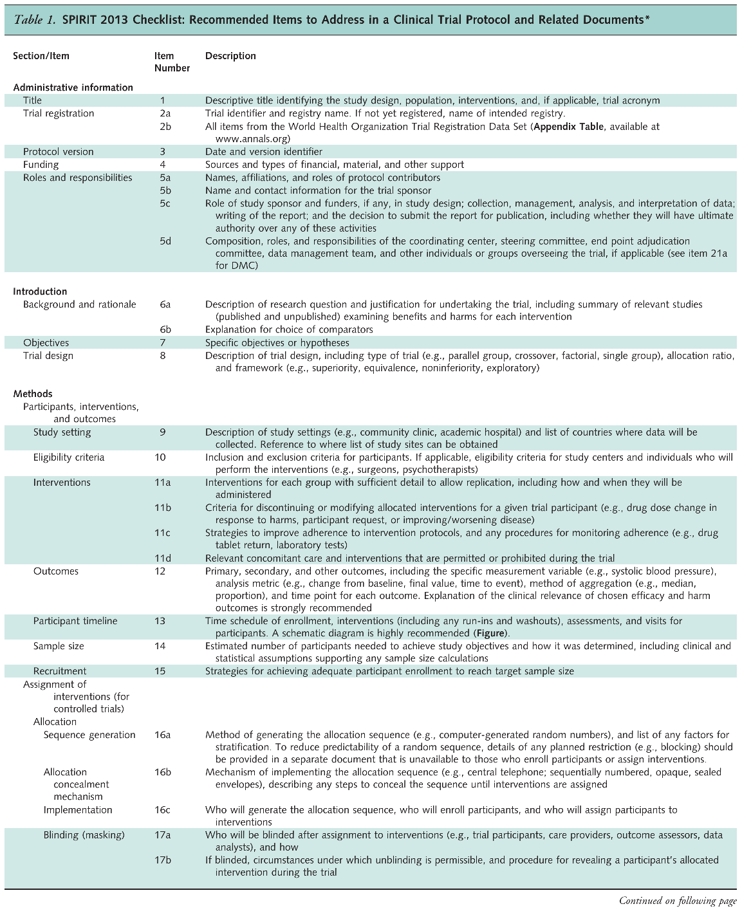

# Randomization and allocation, blinding and placebos

In this chapter we discuss important techniques to allocate patients to two or more arms 
of an RCT. We also discuss blinding and placebos and close with
the CONSORT reporting guidelines in Section \@ref(sec:consort).


## Methods of allocation
There exist several methods to allocate patients to the different 
treatment groups in a clinical trial. 

### Simple randomization
Using *simple randomization* for allocation of $2n$ patients to 
two treatment groups, A and B, the number of patients $N_A$ in group A
has a binomial distribution: 
$$
N_A \sim \Bin(2n, 1/2),
$$
which is the same for $N_B$.
However, one is fixed by the other: $N_B = 2n - N_A$. 

The distribution of the larger group size $N_{\max}=\max(N_A,N_B)$ can then be 
derived as

\[
\Pr(N_{\max}=r) = \left\{
\begin{array}{rl}
 2^{-2n} {2n \choose n} & \mbox{ for } r=n \\[.25cm]
  2^{1-2n} {2n \choose r} & \mbox{ for } r=n+1,\ldots, 2n.
\end{array}
\right.
\]


:::{.proof}
Given a specific $N_A$, $N_{\max}$ takes the following value:


```{r, results='asis', echo=FALSE}
library(knitr)
library(kableExtra)

# Define the table data
data <- data.frame(
  Na = c("$N_A$", "$0$", "$1$", "$\\dots$", "$n - 1$", "$n$", "$n + 1$", "$\\dots$", "$2n - 1$", "$2n$"),
  Nb = c("$N_B$", "$2n$", "$2n - 1$", "$\\dots$", "$n + 1$", "$n$", "$n - 1$", "$\\dots$", "$1$", "$0$"),
  Nmax = c("$N_{\\max}$", "$2n$", "$2n - 1$", "$\\dots$", "$n + 1$", "$n$", "$n + 1$", "$\\dots$", "$2n - 1$", "$2n$")
)

# Transpose the data to match the original table layout
data <- t(data)

# Create a data frame from the transposed data
df <- as.data.frame(data, stringsAsFactors = FALSE)
colnames(df) <- NULL

# Print the table using kable
kable(df, format = "html", escape = FALSE,row.names = FALSE) %>%
  kable_styling(full_width = FALSE, position = "center")
```

Equal sample size for both groups, $r = n$, is a special case as it appears only once:
\begin{equation*}
\Pr(N_{\max} = n) = \Pr(N_A = n)
= \binom{2n}{n} \left(\frac{1}{2}\right)^{2n} = 2^{-2n} \binom{2n}{n}.
\end{equation*}

For $r = n + 1, \dots, 2n$, the larger group can be either A or B, leading to:
\begin{eqnarray*}
\Pr(N_{\max} = r)
& = & \Pr(N_A = r) + \Pr(N_A = 2n - r) \\
& = & \binom{2n}{r} \left(\frac{1}{2}\right)^{2n} +  \binom{2n}{2n - r} \left(\frac{1}{2}\right)^{2n} \\
& \overset{\text{symm.}}{=} & 2 \cdot \binom{2n}{r} \left(\frac{1}{2}\right)^{2n} 
= 2^{1 -2n} \binom{2n}{r}.
\end{eqnarray*}
:::
\


For example, for $n=15$, $\Pr(N_{\max} \geq 20) = 0.10$. So, there is a substantial chance that the two groups will end up with markedly differing sizes, as illustrated in Figure \@ref(fig:simple).
<!-- The power can be calculated as:  -->
<!-- \[ -->
<!-- \mbox{ Power } = \Phi\left(\sqrt{({n_A n_B})/({n_A+n_B})} - z_{1-\alpha/2}\right) \, , -->
<!-- \] -->
Unequal group sizes lead to a *loss in power*.
For example, for Cohen's $d=1$, total sample size $n_A+n_B=30$ and $\alpha=0.05$ 
the loss in power is illustrated in Figure \@ref(fig:powerloss).


```{r simple, fig.cap = "Probability for unequal group sizes with simple randomization and a total sample size of $30$.", echo=F}
P.NMax <- function(n, r) 2^(1-2*n)*choose(2*n, r)
n <- 15
support <- c(n:(2*n))
dist.NMax <- P.NMax(n, support[-1])
dist.NMax <- c(1-sum(dist.NMax), dist.NMax)
#round(sum(dist.NMax[support>=20]),2)

mycol <- c(rep(1, 5), rep(2, 21))
par(las=1)
plot(support, dist.NMax, type="p", ylab="Probability", xlab="Size of larger group", col=mycol, pch=20)
for(i in 1:n) 
    lines(rep(14+i, 2), c(0, dist.NMax[i]), col=mycol[i])
text(24, 0.06, "Pr = 0.10", col=2)
``` 


```{r powerloss, fig.cap = "Loss in power for unequal group sizes in a scenario with $d=1$, $n_A+n_B = 30$ and $\\alpha = 0.05$.", echo=F}
n <- 30
n1 <- c(1:(n-1))
n2 <- n-n1
power <- c(0, pnorm(sqrt((n1*n2)/(n1+n2))-1.96), 0)
n1 <- c(0, n1, n)
par(las=1)
plot(n1, power*100, type="b", xlab="Group size in group A", ylab="Power (in %)", cex=0.65, pch=19, ylim=c(0,80))
lines(c(-2,32), rep(max(power*100), 2), col=2, lty=2)
lines(c(-2,32), rep(60, 2), col=1, lty=2)
lines(c(-2,32), rep(40, 2), col=1, lty=2)
lines(c(-2,32), rep(20, 2), col=1, lty=2)
text(26.5, 73, labels=paste("max power = ", as.character(round(max(power*100))), "%", sep=""), col=2)
``` 


### Block randomization

The problem of unbalanced group sizes can be solved by using a form of restricted randomization with so-called *random permuted blocks* (RPBs). For example, with blocks of length 4, there are the following six different sequences of length 4 that comprise two As and two Bs:

```{r, results='asis', echo=FALSE}

library(knitr)
library(kableExtra)
data <- data.frame(
  row_num = c(1, 2, 3, 4, 5, 6), 
  col1 = c("A", "A", "A", "B", "B", "B"),
  col2 = c("A", "B", "B", "B", "A", "A"),
  col3 = c("B", "B", "A", "A", "A", "B"),
  col4 = c("B", "A", "B", "A", "B", "A"))

kable(data, format = "html", escape = FALSE, col.names = NULL) %>%
  kable_styling(full_width = FALSE, position = "center") %>%
  column_spec(1, border_right = TRUE)
```

In this case, the randomization selects randomly a block for every group of four patients. Block randomization using RPBs of length 4 ensures that group sizes never differ by more than 2. After every fourth patient, the two treatment groups must have the same size.

RPBs can also be used with other block lengths or for more than two groups, e.g. for a block length of 6 and three groups, there are 90 different sequences:
```{r, echo = FALSE, message = FALSE}
library(knitr)
library(kableExtra)

# Define the table data
df <- data.frame(
  row_num = c(1, 2, 3, "$\\vdots$", 90),
  col1 = c("A", "A", "A", "$\\vdots$", "C"),
  col2 = c("A", "B", "B", "$\\vdots$", "C"),
  col3 = c("B", "B", "A", "$\\vdots$", "B"),
  col4 = c("B", "A", "B", "$\\vdots$", "B"),
  col5 = c("C", "C", "C", "$\\vdots$", "A"),
  col6 = c("C", "C", "C", "$\\vdots$", "A")
)

# Print the table using kable
kable(df, format = "html", escape = FALSE, col.names = NULL) %>%
  kable_styling(full_width = FALSE, position = "center") %>%
  column_spec(1, border_right = TRUE)
```


The following `R` code computes the different sequences for RPBs of length 4:


```{r echo=TRUE, message = FALSE}
library(randomizeR)
## bc: length of block
## K: number of treatment groups 
obj4 <- pbrPar(bc = 4, K = 2)
getAllSeq(obj4)
```

:::{.example #ulcers}
An RCT was conducted to examine the use of cold atmosperic plasma 
as a method to treat diabetic foot ulcers [@Mirpour2020].
The Methods section states that the patients were randomly assiged to 
the two treatment groups using block randomization with mixing block sizes 
of $4$. 
:::

In some instances, the knowledge of the block length and of previous treatments
allows the next treatment to be predicted. This may cause *selection bias*.
RPBs with *random block length* have been suggested to avoid the potential for
selection bias.

The following `R` code creates the randomization list for RBPs with random 
block length of 2 and 4: 

```{r echo=TRUE}
obj24 <- rpbrPar(N=100, K = 2, rb=c(2,4))
(seq24 <- genSeq(obj24))

# Randomization list
as.character(getRandList(seq24))
``` 


### Unequal randomization

Unequal randomization can provide greater experience of a new treatment and may 
even encourage recruitment in certain trials. If the imbalance is no
greater than 2:1, the loss in power is small (e.g. from 90\% to 86\% for 
$\alpha=5\%$).
The treatment allocation sequences could be built by randomly selecting from the 
15 blocks of length 6, comprising 4 As and 2 Bs.

The following `R` code computes the 2:1 allocation sequences
for a 2:1 allocation ratio using RPBs of length 6 for two groups:


```{r echo=TRUE}
library(randomizeR)
## bc: length of each block
obj <- pbrPar(bc=6, K = 2, ratio=c(2,1))
genSeq(obj, r=3, seed=123)
``` 

### Stratification
*Stratification* is useful when there is imbalance with respect to prognostic factors. 
Suppose we wish to compare a new treatment $T$ with placebo $P$ to see if it 
improves a certain continuous outcome. An RCT is conducted with $n$ patients 
in each group, all younger than 16 years of age. 
However, there is an important binary *prognostic factor* 
(e.g. age) which has level $A$ (child, < 12 years) in a proportion 
of the eligible patients, otherwise it has level $B$ 
(adolescent, $\geq$ 12 years).
Suppose that there is *no treatment* effect, but the mean outcomes 
$\mu_A$ and $\mu_B$ for type $A$ and $B$ differ: $\mu_A \neq \mu_B$.
Let us assume that we have conducted one particular trial with $n$ patients 
per treatment group and 

-   $n_T$ patients of type $A$ (children) in group $T$ and
-   $n_P$ patients of type $A$ in group $P$.


The expected 
outcome difference between group $T$ and $P$ then is

$$(n_T-n_P)(\mu_A-\mu_B)/n.$$


Although there is no treatment effect, this will be non-zero if $n_T \neq n_P$. 
This bias is called *allocation bias* (see \@ref(sec:allocationbias)). Balance 
($n_T = n_P$) can only be guaranteed *on average across all possible trials*, 
but not for our specific trial. Hence, the trial design should ensure that 
$n_T \approx n_P$.


Stratification aims to control the imbalance between groups not with respect to
their size, but with respect to their *composition*. 
The idea is to use different
RPBs for different strata defined by relevant prognostic factors. For example,
if age is an important prognostic factor, one may use an RPB design for 
children and another one for adults. The number of children (and of adults)
receiving each treatment will then be very similar.

### Minimization

If there are many prognostic factors, using a separate RPB for each possible 
combination of these factors becomes impractical. For example, if there are 
5 binary prognostic factors, there will be already $2^5=32$ strata. 
*Minimization* aims to balance the groups with respect to each factor,
but not for each combination of the factors. The minimization algorithm is:

1.  Suppose a new patient enters the trial with certain values 
$x_1, \ldots, x_J$ of relevant prognostic factors.
2.  The difference $D_j$ of numbers of patients allocated to group
$A$ and patients allocated to group $B$ is computed for the observed value
$x_j$ of each prognostic factor $j=1,\ldots,J$.
3.  Compute the *total difference* $D = \sum_j D_j$ and proceed as 
follows (with some $p>1/2$): 

\[
\mbox{If} \left\{ \begin{array}{c} D = 0 \\ D < 0 \\ D > 0 \end{array} \right\}
\begin{array}{c}
  \mbox{then allocate the new patient} \\ \mbox{to group A with probability}
\end{array}
\left\{ \begin{array}{c} 0.5 \\ p \\ 1-p \end{array} \right\}.
\]

The minimization is deterministic if $p = 1$ and $D \neq 0$.

## Blinding and placebos

### Single and double blindness
Blinding is used to avoid assessment bias. We distinguish between
*single-blind* and *double-blind* trials. In a single-blind trialm the patient 
is unaware of the treatment being given, while in a 
double-blind trial, neither the doctor nor the patient knows what treatment 
is being given.
In some trials, the statistical analysis is also carried out 
blinded because of subjective elements in any statistical analysis. 
For example, decisions like whether to transform the outcome variable, 
whether to compute risk differences, risk ratios or odds ratios for binary 
outcomes, or whether to include a covariate in the analysis all 
involve a degree of subjectivity.
A precise statistical analysis plan helps in any case.


:::{.example #ulcers name="continued"}
In the RCT from @Mirpour2020, the patient were blinded, and 
the data were collected by a trained physician 
and nurse who were blinded to the randomization method and the treatment 
assignment. Moreover, the data were analyzed by a blinded investigator 
to the study groups. 
:::


### Placebos

Placebos are treatments that look similar to the true treatment but
contain no active ingredient.
They have essentially two roles: first, placebos facilitate blindness 
in RCTs, as a treatment versus no treatment comparison cannot be blinded,
but treatment versus placebo can often be blinded; second, placebos help
control the placebo effect.


The *placebo effect* occurs if a patient exhibits a response to treatment, 
even though the treatment has *no active component* and cannot be having a 
direct effect. If only *untreated controls* (no treatment at all) are used, 
then we would not be able to tell whether an observed effect is due to treatment 
or to the placebo effect. Therefore a *placebo control group* is usually selected 
to control the placebo effect. In some trials, both untreated and placebo
control groups are used in addition to the usual intervention group to 
*directly assess* the size of the placebo effect.


### The double-dummy technique

Placebos can also help in the comparison of *two active treatments*. Suppose a 
blue tablet is to be compared to a red tablet. Color cannot be changed, but the
drug companies can produce placebo versions of the blue and red tablet, 
respectively. The *double-dummy technique* then gives both a blue *and* 
red tablet to each patient, in one group with blue active treatment and
red placebo and vice versa in the other group. For example, this method 
is useful to blind a comparison of a treatment given as a tablet with an 
intravenous treatment.


## Reporting guidelines for Clinical Trials

### The SPIRIT Statement {#sec:spirit}

The SPIRIT
(**S**tandard **P**rotocol **I**tems: **R**ecommendations for **I**nterventional **T**rials) statement provides evidence-based recommendations for the minimum content of a clinical trial protocol [@spirit; @spiritEE]. SPIRIT is widely endorsed as an international standard for trial protocols.
The recommendations are outlined in a 33-item *checklist* (see Figures \@ref(fig:SPIRITchecklist1) and \@ref(fig:SPIRITchecklist2)), and *figure* (template of recommended content for the schedule of enrolment, interventions, and assessments). Important details for each checklist item can be found in the Explanation & Elaboration paper [@spiritEE]. The items 14, 20a, 20b and 20c are statistical, and are closely related to, i.e., need to correspond with, items 7, 8, 12 and 16a.
The current recommendations have been established in 2013, an update will be published soon (see 
@Hopewell2022 and https://www.consort-spirit.org/).

```{r SPIRITchecklist1, fig.cap="The SPIRIT checklist (items 1--17).", fig.align="center", echo=FALSE, eval = TRUE}

```

```{r SPIRITchecklist2, fig.cap="The SPIRIT checklist (items 18--33).", fig.align="center", echo=FALSE, eval = TRUE}

```


### The CONSORT Statement {#sec:consort}

The CONSORT 
(**CONS**olidated **S**tandards **O**f **R**eporting **T**rials) statement
is an evidence-based minimum set of recommendations for reporting RCTs 
[@consort; @consortEE].
It encompasses various initiatives developed by the CONSORT Group to alleviate 
the problems arising from inadequate reporting of RCTs. It offers a standard 
way for authors to prepare reports of trial design and analysis, facilitating their 
complete and transparent reporting, and aiding their critical appraisal and 
interpretation. The CONSORT Statement comprises a 25-item *checklist*, see Figure \@ref(fig:CONSORTchecklist),  and a 
*flow diagram*, see Figure \@ref(fig:CONSORTdiagram). The current recommendations 
have been established in 2010, an update will be published soon (see 
@Hopewell2022 and https://www.consort-spirit.org/).


```{r CONSORTchecklist, fig.cap="The CONSORT checklist.", fig.align="center", echo=FALSE, eval = TRUE}
knitr::include_graphics("figures/ConsortCheckList.png")
```

```{r CONSORTdiagram, fig.cap="The CONSORT flow diagram.", fig.align="center", echo=FALSE}
knitr::include_graphics("figures/consort-flow-diagram.png")
```


## Reporting results {#sec:reporting}
The results of a statistical analysis should be reported as follows:

-  The recommended format for CIs is "from $a$ to $b$" or "$a$ to $b$",
  *not* "$(a,b)$", "$[a,b]$" or "$a-b$".
  
-  The $P$-values should be rounded to two significant digits, 
e.g. $p = 0.43$ or $p = 0.057$. 
If $0.001 < p < 0.0001$, $P$-values should be rounded to one significant digit, 
e.g. $p=0.0004$. 
$P$-values should not be reported 
as $p<0.1$ or $p<0.05$ etc., as important information about the actual
$P$-value is lost. 
Only very small $P$-values should be reported with the "<" symbol, e.g.
"$p < 0.0001$".


An example a good reporting is:

"The difference in means at follow-up was 2.28 units 
(95\% CI: $-1.34$ to $5.90$, $p=0.21$)."


## Additional references
 
The design of experiments is discussed in @bland (Chapter 2). 
Allocation methods, assessment, blinding and placebos are discussed in 
@matthews (Chapters 4--5). Studies where the methods from this 
chapter are used in practice
are for example @berlin, @aardweg, @ballard.
