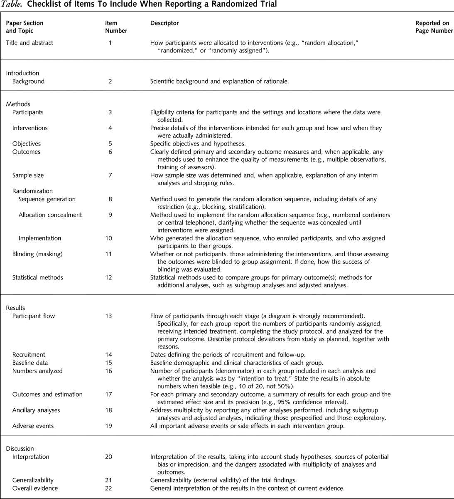

# Analysis of continuous outcomes {#contOut}


Effect size estimates quantify clinical relevance, confidence intervals 
indicate the (im)precision of the effect size estimates as population 
values, and $P$-values quantify statistical significance, i.e. the 
evidence against the null hypothesis. 
All three should be reported for each outcome of an RCT 
and the reported $P$-value should be compatible with the selected confidence 
interval. 
While this chapter focuses on continuous outcomes,
guidelines presented in Section \@ref(sec:consort) 
are true for all outcome types. 
Binary outcomes are discussed in Chapter \@ref(contOut). 


## The CONSORT Statement {#sec:consort}

The CONSORT 
(**CONS**olidated **S**tandards **O**f **R**eporting **T**rials) statement
is an evidence-based minimum set of recommendations for reporting RCTs [@consort, @consortEE].
It encompasses various initiatives developed by the CONSORT Group to alleviate 
the problems arising from inadequate reporting of RCTs. It offers a standard 
way for authors to prepare reports of trial findings, facilitating their 
complete and transparent reporting, and aiding their critical appraisal and 
interpretation. The CONSORT Statement comprises a 25-item *checklist* and a 
*flow diagram*, see Figure \@ref(fig:CONSORTdiagram). The recommendations 
have been established in 2010, an update will be published soon (see 
@Hopewell2022 and https://www.consort-spirit.org/)


```{r CONSORTchecklist, fig.cap="The CONSORT checklist.", fig.align="center", echo=FALSE, eval = FALSE}

```

```{r CONSORTdiagram, fig.cap="The CONSORT flow diagram.", fig.align="center", echo=FALSE}
knitr::include_graphics("figures/consort-flow-diagram.png")
```


### Reporting results
The results of a statistical analysis should be reported as follows:

-  The recommended format for CIs is "from $a$ to $b$" or "$a$ to $b$",
  *not* "$(a,b)$", "$[a,b]$" or "$a-b$".
  
-  The $P$-values should be rounded to two significant digits, 
e.g. $p = 0.43$ or $p = 0.057$. 
If $0.001 < p < 0.0001$, $P$-values should be rounded to one significant digit, 
e.g. $p=0.0004$. 
$P$-values should not be reported 
as $p<0.1$ or $p<0.05$ etc., as important information about the actual
$P$-value is lost. 
Only very small $P$-values should be reported with the "<" symbol, e.g.
"$p < 0.0001$".


An example a good reporting is:

"The difference in means at follow-up was 2.28 units 
(95\% CI: $-1.34$ to $5.90$, $p=0.21$)."


:::{.example #didgeridoo}
The Didgeridoo Study [@puhan]
is a randomized controlled trial with simple randomization. Patients 
with moderate obstructive sleep apnoea syndrome have been randomized to 
4 months of Didgeridoo practice ($n = 11$) or 4 months on the waiting list
($n = 11$).
:::

```{r puhan, echo=FALSE, fig.cap="Abstract of publication of the Didgeridoo Study.", fig.align='center', eval = FALSE}
knitr::include_graphics("figures/abstract2.pdf")
```


```{r echo=F}
library(xtable)
X <- read.table("data/alphorn.dat",header=TRUE,sep="\t")
X$treatment <- abs(X$group-1)
X$treatment <- ifelse(X$treatment==0, "Control", "Didgeridoo") 
X$treatment <- factor(X$treatment, labels=c("Control", "Didgeridoo"))
##X$treatment <- as.factor(X$treatment, levels=c("Didgeridoo", "Control"))
attach(X, warn.conflicts = FALSE)
x1<-X[group==0,17:18]
y1<-X[group==1,17:18]
names<-c("didgeridoo","control")
## treatment <- abs(group-1)
epworth <- rbind(x1, y1)
baseline <- epworth[,1]
```

```{r echo = FALSE, eval = F}
table(treatment)
```


The primary endpoint is the Epworth scale (integers from 0-24). This scale is 
ordinal but for the analysis, it is considered as continuous due to the 
large number of possible values. Measurements are taken at the start of the 
study (*Baseline*) and after four months (*Follow-up*). 
Figure \@ref(fig:puhanFUmeas) compares the follow-up measurements of the 
treatment and control group for the primary endpoint. When we want to 
analyze the difference of these follow-up measurements between the two 
groups, regression analysis gives identical results as a $t$-test:

```{r puhanFUmeas, fig.cap = "Follow-up measurements of primary endpoint in the Didgeridoo Study.", echo=F}
ylab<-c("Epworth scale")
ylim1<-c(0,24)
nx<-dim(x1)[1]
ny<-dim(y1)[1]
histborder <- "black"#"white"
histcol <- gray(0.4)
pch.mean <- 8 # 4, 16
pch.median <- 17
lwd.lines <- 2
lwds <- 1.5 ## points 
pars.boxplot <- list(boxwex = 0.5, staplewex = 0.5, medlwd = 2, whisklty = 1,  whisklwd = 1)

par(mfrow=c(1,1))
library(beeswarm)

beeswarm(epworth2 ~ group, data = X, method = "center", ylab="Epworth-Scale at Follow-up", xlab="Treatment group", pch=16, cex=1.5, xlim = c(0.5, 2.5), xaxt = "n", las = 1, lwd = lwds, main = "", col="red")
axis(1, c(1, 2), (c("Didgeridoo", "Control")), padj = 0.5)

eps <- 0.1
names <- c("Didgeridoo", "Control")
mymeans <- numeric()
for(i in 1:2){
    j <- names[i]
    mymeans[i] <- mean(X$epworth2[X$group==(i-1)])
    mymean <- mymeans[i]
    lines(c(i-eps, i+eps), rep(mymean, 2), col = "black", lwd = 3)
    text(i-eps, mymean, as.character(round(mymean, 2)), pos=2)
}

diffmean <- mymeans[1]-mymeans[2]

text(1.25, 15, paste0("Mean difference: ", as.character(round(diffmean, 2))))

legend("topleft", "Mean", col = "black", lwd = 3, bty = "n", cex=1)


f.up <- epworth[,2]

``` 


```{r echo=T}
# t-test
print(res <- t.test(f.up ~ treatment, var.equal=TRUE))
(DifferenceInMeans <- mean(res$conf.int))  
```

```{r echo=T, results="asis"}
# regression analysis
library(biostatUZH)
m1 <- lm(f.up ~ treatment)
knitr::kable(tableRegression(m1, intercept=FALSE, latex = FALSE, xtable = FALSE))
```

## Comparison of two groups

We can compare the follow-up measurements in two groups 

-  with a $t$-test in case of *equal variances*,
-  with Welch's-test or Behrens test in case of *unequal variances*.

The $t$-test is explained in Appendix \@ref(Pvalues) (and also the $z$-test). 
Alternative methods that adjust for baseline values are discussed in 
Section \@ref(sec:baseline).

### Equal variances {#sec:equalvariance}

The $t$-test assumes independent measurements in two groups that are normally distributed with equal variances. The null hypothesis is that the mean difference $\Delta$ between the two groups is $0$. Assuming $H_0$ is true, the test statistic

$$T = \frac{\widehat \Delta}{\SE(\widehat \Delta)}.$$

follows a $t$-distribution with $m+n-2$ ``degrees of freedom'' (df).

For large df's, the $t$-distribution is close to a standard normal 
distribution as illustrated in Figure \@ref(fig:tdistr).


```{r tdistr, fig.cap = "Comparison of $t$-distribution (with large degree of freedom) to a standard normal distribution.", echo = FALSE}
df <- 23
grid <- seq(-4, 4, .01)
tDensity <- dt(grid, df=df)
normDensity <- dnorm(grid)
par(las=1)
matplot(grid, cbind(normDensity, tDensity), type="l", lty=1, lwd=2, xlab="x", ylab="density")
legend("topright", lty=1, lwd=2, col=c(1,2), legend=c("standard normal", "t with 23 df"))
``` 


Here is a comparison of the two-sided $P$-value $p = \P(\abs{T} \geq \abs{t})$
using the exact $t$-distribution and the approximate normal distribution: 
```{r echo=TRUE}
print(res$statistic)
## exact p-value based on t-distribution
unname(2*(1-pt(abs(res$statistic), df=23)))
## normal approximation
unname(2*(1-pnorm(abs(res$statistic))))
```

Here we compare the factor used to compute the limits of exact and approximate 95\% confidence intervals 
${\widehat \Delta} \pm t % t_{(1+\gamma)/2}%(m+n-2) 
  \cdot \SE(\widehat \Delta)$ resp. ${\widehat \Delta} \pm z % t_{(1+\gamma)/2}%(m+n-2) 
  \cdot \SE(\widehat \Delta)$.
  
```{r echo=TRUE}
gamma <- 0.95
## Exact factor t based on t-distribution
(t <- qt((1+gamma)/2, df=23))
## Approximate factor z based on normal distribution
(z <- qnorm((1+gamma)/2))
```


### Unequal variances

In case of unequal variances, $\sigma_T^2$ and $\sigma^2_C$ are assumed to be
different and the standard error then is

\begin{equation*}
  \SE(\widehat \Delta) = \sqrt{\frac{s_T^2}{m} + \frac{s_C^2}{n}},
\end{equation*}
where $s_T^2$ and $s_C^2$ are estimates of the variances $\sigma_T^2$ and 
$\sigma_C^2$ in the two groups. In this case, the exact null distribution of
$T=\widehat \Delta/{\SE(\widehat \Delta)}$ is unknown. Approximate solutions are:


-  *Standard normal*, which is fine for large $m$ and $n$.
-  *Welch's Test*, which uses a $t$-distribution with (non-integer) degrees of freedom
$\nu$ where $\nu$ is the solution of
\[
\frac{(s_T^2/m+s_C^2/n)^2}{\nu} = \frac{(s_T^2/m)^2}{m-1} + \frac{(s_C^2/n)^2}{n-1}
\]
-  *Behrens Test* \code{biostatUZH::behrensTest} is another option that can be derived with Bayesian arguments \citep[Sec. 4.3]{ArmitageBerryMatthews}.

-  The *Mann-Whitney Test* gives a $p$-value, which is not compatible with the CI for the mean difference. Instead, it provides a CI for the *median* of the difference between a sample from X and a sample from Y.


In R

```{r echo=T, warning = FALSE}
## Welch Test
print(res2 <- t.test(f.up ~ treatment, var.equal=FALSE))
print(DifferenceInMeans <- mean(res2$conf.int))


## Behrens Test
library(biostatUZH)
behrens.test(f.up ~ treatment)

## Mann-Whitney Test
wilcox.test(f.up ~ treatment, conf.int=TRUE)
```


## Adjusting for baseline {#sec:baseline}

### Change scores
Baseline values may be imbalanced between treatment groups just as any other prognostic factor. To analyse change from baseline, we use change scores:

:::{.definition}
The *change score* is the change from baseline defined as:
  \[
  \mbox{change score} = \mbox{follow-up} - \mbox{baseline}.
  \]
:::

:::{.example #3methods}
Figure \@ref(fig:puhanBaselineFU) shows the combinations of baseline and follow-up measurements for each individual. It is visible that the change from baseline to follow-up is larger in the treatment group than in the control group. Figure \@ref(fig:puhanChangeScore) now directly compares the change scores.
:::

```{r puhanBaselineFU, fig.cap = "Individual baseline and follow-up measurements in the Didgeridoo Study by treatment group.", echo=F}
ylab<-c("Epworth scale")
ylim1<-c(0,24)
nx<-dim(x1)[1]
ny<-dim(y1)[1]

par(mfrow=c(1,2), las=1)

plot(0,0,type="n",xlim=c(0,1),ylim=ylim1,xlab="",xaxt="n",ylab=ylab[1])
points(rep(0,nx),x1[,1],pch=19)
points(rep(1,nx),x1[,2],pch=19)
for(i in 1:nx) lines(c(0,1),c(x1[i,1],x1[i,2]),lty=1,col=5)
title(names[1],cex=0.8)

plot(0,0,type="n",xlim=c(0,1),ylim=ylim1,xlab="",xaxt="n",ylab=ylab[1])
points(rep(0,ny),y1[,1],pch=19)
points(rep(1,ny),y1[,2],pch=19)
for(i in 1:ny) lines(c(0,1),c(y1[i,1],y1[i,2]),lty=1,col=1)
title(names[2],cex=0.8)
```


```{r puhanChangeScore, fig.cap = "Change scores for primary endpoint in the Didgeridoo Study.", echo=F}
ylab<-c("Epworth scale")
ylim1<-c(0,24)
nx<-dim(x1)[1]
ny<-dim(y1)[1]
histborder <- "black"#"white"
histcol <- gray(0.4)
pch.mean <- 8 # 4, 16
pch.median <- 17
lwd.lines <- 2
lwds <- 1.5 ## points 
pars.boxplot <- list(boxwex = 0.5, staplewex = 0.5, medlwd = 2, whisklty = 1,  whisklwd = 1)

par(mfrow=c(1,1))
library(beeswarm)
change.score <- f.up - baseline

beeswarm(change.score ~ group, data = X, method = "center", ylab="Epworth Change Score", xlab="Group", pch=16, cex=1.5, xlim = c(0.5, 2.5), ylim=c(-10, 5), xaxt = "n", las = 1, lwd = lwds, main = "", col="red")
axis(1, c(1, 2), (c("Didgeridoo", "Control")), padj = 0.5)
abline(0, 0, lty=2)

eps <- 0.1
names <- c("Didgeridoo", "Control")
mymeans <- numeric()
for(i in 1:2){
    j <- names[i]
    mymeans[i] <- mean(change.score[X$group==(i-1)])
    mymean <- mymeans[i]
    lines(c(i-eps, i+eps), rep(mymean, 2), col = "black", lwd = 3)
    text(i-eps, mymean, as.character(round(mymean, 2)), pos=2)
}

diffmean <- mymeans[1]-mymeans[2]

text(1.25, 2, paste0("Mean difference: ", as.character(round(diffmean, 2))))

legend("topleft", "Mean", col = "black", lwd = 3, bty = "n", cex=1)

f.up <- epworth[,2]

## %% plot(0,0,type="n",xlim=c(0,1),ylim=ylim1,xlab="",xaxt="n",ylab=ylab[1])
## %% points(rep(0.25,nx),x1[,2],pch=19)
## %% points(rep(.75,ny),y1[,2],pch=19)
## %% axis(1, at=c(0.25,.75), labels=names) 
```


A change score analysis in \code{R} for the Didgeridoo Study yields:

```{r echo=T}
change.score <- f.up - baseline
print(res3 <- t.test(change.score ~ treatment, var.equal=TRUE))
(DifferenceInMeans <- mean(res3$conf.int))  
```

This result can also be found in an extract of the reported results in 
Figure \@ref(fig:didgeridootab2).

```{r didgeridootab2, fig.cap="Reported results of the Didgeridoo Study.", out.width="90%", fig.align='center', echo = FALSE}
knitr::include_graphics("figures/TBL22.pdf")
```


### Analysis of covariance (ANCOVA)

*Analysis of covariance* (ANCOVA) is an extension of the change score analysis. 
First note that the change score analysis can also be done with regression, 
see model m2 in Example \@ref(exm:3methods). Here, the \code{offset(x)} command
fixes the coefficient of \code{x} at 1. It is therefore natural to extend this
regression model to the ANCOVA model as it is done in model m3 of the example. 
Now the \code{baseline} coefficient $\beta$ is estimated. The ANCOVA model reduces

-  to the analysis of follow-up for $\beta=0$,
-  to the analysis of change scores for $\beta=1$.


Denote the different outcome means as $\mu_B$ at baseline (in both groups), 
$\mu$ at follow-up in the control group, $\mu + \Delta$ at follow-up in the 
treatment group. The mean difference $\Delta$ is of primary interest. Let 
$\sigma^2$ be the common variance of all measurements and $\rho$ the 
correlation between baseline and follow-up measurements. Assume there are 
$n$ observations in each group.

The ANCOVA model estimates $\beta$ and the mean difference $\Delta$ jointly 
with *multiple regression*. With ${\sigma_B^2}$ and ${\sigma_F^2}$ being the 
variances of baseline and follow-up, it holds that
\[
  \beta = \rho \, \frac{\sigma_F}{\sigma_B},
\]
which simplifies to $\rho$ if the variance does not change from baseline to follow-up, \ie if $\sigma_B^2 = \sigma_F^2$.

:::{.example}
Comparing the three different analysis methods in the Didgeridoo Study:
:::

```{r echo=T, results="asis"}
# Follow-up analysis
m1 <- lm(f.up ~ treatment)
knitr::kable(tableRegression(m1, intercept=FALSE, latex = FALSE))

# Change score analysis
m2 <- lm(f.up ~ treatment + offset(baseline))
knitr::kable(tableRegression(m2, intercept=FALSE, latex = FALSE))

# ANCOVA
m3 <- lm(f.up ~ treatment + baseline)
knitr::kable(tableRegression(m3, intercept = FALSE, latex = FALSE))
```


#### Comparison of effect estimates

Let $\bar F_T$ and $\bar F_C$ be the mean follow-up values and $\bar B_T$ and $\bar B_C$ the mean baseline values in the treatment and control group, respectively. Then, 

\begin{eqnarray*}    
\widehat \Delta_1 & = & \bar F_T - \bar F_C, \\
\widehat \Delta_2 & = & (\bar F_T - \bar B_T) - (\bar F_C - \bar B_C).
\end{eqnarray*}

Now, let $\bar {b}_T$ and $\bar {b}_C$ denote the *observed* mean baseline values in the current trial. Conditioning on these baseline values, we have (the proof is part of the exercises):

\begin{eqnarray*}    
    \E(\widehat \Delta_1 \;|\; \bar b_T, \bar b_C) & = & \Delta + \rho \cdot (\bar b_T - \bar b_C) \\
    \E(\widehat \Delta_2 \;|\; \bar b_T, \bar b_C) & = & \Delta + (\rho - 1) \cdot (\bar b_T - \bar b_C)
\end{eqnarray*}

Hence, given the mean baseline values $\bar {b}_T$ and $\bar {b}_C$,
$\widehat \Delta_1$ and $\widehat \Delta_2$ are unbiased if there is 
baseline balance ($\bar {b}_T=\bar {b}_C$). However, they are both *biased* 
whenever the following two conditions hold:

1.  There is (positive) *correlation* $0 < \rho < 1$,  between baseline and follow-up measurements.
2.  There is *baseline imbalance* ($\bar b_T \neq \bar b_C$):


In the Didgeridoo Study, \eg, there is baseline imbalance: 
$\bar {b}_T=`r round(mean(baseline[group==1]), 1)`$, 
$\bar {b}_C=`r round(mean(baseline[group==0]), 1)`$. 

The ANCOVA estimate

\begin{equation*}
\widehat \Delta_3 =    \bar F_T - \bar F_C - \rho \cdot (\bar b_T - \bar b_C)
\end{equation*}

on the other hand is an unbiased estimate of the mean difference $\Delta$ (see proof in the exercises).

The variances of the effect estimates in the three models can be compared by the corresponding variance factors (derived in the exercises):

$$
\Var(\widehat \Delta) = \color{red}{\mbox{variance factor}} \cdot \sigma^2 /n 
$$


------------------------------------------------


\vspace{-0.5cm}

$$
\begin{aligned}
  \Var(\widehat \Delta_1) &= \color{red}{2} \cdot \sigma^2 /n \\
  \Var(\widehat \Delta_2) &= \color{red}{4 (1-\rho)} \cdot \sigma^2 /n \\
  \Var(\widehat \Delta_3) &= \color{red}{2 (1-\rho^2)} \cdot \sigma^2/n
\end{aligned}
$$


Figure \@ref(fig:varfactors) compares the variance factors of the three
models for varying correlations $\rho$. The variance of $\widehat \Delta_3$ 
is *always smaller* than the variances of $\widehat \Delta_1$ and
$\widehat \Delta_2$. Hence, the required *sample size* for ANCOVA reduces
by the factor $(1-\rho^2)$ compared to the standard comparison of two 
groups without baseline adjustments. For $\rho > 1/2$, $\widehat \Delta_2$
will have *smaller variance* than $\widehat \Delta_1$, so will produce 
narrower CIs and more powerful tests. In the Didgeridoo Study we obtain
$\hat \rho=`r round(cor(f.up, baseline), 2)`$.

```{r varfactors, fig.cap = "Comparison of variance factors", echo = FALSE}
n <- 1
sigma <- 1
rho <- seq(0, 1, 0.01)
var1 <- 2*sigma^2/n
var2 <- 4*sigma^2*(1-rho)/n
var3 <- 2*sigma^2*(1-rho^2)/n
par(las=1)
matplot(rho, cbind(var1, var2, var3), xlab="correlation", ylab="variance factor", type="l", lwd=2, lty=1)
legend("topright", legend=c("Follow-up analysis", "Change score analysis", "ANCOVA"), lty=1, col=1:3, lwd=2)
```

#### Adjusting for other variables

ANCOVA allows a wide range of variables measured at baseline to be used to
adjust the mean difference. The safest approach to selecting these variables 
is to decide this *before* the trial starts (in the study protocol). Prognostic
variables used to stratify the allocation should *always* be included as covariates.

:::{.example}
In the Didgeridoo Study, the mean difference has been adjusted for 
severity of the disease (\code{base.apnoea}) and for weight change during 
the study period (\code{weight.change}). The same results as in
Figure \@ref(fig:didgeridootab2) can be obtained with the following regression model.
:::


```{r echo=F}
weight.change <- dweight
base.apnoea <- ah1
```

```{r echo=T, results="asis"}
m4 <- lm(f.up ~ treatment + baseline + weight.change + base.apnoea)
knitr::kable(tableRegression(m4, intercept = FALSE, latex = FALSE))
``` 


## Additional references

Relevant references are Chapter 10 "Comparing the Means of Small Samples" 
and Chapter 15 "Multifactorial Methods" in @bland as well as Chapter 6
"Analysis of Results" in @matthews. 
Analysing controlled trials with baseline and follow up measurements
is discussed in the Statistics Note @SN_baselineFU. Studies where the 
methods from this chapter are used in practice are for example @ravaud,porto,james.

