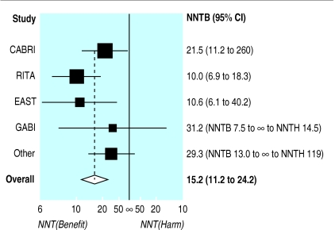

# Analysis of binary outcomes 

Binary outcomes are ubiquitous in medical research and the comparison
of binary outcomes in RCTs is very common.  This chapter discusses
various statistical quantities that can be calculated for comparing
binary outcomes. We discuss statistical tests, suitable effect measures and
methods to adjust for possible baseline variables. 

## Comparison of two proportions

Throughout this section, we will work with the following example.

:::{.example}
The APSAC Study is an RCT to compare a new thrombolytikum (APSAC) with the 
standard treatment (Heparin) in patients with acute cardiac infarction [@meinertz].
The outcome is mortality within 28 days of hospital stay. Table \@ref(tab:apsac) 
summarizes the results of this study, including 95\% Wilson CIs for the 
proportion of patients who died in the respective treatment groups.
:::


```{r echo=F}
library(biostatUZH)
w1 <- wilson(x=9,n=162)*100
w2 <- wilson(x=19,n=151)*100
``` 


```{r apsac, echo = FALSE}
library(dplyr)
library(kableExtra)
# Sample data for the table
data <- data.frame(
  Therapy = c("APSAC", "Heparin", "Total"),
  dead = c(9, 19, 28),
  alive = c(153, 132, 285),
  total = c(162, 151, 313),
  Percent_dead = c("5.6%", "12.6%", ""),
  Standard_error = c("1.8%", "2.7%", ""),
  Wilson_CI = c(paste0(format(0.039, digits=1, nsmall=1), " to ", format(0.074, digits=1, nsmall=1)), 
                paste0(format(0.098, digits=1, nsmall=1), " to ", format(0.157, digits=1, nsmall=1)), 
                "")
)

kable(data, caption = "Results of the APSAC Study.", 
      col.names = c("Therapy", "Dead", "Alive", "Total", "Percent Dead", 
                    "Standard Error", "95% Wilson-CI")) %>%
  kable_styling(bootstrap_options = c("striped", "hover", "condensed", "responsive"),
                full_width = F, position = "center")
```


A visual comparison for the two separate CIs in Figure \@ref(fig:apsacfig) 
shows that they overlap. However, overlapping CIs are not necessarily an
indication for a non-significant treatment effect. Instead, we should rather 
look at CIs for combined effect measures such as the ones defined in Definition \@ref(def:twoprops).


```{r apsacfig, fig.cap = "95\\% Wilson confidence intervals for the death risks in the APSAC Study.", echo=F, warning=FALSE, fig.height=2}
par(las=1)
alpha <- 0.05
za <- qnorm(1 - alpha / 2)
d1 <- 9
n1 <- 162
p1 <- d1/n1
se.p1 <- sqrt(p1*(1-p1)/n1)

d2 <- 19
n2 <- 151
p2 <- d2/n2
se.p2 <- sqrt(p2*(1-p2)/n2)

## ci.p1 <- c(p1-1.96*se.p1,p1+1.96*se.p1)
## ci.p2 <- c(p2-1.96*se.p2,p2+1.96*se.p2)
ci.p1 <- wilson(x=9,n=162)[c(1,3)]
ci.p2 <- wilson(x=19,n=151)[c(1,3)]

arr <- p1-p2
p <- (d1+d2)/(n1+n2)
se.arr <- sqrt(se.p1^2+se.p2^2)
ci.arr <- c(arr-1.96*se.arr,arr+1.96*se.arr)

rr <- p1 / p2
rrr <- 1-rr
se.log.rr <- sqrt(1 / d1 - 1 / n1 + 1 / d2 - 1 / n2)


or <- d1 / (n1 - d1) / (d2 / (n2 - d2))
se.log.or <- sqrt(1 / d1 + 1 / (n1 - d1) + 1 / d2 + 1 / (n2 - d2))

nnt <- 1 / abs(p1 - p2)
ci.nnt <- 1 / abs(ci.arr)
par(mar = c(4, 4, 2, 0), cex=1)
plot(c(0,0), type = "n", xlim=c(0, 18), ylim = c(0.9, 1.8), ylab="", 
xlab="Death risk (in %)", axes=F)
axis(1, at=c(0,5,10,15,20, 25), labels=c(0,5,10,15,20, 25))
axis(2, at=c(1.7, 1.3), labels=c("APSAC", "Heparin"))
lines(ci.p1*100, rep(1.7, 2), col=3, lwd=2)
lines(ci.p2*100, rep(1.3, 2), col=2, lwd=2)
lines(rep(ci.p2[1]*100, 2), c(0.9, 2.1), col=1, lty=2)
lines(rep(ci.p1[2]*100, 2), c(0.9, 2.1), col=1, lty=2)
points(p1*100, 1.7, col=3, pch=19)
points(p2*100, 1.3, col=2, pch=19)
```


### Statistical tests
Commonly used tests to compare two proportions are the \emph{$\chi^2$-test} and *Fisher's "exact" test*, explained in Appendix \@ref(app:pvalues). The null hypothesis in these tests is that there is no difference between groups. Both methods give a $P$-value, but no effect measure. There is a second version of the $\chi^2$-test with *continuity correction*. There are at least *three* different versions to calculate the *two-sided* $P$-value for Fisher's ``exact'' test (see the \code{R} package \code{exact2x2} for details). Fisher's exact test should be used for small samples.

:::{.example}
R code for statistical tests comparing two proportions in the APSAC Study:
:::

```{r echo=F}
APSAC.table <- matrix(c(9,153,19,132), ncol=2, byrow=T, 
                      dimnames = list(c("APSAC", "Heparin"),
                                    c("dead", "alive")))
```

```{r echo=TRUE}
## observed number of cases
print(APSAC.table)
## expected number of cases
print(chisq.test(APSAC.table)$expected)


# chi-squared test
chisq.test(APSAC.table)
chisq.test(APSAC.table, correct=FALSE)

# Fisher's test
fisher.test(APSAC.table)
```

Note that the function fisher.test also provides an odds ratio (with 95\% CI) as effect measure. The output from the $\chi^2$-test can also be used to compute an estimate of the relative risk based on the observed to expected death ratios:

```{r echo=TRUE}
mytest <- chisq.test(APSAC.table)
o <- mytest$observed[,"dead"]
e <- mytest$expected[,"dead"]
print(ratio <- (o/e))
## relative risk
print(RR <- ratio[1]/ratio[2])
``` 

```{r echo=FALSE, eval=FALSE}
SElogRR <- sqrt(sum(1/e))
printWaldCI(log(RR), SElogRR, FUN = exp)
``` 


### Effect measures and confidence intervals

Let $\pi_0$ and $\pi_1$ be the ``true'' risks of death in the Control and APSAC group, respectively with $\pi_0 \geq \pi_1$.
The following quantities are used to compare $\pi_0$ and $\pi_1$:

:::{.definition #twoprops}
The *absolute risk reduction* is defined as
$$\ARR  = \pi_0-\pi_1.$$

The *number needed to treat* is defined as 
$$\NNT = 1 / \ARR.$$

The *relative risk* is defined as
$$\RR = {\pi_1}/{\pi_0}.$$

The *relative risk reduction* is defined as
$$\RRR = \frac{\ARR}{\pi_0} = 1 - \RR.$$

The *odds ratio* is defined as
$$\OR = \frac{\pi_1/(1-\pi_1)}{\pi_0/(1-\pi_0)}.$$
:::


No difference between groups (i.e. $\pi_0 = \pi_1$) corresponds to 
$\ARR=\RRR=0$ and $\RR=\OR=1$. We now discuss each of these effect measures
together with their CIs for the example of the APSAC Study.

#### Absolute Risk Reduction

The ARR is also called *risk difference* ($\RD$) or *probability difference*. The estimated ARR

$$\widehat{\ARR} \ = \ 12.6\%-5.6\%=7\%$$

with standard error

\[
\SE(\widehat{\ARR}) = \sqrt{\frac{\hat \pi_0 (1-\hat \pi_0)}{n_0}+\frac{\hat \pi_1 (1-\hat \pi_1)}{n_1}}= 3.2\%
\]
   
 Here we obtain $\SE(\widehat{\RD}) = 3.2\%$.
can be used to calculate a Wald CI for the ARR. An improved Wilson CI for the ARR can be calculated using the *``square-and-add''* approach [@newcombe1998,Newcombe], see Appendix \@ref(appCI:difference) for details. 
 (Newcombe, 1998).

```{r echo=F}
x1 <- 9
x2 <- 19
n1 <- 162
n2 <- 151
p1 <- x1/n1
p2 <- x2/n2
arr <- p1-p2
arr.se <- sqrt(p1*(1-p1)/n1+p2*(1-p2)/n2)
arr.lower <- arr - 1.96*arr.se
arr.upper <- arr + 1.96*arr.se

nnt.upper <- 1/arr.upper
nnt.lower <- 1/arr.lower
nnt <- 1/abs(arr)
``` 


:::{.example}
  The following R code provides both Wald and Wilson CIs for
  the ARR in the APSAC Study. They are visually compared in
  Figure \@ref(fig:APSACartCIs).  There are no large differences
  between the two types of confidence intervals, only the upper limit
  of the Wilson is slightly larger than the corresponding Wald upper
  limit.
:::


```{r echo=TRUE}
library(biostatUZH)
x <- c(19, 9)
n <- c(151, 162)
print(confIntRiskDiff(x, n))
``` 

```{r echo=F}
res <- confIntRiskDiff(x, n)$CIs
arr.lower.w <- res[2,2]
arr.upper.w <- res[2,3]

nnt.lower.w <- 1/arr.lower.w 
nnt.upper.w <- 1/arr.upper.w 
``` 


The lower plot in Figure \@ref(fig:APSACartCIs) illustrates the
distinct advantage of the Wilson CI that it avoids *overshoot*
with artificial data. Indeed, the upper limit of the Wald confidence
interval for the risk difference is larger than 1 whereas this is not
the case for the Wilson interval.


```{r echo=TRUE}
x.art <- c(11,1)
n.art <- c(12,12)
print(confIntRiskDiff(x.art, n.art))
```


```{r echo=F, warning=FALSE, fig.height=2.5}
library(gplots)

ci.rd <- confIntRiskDiff(x, n)

myx <- rep(ci.rd$rd,2)
li <- ci.rd$CIs[,2]*100
ui <- ci.rd$CIs[,3]*100

par(mar = c(4, 4, 4, 1), las = 1)
#plotCI(x=x, ui=ui, li=li, col="black", barcol="blue", lwd=1, err='y', axes=F, ylab="RD", xlab="Method", ylim=c(-0.2, 0.05))
plotCI(x=myx*100, y=c(1,2), ui=ui, li=li, col="black", barcol="blue", lwd=1, err='x', axes=F, xlab="Absolute Risk Reduction (in %)", ylab="", xlim=c(-0.05, 0.2)*100, ylim=c(0.5,2.5), pch=19)
axis(2, at=c(1,2), label=c("Wald", "Wilson"))
axis(1)
lines(rep(0,2), c(0,3), lty=2)
```


```{r APSACartCIs, fig.cap= "Wald and Wilson CIs for the ARR in the APSAC Study (upper plot) and in an example with artifical data illustrating overshoot (lower plot).", echo=F, warning=FALSE, fig.height=2.5}
library(gplots)

ci.rd.art <- confIntRiskDiff(x.art, n.art)

myx <- rep(ci.rd.art$rd,2)
li <- ci.rd.art$CIs[,2]
ui <- ci.rd.art$CIs[,3]

par(mar = c(4, 4, 4, 1), las = 1)
#plotCI(x=x, ui=ui, li=li, col="black", barcol="blue", lwd=1, err='y', axes=F, ylab="RD", xlab="Method", ylim=c(-0.2, 0.05))
plotCI(x=myx*100, y=c(1,2), ui=ui*100, li=li*100, col="black", barcol="blue", lwd=1, err='x', axes=F, xlab="Absolute Risk Reduction (in %)", ylab="", ylim=c(0.5,2.5), xlim=c(0.4,1.2)*100, pch=19)
axis(2, at=c(1,2), label=c("Wald", "Wilson"))
axis(1)
lines(rep(100,2), c(0,3), lty=2, col=2)
text(115, 1, "Overshoot!", col="red")
```

#### Number Needed to Treat


Suppose we have $n$ patients in each treatment group. The expected number of deaths in the control and intervention group are:
\begin{eqnarray*}
N_0 & = & n \, \pi_0, \\
N_1 & = & n \, \pi_1.
\end{eqnarray*}
The difference is therefore $N_0-N_1 = n \, (\pi_0-\pi_1)$. Suppose we want the difference $N_0 - N_1$ to be one patient. The required sample size $n$ to achieve this is
\[
n = 1/(\pi_0-\pi_1) = 1/\ARR.
\]
This is the *number needed to treat*, the required number of patients to be treated with the intervention rather than control to avoid one death. Depending on the direction of the effect, the NNT is also called *number needed to benefit* or *number needed to harm*.

The interpretation of the estimated $\NNT$
%
$$\quad \widehat{\NNT} \ = \ 1/\widehat{\ARR} \ = 
\ 1 / `r round(abs(arr), 2)` \ = \ `r round(nnt, 1)`$$
%
in the APSAC study is the following: To avoid one death, we need to treat $\widehat{\NNT} = `r round(abs(nnt),1)`$ patients with APSAC rather than with Heparin. A CI for $\NNT$ can be obtained by inverting the limits $\mbox{L}_{\mbox{\scriptsize ARR}}$ and $\mbox{U}_{\mbox{\scriptsize ARR}}$ of the CI for $\ARR$.

:::{.example}
The following R code shows this for the APSAC Study.
:::

```{r echo=TRUE}
(ci.arr <- confIntRiskDiff(x, n)$CIs[2,])
ci.ntt <- 1/ci.arr[c(3,2)]
colnames(ci.ntt) <- c("lower", "upper")
print(round(ci.ntt, 1))
``` 

The CI for $\NNT$ in the APSAC Study is: $1 / `r round(abs(arr.upper.w),3)`$ to $1 / `r round(abs(arr.lower.w),3)`$ \ = \ $`r round(abs(nnt.upper.w),1)`$  to $`r round(abs(nnt.lower.w),1)`$.

Note that the CI for $\NNT$ is only well-defined as long as the CI for $\ARR$ does not contain 0. Otherwise, the confidence interval is actually a confidence region, comprising two different intervals depending on the direction of the treatment effect [@altman1998].
This problem can be circumvented by plotting the number needed to treat on the absolute risk reduction scale, as illustrated in the following example. 

:::{.example}

Figure \@ref(fig:NNTforest) shows a forest plot from @altman1998 where an overall number needed to benefit is calculated from a meta-analysis of data from randomized trials comparing bypass surgery with coronary angioplasty in relation to angina in one year. For three studies (CABRI, RITA, EAST) the 95\% confidence interval for NNT is a regular interval and includes only values that indicate a benefit of therapy. However, for two other entries (GABI and Other) the confidence region for NNT splits into two intervals. For example, for GABI the two intervals are 7.5 to infinity for benefit and 14.5 to infinity for harm. This indicates that this trial is inconclusive regarding the direction of the treatment effect with large uncertainty regarding the actual value of NNT. 
:::

```{r NNTforest, fig.cap="Forest plot for NNT in a meta-analysis [@altman1998].", out.width="100%", fig.align="center"}

```


#### Relative Risk

The RR is also called *risk ratio*. The estimated death risks in both treatment groups are

-  $x_1/n_1=9/162=5.6\%$ for APSAC and 
-  $x_0/n_0=19/151=12.6\%$ for Heparin.

The estimated RR is therefore

$$\widehat{\RR} = \frac{5.6\%}{12.6\%} = 0.44.$$

The calculation of a CI for the RR is based on the \color{red}{log} RR as explained in Table \@ref(tab:CIRR). With the standard error of the log RR

\[
\SE(\color{red}{\log}(\widehat{\RR})) = 
\sqrt{\frac{1}{x_1}-\frac{1}{n_1}+\frac{1}{x_0}-\frac{1}{n_0}}
\]

and the corresponding \emph{95\% error factor} 
\[
  \EF_{.95} = \exp\left\{1.96 \cdot \SE(\color{red}{\log}(\widehat{\RR}))\right\},
\]
we can directly calculate the limits of the CI for the RR as

\begin{equation}
(\#eq:rrci)
\widehat{\RR}/\EF_{.95} \text{ and } \widehat{\RR} \cdot \EF_{.95}.
\end{equation}

:::{.example}
This calculation is implemented in the \code{R} function \code{confIntRiskRatio()} from package \code{biostatUZH}. 
:::


```{r echo=TRUE}
x <- rev(x)
n <- rev(n)
(ci.rr <- confIntRiskRatio(x, n))
``` 
We can see that the data are compatible with a relative risk between
`r round(ci.rr[1], 2)` and `r round(ci.rr[3], 2)`.


```{r CIRR, echo = FALSE}

# Define the data frame
data <- data.frame(
  Quantity = c("RR", "", "\\log RR"),
  Estimate = c("0.44", "<span style='color:red;'>&darr; log &darr;</span>", "-0.82"),
  Standard_Error = c("-", "", "0.39"),
  CI = c("0.21 to 0.95", "<span style='color:red;'>&uarr; exp &uarr;</span>", "-1.58 to -0.06")
)

# Create the table using knitr::kable
kable(data, escape = FALSE, format = "html", table.attr = "class='table table-striped table-hover'", 
      col.names = c("Quantity", "Estimate", "Standard Error", "95%-confidence interval"), 
      caption = "Calculation of a CI for the RR based on the log RR.")


# data <- data.frame(
#   Quantity = c("RR", "", "\\log RR"),
#   Estimate = c("0.44", "\\color{red}{\\downarrow} \\color{red}{\\log} \\color{red}{\\downarrow}", "-0.82"),
#   Standard_Error = c("-", "", "0.39"),
#   CI = c("0.21 to 0.95", "\\color{red}{\\uparrow} \\color{red}{\\exp} \\color{red}{\\uparrow}", "-1.58 to -0.06")
# )
# 
# # Create the table
# kable(data, escape = FALSE, booktabs = TRUE, col.names = c("Quantity", "Estimate", "Standard Error", "95%-confidence interval"), caption = "Calculation of a CI for the RR based on the log RR.") %>%
#   kable_styling(bootstrap_options = c("striped", "hover", "condensed", "responsive"), full_width = F, position = "center")
```


The square-and-add method can also be applied to ratio measures such as the risk ratio @Newcombe (Section 7.3.4), but this is rarely used in practice. One reason might be that the simple approach \@ref(eq:rrci) based on error factors is - by construction - not prone to overshoot below zero. 


#### Relative Risk Reduction

Either ARR or RR can be used to estimate $\RRR$: 
\begin{eqnarray*}
\widehat{\RRR} & = & \frac{\widehat{\ARR}}{\widehat{\pi}_0} \ = \ \frac{`r round(ci.rd$rd, 2)`}{`r round(p2, 3)`} \ = \ `r round(rrr*100, 0)`\% \mbox{ or} \\
\widehat{\RRR} & = & 1-\widehat{\RR} \ = \ 1 - `r round(rr, 2)` \ = \ `r round(rrr*100, 0)`\% 
\end{eqnarray*}
A CI for $\RRR$ can be obtained based on the limits
$\mbox{L}_{\mbox{\scriptsize RR}}$ and $\mbox{U}_{\mbox{\scriptsize RR}}$ of the CI for $\RR$: 

\begin{eqnarray*}
    (1 - \mbox{U}_{\mbox{\scriptsize RR}}) \mbox{ to } (1 - \mbox{L}_{\mbox{\scriptsize RR}}) & = & 
    (1 - 0.95) \mbox{ to } (1 - 0.21) \\ & = & 0.05 \mbox{ to } 0.79 
\end{eqnarray*}

So, the risk of death with APSAC has been reduced by
`r round(rrr*100, 0)`\% (95\% CI: 5\% to 79\%) compared to Heparin. 


#### Odds Ratio

```{r 2x2apsac, results='asis'}
# Load necessary libraries
library(knitr)
library(kableExtra)

# Create the data frame
data <- data.frame(
  Therapy = c("APSAC", "Heparin", ""),
  Yes = c("$a=9$", "$c=19$", ""),
  No = c("$b=153$", "$d=132$", ""),
  Total = c("162", "151", "n=313")
)

# Create the table
kable(data, escape = FALSE, booktabs = TRUE, col.names = c("", "Yes", "No", "Total"), caption = "$2\\times 2$ table for the APSAC Study.") %>%
  kable_styling(bootstrap_options = c("striped", "hover", "condensed", "responsive"), full_width = F, position = "center") %>%
  add_header_above(c("", "Dead" = 2, ""))
```

From Table \@ref(tab:2x2apsac), we can read that the estimated odds of death for 
APSAC are $a/b = 9/153$ ($c/d=19/132$ for Heparin). The estimated OR is therefore
\[
\widehat{\OR} = \frac{a / b}{c / d} = \frac{9 / 153}{19 / 132} = \frac{9 \cdot
  132}{153 \cdot 19} \ = `r round(9*132/(153*19),2)`.
\]
This means that the odds of death are under APSAC 59\% lower than under Heparin treatment. The formulation $\widehat{\OR}=(a\cdot d) / (b \cdot c)$ motivates the alternative name *cross-product ratio*.

```{r apsacSurvival, results='asis'}
# Load necessary libraries
library(knitr)
library(kableExtra)

# Create the data frame
data <- data.frame(
  Therapy = c("APSAC", "Heparin"),
  dead = c(9, 19),
  alive = c(153, 132),
  total = c(162, 151),
  Percent_alive = c("94.4\\%", "87.4\\%"),
  Standard_error = c("1.8\\%", "2.7\\%"),
  CI = c("98.0 to 90.9\\%", "92.7 to 82.1\\%")
)

# Create the table
kable(data, escape = FALSE, booktabs = TRUE, col.names = c("", "Dead", "Alive", "Total", "Percent Alive", "Standard Error", "95% CI"), caption = "Considering survival probability in the APSAC Study.") %>%
  kable_styling(bootstrap_options = c("striped", "hover", "condensed", "responsive"), full_width = F, position = "center")
```


```{r echo=F}
my.OR <- 9*132/(153*19)
``` 

An advantage of the ORs is that they can be inverted for complementary events. If we consider the *survival probability* rather than the *death risk* as in Table \@ref(tab:apsacSurvival), we can see that:

-  The odds ratio for *death risk* is $\OR=`r round(my.OR,2)`$.
-  The odds ratio for *survival* then is

  \[
  \frac{(1-\pi_1)/\pi_1}{(1-\pi_0)/\pi_0} = \frac{\pi_0/(1-\pi_0)}{\pi_1/(1-\pi_1)} = 1/\OR = 1/`r round(my.OR,2)` = `r round(1/my.OR,2)`.
  \]

Such a relationship does not hold for relative risks:
 \[
 1/\RR = 1/0.44 = 2.25,  \mbox{ but } 94.4\%/87.4\% = 1.08.
 \]
 
A disadvantage of the ORs is their noncollapsibility [@Senn2]. 
Consider an example: Table \@ref(tab:strat) presents a contingency table 
stratified by strata while Table \@ref(tab:collapsed) present the collapsed 
contingeny table. 
```{r }
a1 <- 80
b1 <- 20
c1 <- 60
d1 <- 40

or1 <- a1*d1/(b1*c1)

a2 <- 60
b2 <- 40
c2 <- 36
d2 <- 64
or2 <- a2*d2/(b2*c2)

a <- a1+a2
b <- b1+b2
c <- c1+c2
d <- d1+d2
or <- a*d/(b*c)


``` 

```{r strat, echo = FALSE}
# Define your data
a1 <- 10
b1 <- 20
c1 <- 30
d1 <- 40
a2 <- 15
b2 <- 25
c2 <- 35
d2 <- 45

# Create the data frame
data <- data.frame(
  Therapy = c("Therapy A", "Therapy B"),
  Success_1_yes = c(a1, c1),
  Success_1_no = c(b1, d1),
  Success_1_total = c(a1 + b1, c1 + d1),
  Success_2_yes = c(a2, c2),
  Success_2_no = c(b2, d2),
  Success_2_total = c(a2 + b2, c2 + d2)
)

# Create the table
kable(data, escape = FALSE, booktabs = TRUE, col.names = c("", "Yes", "No", "Total", "Yes", "No", "Total"), caption = "Stratified contingency table") %>%
  kable_styling(bootstrap_options = c("striped", "hover", "condensed", "responsive"), full_width = F, position = "center") %>%
  add_header_above(c("", "Stratum 1" = 3, "Stratum 2" = 3)) %>%
  column_spec(2:7, border_left = TRUE)
```


```{r collapsed, echo = FALSE}
# Define your data
a <- 10
b <- 20
c <- 30
d <- 40

# Create the data frame
data <- data.frame(
  Therapy = c("Therapy A", "Therapy B"),
  Yes = c(a, c),
  No = c(b, d),
  Total = c(a + b, c + d)
)

# Create the table
kable(data, escape = FALSE, booktabs = TRUE, col.names = c("", "Yes", "No", "Total"), caption = "Collapsed contingency table") %>%
  kable_styling(bootstrap_options = c("striped", "hover", "condensed", "responsive"), full_width = F, position = "center")
```


-  The OR for Stratum 1 is $\mbox{OR} = \frac{`r a1` \cdot 
`r d1`}{`r b1` \cdot `r c1`} = 
`r format(or1, digits=2, nsmall=2)`$

-  The OR for Stratum 2 is $\mbox{OR} = \frac{`r a2` \cdot 
`r d2`}{`r b2` \cdot `r c2`} = 
`r format(or2, digits=2, nsmall=2)`$
-  The OR from the collapsed analysis is 
$\mbox{OR} = \frac{`r a` \cdot `r d`}{`r b` \cdot `r c`} 
= `r format(or, digits=2, nsmall=2)`$
- [$\rightarrow$] The ORs are the same in both strata, but the OR collapsed 
over strata is different


As for $\RR$ (see Table \@ref(tab:CIRR)), we calculate the standard error of the OR on the log scale:
\[
  \SE(\color{red}{\log}(\widehat{\OR})) = \sqrt{\frac{1}{a}+\frac{1}{b}+\frac{1}{c}+\frac{1}{d}}
  \]

The CI can be directly calculated using the 95\% error factor 
%
\[
  \EF_{.95} = \exp\left\{1.96 \cdot \SE(\color{red}{\log}(\widehat{\OR}))\right\}
\]
Note that CIs for odds ratios may differ even if group sample sizes remain the same:

```{r echo=TRUE}
x <- c(25, 25)
n <- c(50, 50)
(ci.or1 <- confIntOddsRatio(x, n))

x <- c(1, 1)
n <- c(50, 50)
(ci.or2 <- confIntOddsRatio(x, n))
``` 
  
#### Odds Ratios and Relative Risks


There are the following relations between the OR and the RR:

-  If $\pi_0=\pi_1$ then $\OR = \RR = 1$
-  OR and RR always go in the same direction ($<1$ or $>1$)
-  If $<1$, then $\OR < \RR$
-  If $>1$, then $\OR > \RR$
-  Rare disease assumption: 
If disease risks $\pi_0$ and $\pi_1$ are small, then
  $\OR \approx \RR$


:::{.example}
The twoby2 function from the R package Epi computes the RR (relative risk), OR (in two versions) and ARR (probability difference).
  The second version of the odds ratio is the conditional Maximum Likelihood estimate under a hypergeometric likelihood function. There is no closed-form expression for this estimate, which may explain why it is rarely used, but it is compatible to the $p$-value from Fisher's exact test (denoted here as Exact P-value). 
:::

  
```{r echo=T, warning=FALSE}
library(Epi)
twoby2(APSAC.table)
```

Compatible $p$-values can be obtained for each of these effect estimates and the corresponding standard error. They will be similar, but not identical:

```{r echo=TRUE}
## transform normal test statistic z to two-sided p-value
z2p <- function(z) return(2*(1-pnorm(abs(z))))

z <- c(arr/se.arr, log(rr)/se.log.rr, log(or)/se.log.or)
names(z) <- c("risk difference", "log relative risk", "log odds ratio")
pvalues <- z2p(z)
formatPval(pvalues)
```

The one for OR is called \code{Asymptotic P-value} in \code{twoby2()}.


#### Absolute and relative effect measures

Let us consider an example of an RCT with 
\begin{eqnarray*}  
    \mbox{death risk} &= & \left\{ \begin{array}{rl} 0.3\% & \mbox{in 
  the placebo group} \\ 
    0.1\% & \mbox{in the treatment group} 
    \end{array} \right. 
\end{eqnarray*}
Then we have $\ARR=0.2\%= 0.002$ and $\NNT=500$, so there is a *very small absolute effect* of treatment. However, we have $\RR=1/3$ and $\RRR = 2/3 = 67\%$, so there is a *large relative effect* of treatment. 
We cannot transform absolute to relative effect measures (and vice versa) without knowledge of the underlying risks.


## Adjusting for baseline

For binary outcomes, adjusting for baseline variables is usually done using *logistic regression* and will produce *adjusted odds ratios*. Alternatively, the *Mantel-Haenszel method* (MH) can be used, which
gives a *weighted average* of strata-specific odds ratios. The MH method can also be applied to strata-specific risk ratios. However, adjustment for continuous variables using MH is only possible after suitable categorization. 


### Logistic regression

:::{.example}
PUVA 
:::

```{r echo=F}
puva <- read.table("data/puva.txt", header=TRUE)
puva$treatment <- factor(puva$treatment, 
                         levels=c("PUVA","TL-01"))
puva$plaqueSize <- factor(puva$plaqueSize, 
                       levels=c("Small","Large"))
puva <- puva[c(1,3,2,4),]
puva <- puva[,c(2,1,3,4)]
t <- puva$total
``` 

The PUVA trial compares PUVA (drug followed by UVA exposure) versus TL-01 lamp therapy for treatment of psoriasis. The primary outcome is yes if the patient was clear of psoriasis at or before the end of the treatment, and no otherwise. The treatment allocation used RPBs stratified according to whether predominant plaque size was large or small. This ensures a balanced distribution in treatment arms (`r t[1]`:`r t[3]` vs. `r t[2]`:`r t[4]`).

```{r echo=T}
print(puva)
``` 

Unadjusted analysis:
```{r echo=T, results="asis"}
m1 <- glm(cbind(cleared, total-cleared) ~ treatment, 
          data=puva, family=binomial)
## tableRegression gives profile confidence intervals
knitr::kable(tableRegression(m1, latex = FALSE))
``` 


With standard formulae (p. 18):
```{r echo=TRUE}
(x <- rev(by(data=puva$cleared, INDICES=puva$treatment, FUN=sum)))
(n <- rev(by(data=puva$total, INDICES=puva$treatment, FUN=sum)))
round(confIntOddsRatio(x=as.numeric(x), n=as.numeric(n)), 2)
``` 


Strata-specific estimates:
```{r echo=T, results="asis"}
m2Small <- glm(cbind(cleared, total-cleared) ~ treatment, 
          subset=(plaqueSize=="Small"), data=puva, family=binomial)
knitr::kable(tableRegression(m2Small, latex = FALSE))
m2Large <- glm(cbind(cleared, total-cleared) ~ treatment, 
          subset=(plaqueSize=="Large"), data=puva, family=binomial)
knitr::kable(tableRegression(m2Large, latex = FALSE))
``` 

Adjusted analysis with logistic regression:
```{r echo=T, results="asis"}
m3 <- glm(cbind(cleared, total-cleared) ~ treatment + plaqueSize, 
          data=puva, family=binomial)
knitr::kable(tableRegression(m3, latex = FALSE))
```


The adjusted treatment effect is $\widehat{\OR} = `r format(exp(coef(m3)[2]),nsmall=2, digits=2)`$ with 95\% CI from 
$`r format(exp(confint(m3)[2,1]),nsmall=2, digits=2)`$ to 
$`r round(exp(confint(m3)[2,2]),2)`$.
Logistic regression also quantifies the effect of the variable used for adjustment, here plaque size.


## Additional references

Relevant references for this chapter are in particular Chapters 13 "The Analysis of Cross-Tabulations" and 15.10 "Logistic Regression" in @bland as well as Chapter 7.1--7.4 "Further Analysis: Binary Data" in @matthews.
The use of odds ratios is discussed in @altmansackett1996 and @altmandeeks1998. Studies where the methods from this chapter are used in practice are for example @heal,fagerstroem and @vadillo.

