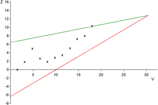

# Sequential methods and trial protocols


## Monitoring accumulating data

Adequate evidence to settle which treatment is superior may have accumulated
long before a clinical trial runs to its planned conclusion. 
In this case, an ethical issue emerges: patients may 
be receiving a treatment that could have been known to be inferior at the time
of treatment. A solution is the application of *repeated significance tests*
(RST) at several *interim analyses*, where a decision will be made whether 
or not to stop the trial. For this, the Neyman-Pearson hypothesis test is 
suitable. However, statistical issues emerge to ensure that the Type I error
rate $\alpha$ is maintained.

### Data monitoring committees

The decision to terminate a trial can be based on the efficacy of 
the new treatment, the worryingly high incidence of side effects, the evidence that the new treatment is less efficacious than the
existing treatment, or on futility, which means that there is little chance of showing that the new treatment is better.


A *data (and safety) monitoring committee*
(D[S]MC) (with clinicians, statisticians, ...) periodically 
reviews the evidence currently available from the trial. 
This is done at a relatively small number of times and may require *unblinded*
study information.
Extensive use of DMCs has led to the widespread use of 
*group sequential* methods. Note that in this context, 
the word "group" no longer refers to treatment group, but 
to successive groups of patients used at each interim analysis.

```{r echo=FALSE, cache=TRUE}
set.seed(15112019)
nsim <- 10000
n <- 10
library(ReplicationSuccess)
library(biostatUZH)
## p2 <- formatPval(t2p(threshold))
p2 <- 0.0104
threshold <- p2z(p2)

z.test <- function(x1, x2, sd=1){
 thetahat <- mean(x1)-mean(x2)
 se <- sqrt(2/length(x1))
 z <- thetahat/se
 return(z)
}

m <- 15
time <- seq(1, n, 1)
statistic <- rep(NA, n)
sig <- sig2 <- numeric()
for(j in 1:nsim){
    x1 <- numeric()
    x2 <- numeric()
    for(i in 1:n){
        x1 <- c(x1, rnorm(m))
        x2 <- c(x2, rnorm(m))
        res <- z.test(x1, x2) ## t.test(x1, x2, var.equal=TRUE)
        statistic[i] <- res ## res$statistic
    }
    sig[j] <- max(abs(statistic)>1.96)
    sig2[j] <- max(abs(statistic)>threshold)
}

TypeIerror <- mean(sig)
TypeIerror2 <- mean(sig2)
``` 


### Group sequential methods {#sec:groupsequential}

"Group sequential" means that the data analysis is conducted in interim analyses after every successive group of $2n$ patients, for example $2n=20$ or $2n=30$. 
Fixing a maximum number of $N$ groups, a trial is stopped at interim if the (two-sided) $P$-value is smaller than a pre-specified *nominal significance level* $\tilde \alpha$, or if $N$ groups of patients have been recruited.
The nominal significance level $\tilde \alpha$ depends on the Type I error rate $\alpha$
and the number of groups $N$. Standard adjustments for multiple testing 
are too conservative, since tests are based on accumulating data with 
a specific dependence structure. 


#### Pockock stopping rule {-}

Using the same nominal significance level $\tilde \alpha$ for each test 
is known as *Pocock stopping rule*. 
The nominal significance level $\tilde \alpha$ depends on the Type I error 
rate $\alpha$ and the number of groups $N$. Figure \@ref(fig:pocock) shows 
how the nominal significance level decreases for increasing number of groups, 
starting with an $\alpha$ of $5$\% for one group. For example, for 10 interim 
analyses the nominal significance level is $\tilde \alpha = 0.0106$, which 
corresponds to a $z$-value of `r round(p2z(0.0106),2)`.


```{r echo=FALSE}
maxy <- 20
``` 


:::{.example #stoppingbiaspocock}
 Remember the example on stopping bias (Figure \@ref(fig:stoppingbias)) where we 
 had accumulating data generated without a treatment effect.
The data is now analyzed in `r n` groups of `r 2*m` patients. 
 Figure \@ref(fig:fprate) shows `r maxy` selected profiles of the test statistic values based on the accumulating data and the false positive rate based on all 
 `r format(nsim, scientific=FALSE)` simulations. With the standard significance threshold (top plot), the false positive rate is 
`r round(100*TypeIerror)`\%. The false positive rate is `r round(100*TypeIerror2)`\% with an adjusted significance threshold (bottom plot) using Pockock rule.
:::


```{r echo=FALSE}
##set.seed(25112021)

jj <- 1
crit <- FALSE
while(crit==FALSE){
## set.seed(29112033+jj)
set.seed(1+jj)
x1 <- numeric()
x2 <- numeric()
myy <- matrix(NA, ncol=maxy, nrow=n)
for(j in 1:maxy){
    x1 <- x2 <- numeric()
    for(i in 1:n){
        x1 <- c(x1, rnorm(m))
        x2 <- c(x2, rnorm(m))
        res <- z.test(x1, x2) ## t.test(x1, x2, var.equal=TRUE)
        statistic[i] <- res ## res$statistic
        myy[i,j] <- res
        ## res <- t.test(x1, x2, var.equal=TRUE)
    ## statistic[i] <- res$statistic
    }
}

myind <- (apply(abs(myy), 2, max)>1.96)
mycol <- ifelse(myind==TRUE, "black", "grey")
myindB <- (apply(abs(myy), 2, max)>threshold)
mycolB <- ifelse(myindB==TRUE, "black", "grey")

crit <- ((sum(mycol=="black")==4) & sum(mycolB=="black")==1)
jj <- jj+1
}


par(las=1)
mycol2 <- ifelse(myind==TRUE, 2, 1)
mycol2o <- order(mycol2)
matplot(time*m*2, myy[,mycol2o], ylim=c(-3.75, 3.75), type="b", lty=1, ylab="test statistic", xlab="Number of patients", xlim=c(0, 2*n*m), cex=0.75, pch=19, axes=FALSE, col=mycol[mycol2o])
box()
axis(2)
val <- seq(0, 300, 60)
axis(1, at=val, as.character(val))
abline(1.96, 0, lty=2, col=2)
abline(-1.96, 0, lty=2, col=2)
legend("topleft", col=c("black", "grey"), lty=c(1,1), legend=c("significant profile", "non-significant profile"), cex=0.65, bg="white")
text(240, -3, paste(as.character(round(100*TypeIerror)), "% false positive"), col=2, cex=1)
``` 

```{r fprate, fig.cap = paste(maxy, " selected profiles of the test statistic values based on the accumulating data and the false positive rate based on all", format(nsim, scientific=FALSE),  "simulations, once with the standard significance threshold (top) and once with an adjusted significance threshold (bottom)."), echo=FALSE}
myindB <- (apply(abs(myy), 2, max)>threshold)
mycolB <- ifelse(myindB==TRUE, "black", "grey")
par(las=1)
matplot(time*m*2, myy, ylim=c(-3.75, 3.75), type="b", lty=1, ylab="test statistic", xlab="Number of patients", xlim=c(0, 2*n*m), cex=0.75, pch=19, axes=FALSE, col=mycolB)
box()
axis(2)
val <- seq(0, 300, 60)
axis(1, at=val, as.character(val))
abline(threshold, 0, lty=2, col=4)
abline(-threshold, 0, lty=2, col=4)
axis(2, at=threshold, labels=as.character(round(threshold, 2)), col="blue", col.axis="blue", col.ticks="blue")
axis(2, at=-threshold, labels=as.character(round(-threshold, 2)), col="blue", col.axis="blue", col.ticks="blue")

legend("topleft", col=c("black", "grey"), lty=c(1,1), legend=c("significant profile", "non-significant profile"), cex=0.65, bg="white")
text(240, -3, paste(as.character(round(100*TypeIerror2)), "% false positive"), col=4, cex=1)


```


```{r echo=FALSE}
## numbers from Table 8.2 in Matthews
N <- c(1,2,3,4,5,10,15,20)
m <- c(3.242, 2.404, 2.007, 1.763, 1.592, 1.156, 0.956, 0.835)
d <- 0.5
n <- (m^2/d^2)*2
alphaPrime <- c(0.05, 0.0294, 0.0221, 0.0182, 0.0158, 0.0106, 0.0086, 0.0075)
T <- 2*round(n)*N

res <- cbind(N, alphaPrime, ceiling(n), T)
sel <- c(1,2,5,6)
resSel <- res[sel,]
resSel <- resSel[,c(1,2,3,4)]
colnames(resSel) <- c("$N$", "$\\tilde\\alpha$", "$n$", "$T$")
``` 


```{r pocock, fig.cap = "Pocock stopping rule and Bonferroni correction as a function of the number of groups.", cache=TRUE, echo = FALSE}
par(las=1)
N <- c(1:20)
res <- resZ <- numeric()
res[1] <- 0.05
resZ[1] <- 1.96
library(ReplicationSuccess)
library(gsDesign)
library(biostatUZH)
for(i in 2:length(N)){
    resZ[i] <- gsDesign(k=N[i], sfu="Pocock", test.type=2)$upper$bound[1]
    res[i] <- (z2p(resZ[i]))
}

par(mfrow=c(1,2), 
    mar = c(5.1, 6, 4.2, 2.1))
matplot(N, res, type="b", pch=19, lwd=2, ylim=c(0,.05), ylab="nominal significance level (two-sided)", xlab="number of groups", axes=FALSE)
## lines(N, 5/N, col=2, type="b", pch=19)
lines(N, 0.05/N, col=4, type="b", pch=19)

y <- c(0:5)
for(i in 1:length(y))
    abline(h=y[i], lty=2, col="grey")
legend("topright", col=c(1,4), lty=1, lwd=2,
       legend=c("Pocock", "Bonferroni"), bg="white")
lines(c(1,10), rep(res[10], 2), lty=2, col="red")
lines(rep(10,2), c(-1, res[10]), lty=2, col="red")
axis(2, at=res[10], labels=as.character(round(res[10], 3)), col="red", col.axis="red", col.ticks="red", cex.axis=.8)
axis(1)
axis(2, at=c(0,2,3,4,5)/100, as.character(c(0,2,3,4,5)/100), cex.axis=0.9)
box()
##lines(rep(10,2), c(1, res[10]), lty=2, col="black")
points(10, res[10], col="red", pch=19)

matplot(N, resZ, type="b", pch=19, lwd=2, ylim=c(1.9,3.2), ylab="threshold for z-value", xlab="number of groups", axes=FALSE, col=c(1,3))
lines(c(1,10), rep(resZ[10], 2), lty=2, col="red")
lines(rep(10,2), c(1, resZ[10]), lty=2, col="red")
points(10, resZ[10], col="red", pch=19)
axis(2, at=resZ[10], labels=as.character(round(resZ[10], 2)), col="red", col.axis="red", col.ticks="red", cex.axis=1)
axis(1)
axis(2, at=c(2,2.2,2.4,2.8,3,3.2), as.character(c(2,2.2,2.4,2.8,3,3.2)))
lines(N, p2z(0.05/N), col=4, type="b", pch=19)
box()
``` 


#### Sample size calculation {-}
The maximum total sample size T depends on the power to detect 
the clinically relevant difference and the maximum number of 
analyses N. In order to maintain a given power, the maximum 
total sample size T increases with increasing N. However, 
for $N> 1$, there is always a chance that less than T patients will be needed. 

  
:::{.example}
Consider a continuous outcome and fix $\alpha=0.05$. Suppose that the goal is to 
detect a treatment difference of `r d` standard deviation with power 90\%.
The maximal number $N$ of analyses after every successive group of 
$2n$ patients affects the nominal significance level $\tilde \alpha$ and the 
maximum total sample size $T = 2nN$, see \@ref(tab:pococktbl). 
:::


```{r pococktbl, echo = FALSE}
knitr::kable(resSel, 
      caption = "Nominal significance level $\\tilde \\alpha$ to detect a treatment difference of $0.5$ standard deviation with power 90\\% and the maximum total sample size $T = 2n\\cdot N$ based on the Pocock criterion with different values for the number of interim analyses $N$.", 
      booktabs = TRUE, align = "l")
```


#### Other stopping rules {-}
The Pocock stopping rule, where each test uses the same nominal significance level 
$\tilde \alpha$, has two disadvantages. First, it is not too difficult for 
a trial to be halted early, which is considered as undesirable and uncompelling 
by some authors. Second, suppose that the trail terminates at the final analysis 
with $\tilde \alpha < p < \alpha$. Many clinicians find it difficult to 
accept that the result of this trial is significant. 

It is better to use a stopping rule $a_1, a_2, \ldots, a_N$ where $a_j$ is 
the significance threshold at the $j$-th interim analysis with $a_1$ very 
small and $a_j$ gradually increasing to $a_N$ close to $\alpha$. Three such
stopping rules are shown in Table \@ref(tab:stoppingrulestbl) and Figure
\@ref(fig:stoppingrules). 
They all control the overall Type I error rate $\alpha=5\%$ with $N=5$ maximal 
interim analyses, except for the Haybittle-Peto approach which controls it only 
approximately.


```{r stoppingrulestbl}
library(kableExtra)
# Data for the table
stopping_rules <- data.frame(
  Method = c("Haybittle-Peto (1971)", "Pocock (1977)", "O'Brien-Fleming (1979)", "Fleming et al. (1984)"),
  Interim1 = c(0.001, 0.0158, 5e-6, 0.0038),
  Interim2 = c(0.001, 0.0158, 0.0013, 0.0048),
  Interim3 = c(0.001, 0.0158, 0.0085, 0.0053),
  Interim4 = c(0.001, 0.0158, 0.0228, 0.0064),
  Interim5 = c(0.05, 0.0158, 0.0417, 0.0432)
)

# Create the table using kable
kable(stopping_rules,
      col.names = c("Method", "1", "2", "3", "4", "5"), 
      caption = "Nominal significance levels of different stopping rules for 5 interim analyses.",
      booktabs = TRUE, escape = FALSE) %>%
  add_header_above(c("", "Interim analysis" = 5))
```


```{r stoppingrules, fig.cap = "Different methods for stopping rules with $5$ maximal interim analyses.", echo=F}
par(las=1)
HP <- c(rep(0.001, 4), 0.05)
Po <- rep(0.0158, 5)
OBF <- c(5e-6 , 0.0013 , 0.0085 , 0.0228 , 0.0417)
Fl <- c(0.0038, 0.0048, 0.0053, 0.0064, 0.0432)
group <- c(1:5)

matplot(group, 100*cbind(HP, Po, OBF, Fl), type="b", ylab="significance threshold (in %)", xlab="interim analysis", lty=1, pch=19, ylim=c(0,5))
abline(h=5, col=1, lty=3)
legend("topleft", lty=1, col=c(1:4), legend=c("Haybittle-Peto", "Pocock", "O'Brien-Fleming", "Fleming"), lwd=1.5, pch=19, bg="white")
``` 


These stopping rules are implemented in the R package `gsDesign` 
(Note that, here for 3 interim analyses, the output `Nominal p` is 
the one-sided nominal significance level, which needs to be multiplied by $2$):

```{r echo=TRUE}
library(gsDesign)

## Pocock stopping rule
gsDesign(k = 3, sfu = "Pocock", test.type = 2)

## O'Brien Fleming stopping rule
gsDesign(k = 3, sfu = "OF", test.type = 2)
``` 

There are also other forms of stopping rules. A more flexible
approach is based on the Lan-DeMets *alpha spending function* and does not
require the maximum number of interim analyses to be specified in advance. 
Another popular approach to analyze accumulating data is Whitehead's 
*triangular test* based on the score statistic $Z$ and the Fisher information
$V$. Figure \@ref(fig:SRtriangular) shows how this approach is used as 
a stopping rule in an example.

```{r SRtriangular, fig.cap="Whitehead's triangular test as a stopping rule: Crossing of green/red line implies positive/negative trial conclusion.", fig.width = 12, echo=FALSE, fig.align='center'}

```

### Problems of stopping at interim 

If a trial terminates early, then there are problems with obtaining unbiased 
treatment effects due to the sequential nature of the trial. 
If a traditional analysis is performed in a trial that stops at 
interim because treatment is found to be 
significantly better than control, then
the treatment effect estimate will be too large,
the CI will be too narrow,
and the $P$-value will be too small,
Advanced methods for attempting to correct this bias are available, but rarely used, see @robertson_point_2023 and 
@robertson_confidence_2024 for recent reviews. 

```{r setup2, echo=FALSE}
n <- 10
m <- 15
effect <- 0.35
```

:::{.example #attenuated}
We illustrate the problems of stopping at interim in a simulation example. 
Suppose that we have two equally sized treatment arms and a continuous primary outcome. 
The difference in means $\theta$ is used as effect size.
We fix the following analysis parameters: $N=`r n`$ interim analyses with 
Pocock bound $z_P=2.56$ (nominal significance level
$\tilde \alpha = `r formatPval(z2p(resZ[10]))`$) and $n=`r m`$ 
patients per group and treatment arm to achieve a power of 75\% to detect the true treatment effect $\theta=`r effect`$ with standard deviation $\sigma=1$.
Significance at the $k$-th interim analysis implies the following minimum 
detectable difference (MDD, Compare Table \@ref(tab:samplesizecont)) for the treatment effect estimate:
\begin{equation*}
\hat \theta \geq z_P \sqrt{2/(k \cdot n)}.
\end{equation*}
:::


```{r SRsimulation, fig.cap = "Effect sizes in a simulation with the Pocock stopping rule for a maximal number of 10 interim analyses (Example \\@ref(exm:attenuated)).", echo=FALSE, cache=TRUE}
set.seed(15112019)
nsim <- 10000
library(ReplicationSuccess)
library(biostatUZH)
## p2 <- formatPval(t2p(threshold))
p2 <- 0.0104
threshold <- p2z(p2)

bound <- threshold * sqrt(2/(seq(1,10,1)*15))

z.test <- function(x1, x2, sd=1){
    thetahat <- mean(x1)-mean(x2)
    se <- sqrt(2*sd/length(x1))
    z <- thetahat/se
    return(z)
}

time <- seq(1, n, 1)
statistic <- rep(NA, n)
## sig <- sig2 <- numeric()
## thetahat: estimates after significance
## thetahat2: all estimates
thetahat <- thetahat2 <- matrix(NA, nrow=nsim, ncol=n)
for(j in 1:nsim){
    x1 <- x2 <- numeric()
    sig <- FALSE
    for(i in 1:n){
        x1 <- c(x1, rnorm(m, mean=effect))
        x2 <- c(x2, rnorm(m))
        statistic <- z.test(x1, x2) ## t.test(x1, x2, var.equal=TRUE)
        if(abs(statistic)>threshold){
            sig <- TRUE
            thetahat[j,i] <- thetahat2[j,i] <- mean(x1)-mean(x2)
            break
        }
    }
    if(sig==FALSE)
        thetahat2[j,n] <- mean(x1)-mean(x2)
}

par(las=1)
what <- apply(thetahat, 2, mean, na.rm=TRUE)
matplot(seq(1,10,1), cbind(what, bound), ylim=c(0.1, 1.2), ylab="effect size", pch=c(19, 17), xlim=c(0, n+1), col=c(1, "magenta"), 
     xlab="interim analysis", axes=FALSE, type="p")
axis(1, at=seq(1, 10, 1))
axis(2)
box()
myn <- (apply(!is.na(thetahat), 2, sum))
text(1, what[1], paste0(as.character(round(100*myn[1]/nsim)), "% significant"), pos=3)
text(2:10, what[2:10], paste0(as.character(round(100*myn[2:10]/nsim)), "%"), pos=3)
## text(1:10, what, paste0(as.character(round(100*myn/nsim)), "%"), pos=3)
abline(h=effect, lty=2, col=2)
text(.5, effect, "true effect", pos=1, col=2, cex=0.8)
abline(h=mean(thetahat, na.rm=TRUE), lty=2, col=3)
text(1.1, mean(thetahat, na.rm=TRUE), "mean sign. effect", pos=3, col=3, cex=0.8)
abline(h=mean(thetahat2, na.rm=TRUE), lty=2, col=4)
text(1.2, mean(thetahat2, na.rm=TRUE), "mean overall effect", pos=1, col=4, cex=0.8)
sigprop <- cumsum(myn)[n]/nsim
text(3, effect/5*3, paste("Significant trial proportion", round(100*sigprop), "%"), pos=4)
text(3, effect/5*2, paste("Non-significant trial proportion", round(100*(1-sigprop)), "%"), pos=4)
axis(2, effect, col=2, col.ticks=2, col.axis=2, cex.axis=0.9)
axis(2, round(mean(thetahat, na.rm=TRUE),2), cex.axis=0.9, col=3, col.ticks=3, col.axis=3)
axis(2, round(mean(thetahat2, na.rm=TRUE),2), cex.axis=0.9, col=4, col.ticks=4, col.axis=4)

legend("topright", c("Mean", "Minimum detectable difference"), pch=c(19, 17), col=c(1,"magenta"))
``` 


The effect size and minimum detectable difference 
for each interim analysis are displayed in Figure \@ref(fig:SRsimulation). 
The mean effect size of all significant trials is $`r round(mean(thetahat, na.rm=TRUE),2)` > `r effect`$, 
the mean effect size of all non-significant trials is 
$`r round(mean(thetahat2[,n], na.rm=TRUE),2)` < `r effect`$, and the 
mean effect size of all trials is $`r round(mean(thetahat2, na.rm=TRUE),2)` > `r effect`$. 


## The trial protocol

The trial protocol serves at least three purposes. First, it outlines the
reasons for running a trial. Second, it is an operations manual for the trial,
e.g.: assessment for eligibility,  treatment allocation, blinding procedure etc.
Finally, it is the scientific design document for the trial,
e.g.: methods for allocation, ways of assessing outcomes etc.
It needs approval by ethics committees, funding bodies, regulatory authorities etc.

### Designing and reporting trials {-}

A convincing report can only result from a convincing study design. 
Problems should be addressed already in the trial protocol 
to ensure that choices have not been influenced by the results.
These can be for example problems of multiplicity such as which subgroups 
should be examined, which outcomes are primary and which are secondary, 
whether outcomes should be compared using baseline information, or 
whether the outcome variable should be transformed.
<!--Steffi, 20.11.2024: I added a reference to Section 6.3.1 here. I hope it works-->
Note that the most important statistical aspects need to be defined already in the study protocol (see Section \@ref(sec:spirit)).


### Protocol deviations {-}
Not all patients may adhere to the protocol, e.g. some may not take the 
medication in the quantities and at the times specified in the protocol, some 
may not turn up to the clinic for outcome measurements to be assessed, some may
assert their right to withdraw from the study. In addition, ineligible patients 
may enter the trials, and other treatment than the one allocated may be administered. 

@matthews (Section 10.2) gives examples of protocol deviations. They can be 
dealt with differently in the analysis:

:::{.definition}

1.  The **per-protocol** analysis compares groups of patients who were actually 
treated as specified in the protocol, excluding non-compliant patients.
2.  The **as-treated** analysis compares groups of patients as they were 
actually treated. No patients are excluded from this analysis.
3.  The **intention-to-treat** (ITT) analysis compares groups of patients as 
they were allocated to treatment.
:::


The ITT principle states: "Compare the groups as if they were formed by 
randomization, regardless of what has happened subsequently to the patients" 
@matthews (Sec. 10.3).
Any other way of grouping the patients cannot guarantee balance at the start 
of the treatment. Per-protocol or as-treated analyses are subject to possible
confounding, so should be interpreted cautiously. On the other hand, analysis
by the ITT principle may lead to attenuated treatment effects.

:::{.example}
The Angina Trial is an RCT comparing surgical versus medical treatment for 
angina. Primary outcome is 2-year mortality. In this trial, 
not all patients received the treatment they were allocated to.
:::


```{r echo=F}
No.Death <- c(15,6,2,27)
No.Total <- c(369,26,48,323)
No.Survived <- No.Total - No.Death
mylevels <- c("Surgery", "Medicine")
Allocated <- factor(c("Surgery", "Surgery", "Medicine", "Medicine"), levels=mylevels)
Received <- factor(c("Surgery", "Medicine", "Surgery", "Medicine"), levels=mylevels)
MortRate <- round(No.Death/No.Total*100, 2)
angina <- data.frame(Allocated,Received,No.Death,No.Total,No.Survived,MortRate)
``` 

```{r echo=F}
library(Epi)
``` 

```{r echo=TRUE}
print(angina)
``` 

This trial can be analyzed based on the three different analysis types.
For the per-protocol analysis, we need to restrict the patients that we analyze.

```{r echo=TRUE}
## patients included in a per-protocol analysis
angina.perProtocol <- angina[Allocated==Received,]
print(angina.perProtocol)
``` 

```{r echo=TRUE}
## intention-to-treat analysis
tab.intentionToTreat <- xtabs(cbind(No.Death, No.Survived) ~ Allocated, 
                              data=angina)
twoby2(tab.intentionToTreat)

## per-protocol analysis
tab.perProtocol <- xtabs(cbind(No.Death, No.Survived) ~ Allocated, 
                         data=angina.perProtocol)
twoby2(tab.perProtocol)

## as-treated analysis
tab.asTreated <- xtabs(cbind(No.Death, No.Survived) ~ Received, 
                       data=angina)
twoby2(tab.asTreated)
```


## Additional references

You can find more about RSTs and sequential methods in @bland (Ch. 9.11) and in @todd2001, about ITT in @bland (Ch. 2.6), about monitoring accumulating data in @matthews (Ch. 8) and about protocols and protocol deviations in @matthews (Ch. 10). Studies where the methods from this chapter are used in practice are for example @acre2009, @durancantolla2010, @burgess2005

