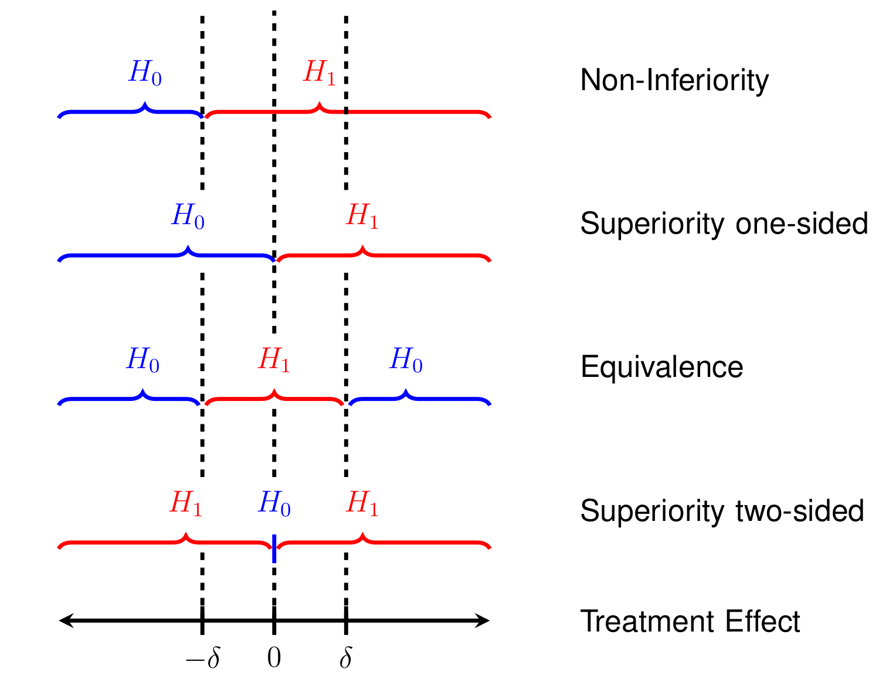

# Some special designs 

This chapter gives an introduction to some special randomized
controlled trial designs. Cluster-randomized trials no longer
randomize on individual (patient) level.  Equivalence and non-inferiority trials
differ from superiority trials in the sense that the objective of the
trial is no longer to show that the intervention is better than
control, but to show that two treatments are equivalent or
one is non-inferior to the other one, respectively.

## Cluster-randomized trials

Up to now, we have seen randomization of patients. *Cluster-randomized trials* allocate groups of patients *en bloc* to the same treatment. 

:::{.example #gps}
@kinmonth1998
is an intervention study in primary care about whether additional training of 
nurses and general practitioners (GPs) in a general practice improves the 
care of patients with newly diagnosed type II diabetes mellitus. 
In this study, $41$ practices were randomized to the *status quo* or to 
receive additional training for their staff. 
:::

### Analysis

Standard methods can no longer be used, as patient responses from the same cluster are dependent.
The intraclass correlation coefficient, i.e. 
the correlation between outcomes within a cluster, needs to be taken into account.
In the following, we discuss two methods of analysis. First, we consider a simple
approach, which constists of constructing a
*summary measure* for each cluster and then analyze these summary values.
Then, to analyse data on patient level, a *mixed model* formulation, 
a regression model with cluster-specific random effects, is needed. 
An alternative approach are so-called generalized estimating equations (GEEs). 
These methods will be applied to the following example:

:::{.example #radiology}
@oakeshott_etal1994, see also @SN_clusterAnalysis, report 
on the effect of guidelines for radiological referral on the referral 
practice of GPs where $17$ practices in the intervention group received
guidelines and 17 control practices were not sent anything. Outcome 
measure was the percentage of x-ray examinations requested that conformed 
to the guidelines. The data from the first 5 practices with and 
without intervention are shown below:
:::

```{r echo=FALSE, warning=FALSE}
CRT <- read.table("data/CRT.txt", header=TRUE)
CRT$Percentage <- CRT$Conforming/CRT$Total*100
CRT$Group <- factor(CRT$Group, levels = c("Intervention", "Control"))
library(biostatUZH)
library(Epi)
``` 

```{r echo=TRUE}
head(CRT, 5)
tail(CRT, 5)
``` 


#### Summary measure analysis {-}

The analysis on practice level can be performed by applying a 
$t$-test to compare the percentage of x-ray examination in each practice.
For simplicity we follow 
@SN_clusterAnalysis and treat the percentages as a continuous outcome. 


```{r echo=TRUE}
(mytTest <- t.test(Percentage ~ Group, var.equal = TRUE, data = CRT))
(DifferenceInMeans <- mean(mytTest$conf.int))
``` 

```{r }
CRT$Group <- factor(CRT$Group, levels = c("Control", "Intervention"))
``` 

The same results can be obtained with regression analysis,
but we can also use the number of referrals as weight. 
The latter is the preferred analysis on practice level, as it takes into account 
the different cluster sizes (number of patients included per practice).

```{r echo=TRUE, results="asis"}
result <- lm(Percentage ~ Group, data = CRT) 
result.w <- lm(Percentage ~ Group, data = CRT, weight = Total)
knitr::kable(tableRegression(result, xtable = FALSE))
knitr::kable(tableRegression(result.w, xtable = FALSE))
``` 


#### Logistic regression with random effects {-}

The recommended analysis on patient level for a binary outcome is 
logistic regression with random effects for practices. The random effects 
account for possible correlation between patients treated in the same practice.
We could in principle analyse the data in a long format, with a row for each 
patient and a binary outcome reflecting whether the x-ray from that particular 
patient conformed to the guidelines. However, as in standard logistic regression 
we can aggregate the data to binomial counts in each practice $\times$ treatment 
group combination, but keep the random effects on practice level. 


```{r echo=TRUE, warning=FALSE}
library(lme4)
CRT$Outcome <- cbind(CRT$Conforming, CRT$Total-CRT$Conforming)
result.glmm <- glmer(Outcome ~ Group + (1|Practice), 
                     family = binomial, data = CRT)
(summary(result.glmm)$varcor)
(ttable <- coef(summary(result.glmm)))
## treatment effect on patient level (odds ratio)
printWaldCI(ttable[2,1], ttable[2,2], FUN = exp)

```

```{r echo=FALSE, results=FALSE}

result.glm <- glm(Outcome ~ Group, 
                     family = binomial, data = CRT)
(summary(result.glm))

``` 

Just for illustration, we show an analysis of Example \@ref(exm:radiology)
on patient level where we ignore the clustering and aggregate the data 
to a 2x2 table (*not recommended*). 


```{r echo=TRUE}
## aggregate data to 2x2 table ignoring cluster membership
Sums <- lapply(split(CRT, CRT$Group), 
               function(x) c(Sums = colSums(x[,3:4]))
               )
Total <- c(Sums$Intervention["Sums.Total"], Sums$Control["Sums.Total"])
Conf <- c(Sums$Intervention["Sums.Conforming"], 
          Sums$Control["Sums.Conforming"])
notConf <- Total-Conf
Group <- factor(c("Intervention", "Control"), 
                levels = c("Intervention", "Control")
                )
tab <- xtabs(cbind(Conf, notConf) ~ Group)
print(tab)
twoby2(tab)
``` 

This analysis is wrong, as it ignores the cluster structure and acts as if
patients had been randomly assigned to treatment groups. This results in 
confidence intervals which are too narrow and $P$-values which are too small.


#### Mixed model for continuous outcomes {-}

The mixed model formulation for a continuous outcome $X_{ij}$ from patient
$j$ in cluster $i$ is

```{r}
treatment <- c("A", "B")
model <- c("$X_{ij} = \\alpha + \\xi_i + \\epsilon_{ij}$", "$X_{ij} = \\alpha + \\Delta + \\xi_i + \\epsilon_{ij}$")
table_data <- data.frame(Treatment = treatment, Model = model)

# Print the table using kable
knitr::kable(table_data, format = "markdown", align = c("l", "l"),
             caption = "Models for treatments A and B in the study.", 
             booktabs = TRUE)
```


where

-  $\Delta$ is the treatment effect of B vs. A, 
-  $\xi_i$ is a cluster-specific random effect with variance $\sigma_b^2$,
-  the errors $\epsilon_{ij}$ have variance $\sigma_w^2$.

The total variance is then $\Var(X_{ij}) = \sigma^2 = \sigma_b^2 + \sigma_w^2$ and 
the intraclass/intracluster correlation coefficient is $\rho= \sigma_b^2/\sigma^2$.
The analysis can be performed with `lme4::lmer()`.

### Sample size calculation 

In addition to a standard sample size calculation, 
we need the average cluster size $\bar n_c$ and the intraclass correlation $\rho$.
The total number of patients receiving each treatment should then be

\begin{equation*}
n = \underbrace{\frac{ 2 \sigma^2 (u+v)^2}{ \Delta^2}}_{\scriptsize \mbox{standard RCT sample size}} \times \quad \underbrace{(1+ \rho(\bar n_c-1))}_{\scriptsize \mbox{design effect $D_{\mbox{eff}}$}}.
\end{equation*}

For example, suppose $\bar n_c=7$ and $\rho=0.5$, then $D_{\mbox{eff}} = 4$, 
so 4-times as many patients are needed than for a standard RCT on patient-level. 

If the number of patients

$$n = \frac{ 2 \sigma^2 (u+v)^2}{ \Delta^2} \cdot D_{\mbox{eff}}$$

has been calculated, then the *number of clusters* $N_c$ receiving each
treatment is $n/\bar n_c$. Alternatively, we could directly calculate

\begin{equation*}
N_c = \frac{ 2 (\sigma_b^2 +\sigma_w^2/\bar n_c) (u+v)^2}{ \Delta^2}.
\end{equation*}


## Equivalence and non-inferiority trials

Up to now, we discussed *superiority* studies. The aim of *equivalence*  trials 
is not to detect a difference, but to establish equivalence of the two treatments.
An equivalence trial needs pre-specification of an *interval of equivalence* 
$I=(-\delta, \delta)$ for the treatment difference. If $\delta$ is only specified in 
one direction, then we have a *non-inferiority* trial with 
*non-inferiority interval* $I=(-\infty, \delta)$ or $I=(-\delta, \infty)$, 
depending on the context. Non-inferiority trials are based on one-sided 
hypothesis tests to check whether one group is almost as good (not much worse) 
than the other group.

The following scenarios highlight why non-inferiority and equivalence studies
may be more appropriate than superiority studies in certain cases.

One scenario is when the intervention being evaluated is expected to
perform similarly to the standard of care with respect to the primary
endpoint but offers potential advantages in secondary endpoints. These
advantages could include fewer side effects, reduced production costs,
more convenient formulations (e.g., tablets instead of infusions), 
fewer required doses, or improvements in quality of life.

Another scenario involves studies assessing the bioequivalence of drugs 
that share the same active ingredient, such as different formulations of the 
same medication or generic alternatives.


Table \@ref(tab:3designstab) (second column)
compares superiority to equivalence studies in 
terms of the underlying test hypotheses for the treatment effect $\Delta$. 
The *point null hypothesis* in a superiority trial is "too narrow" to be proven.
If a superiority trial shows a large $P$-value, then the only implication is
that there is no evidence against $H_0$. In contrast, equivalence studies 
specify an interval of equivalence (through an equivalence margin $\delta$) as a 
composite alternative hypothesis with its complement as the null hypothesis. 
This construction makes it possible to quantify the evidence for equivalence. 
Figure \@ref(fig:hypotheses) illustrates the  hypotheses of the different design types.

```{r 3designstab}
# Creating a data frame for the table
design <- c("Superiority", "Equivalence", "Non-inferiority")
hypotheses <- c("$H_0$: $\\Delta=0$ vs. $H_1$: $\\Delta \\neq 0$", 
                "$H_0$: $\\abs\\Delta \\geq \\delta$ vs. $H_1$: $\\abs\\Delta \\leq \\delta$", 
                "$H_0$: $\\Delta \\leq -\\delta$ vs. $H_1$: $\\Delta > -\\delta$")
sample_size <- c("$n = \\frac{ 2 \\sigma^2 (z_{1-\\alpha/2}+z_{1-{\\beta}})^2}{ \\Delta^2}$",
                 "$n = \\frac{2 \\sigma^2(z_{1-\\alpha}+z_{1-{\\beta/2}})^2}{\\delta^2}$",
                 "$n = \\frac{2 \\sigma^2(z_{1-\\alpha}+z_{1-{\\beta}})^2}{\\delta^2}$")

table_data <- data.frame(Design = design, Hypotheses = hypotheses, `Sample size` = sample_size)

# Print the table using kable
knitr::kable(table_data, format = "markdown", align = c("l", "l", "l"),
             caption = "Comparison of superiority, equivalence, and non-inferiority study designs.",
             booktabs = TRUE)
```


```{r hypotheses, fig.cap="Comparison of superiority, equivalence, and non-inferiority study designs.", out.width='\\textwidth', echo=FALSE}

```

### Equivalence trials

To assess equivalence, we compute a confidence interval at level $\gamma$ for the difference in the treatment means. The treatments are considered equivalent if both ends of the confidence interval lie within the pre-specified interval of equivalence $I=(-\delta, \delta)$. If this does not occur, then equivalence has not been established. The Type I error rate of this procedure is 

$$\alpha \approx (1-\gamma)/2,$$

as shown in Appendix \@ref(equiv).

For $\gamma=90\%$, we have $\alpha\approx 0.05$ and for $\gamma=95\%$, we have  $\alpha\approx 0.025$.

#### The TOST procedure {-}

An alternative approach to assess equivalence is the TOST procedure as follows:


1.  Apply **T**wo separate standard **O**ne-**S**ided significance **T**ests 
(TOST) at level $\alpha$:  
2.  Test 1 for $H_0$: $\Delta \leq - \delta$ vs. $H_1$: $\Delta > - \delta$
3.  Test 2 for $H_0$: $\Delta \geq \delta$ vs. $H_1$: $\Delta < \delta$
4.  If both one-sided tests can be rejected, we can conclude equivalence at
level $\alpha$. 

:::{.example #fake}
Remember Example \@ref(exm:sleep) about a  soporific drugs in terms of increase 
in hours of sleep compared to control. While this trial was not planned as an 
equivalence trial, let us suppose here the goal is to show equivalence at 
margin of $\delta=0.5$ h. To make this scenario more reasonable, we simulate 
new (fake) data. Independent of the group (drug administered), we simulate all 
data from the same normal distribution with mean and variance estimated from
the original data. You can see that there is less difference between the 
two groups in Figure \@ref(fig:fakefig) (fake data) than in 
Figure \@ref(fig:soporific) (original data).
:::


```{r fakefig, fig.cap = "Comparison of two soporific drugs in a simulated (fake) example based on Example \\@ref(exm:sleep)", echo=FALSE, fig.width= 5, fig.height=3.5}
library(biostatUZH)
histborder <- "black"#"white"
histcol <- gray(0.4)
pch.mean <- 8 # 4, 16
pch.median <- 17
lwd.lines <- 2
lwds <- 1.5 ## points 
pars.boxplot <- list(boxwex = 0.5, staplewex = 0.5, medlwd = 2, whisklty = 1,  whisklwd = 1)

## fake data
set.seed(123)
n <- nrow(sleep)
mymu <- mean(sleep$extra)
mysd <- .4*sd(sleep$extra)
sleep$extra <- rnorm(n, mean=mymu, sd=mysd)


library(beeswarm)
par(mar = c(4,4,4,4), mfrow = c(1,1))
beeswarm(extra ~ group, data = sleep, method = "center", ylab="increase in hours of sleep", xlab="", pch=16, cex=.75, xlim = c(0.5, 2.5), xaxt = "n", las = 1, lwd = lwds, main = "", col="red")

sleep$ID <- as.numeric(sleep$ID)

for(i in c(min(sleep$ID):max(sleep$ID)))
    lines(c(1,2), c(sleep$extra[sleep$group==1 & sleep$ID==i],sleep$extra[sleep$group==2 & sleep$ID==i]), col=2)
axis(1, c(1, 2), c("Drug 1", "Drug 2"), padj = 0.5)
``` 


```{r echo=TRUE}
## solution 1: confidence interval
res <- t.test(extra ~ group, data = sleep, conf.level = 0.9)
print(res$conf.int)
``` 

The limits of the $90$\% CI do not lie within the interval of equivalence (-0.5h, 0.5h). Hence, equivalence cannot be established.

```{r echo=TRUE}
## solution 2: TOST procedure
tost1 <- t.test(extra ~ group, data = sleep, mu = -0.5, 
                alternative = "greater", sig.level = 0.05)
print(tost1$p.value)
tost2 <- t.test(extra ~ group, data = sleep, mu = 0.5, 
                alternative = "less", sig.level = 0.05)
print(tost2$p.value)
``` 

One $p$-value is larger than $\alpha=5\%$, the other one is smaller.
Hence, equivalence cannot be established.

Figure \@ref(fig:3designs) shows different conclusions 
based on the confidence interval.


```{r 3designs, fig.cap = "Concluding superiority, equivalence or non-inferiority based on a confidence interval for the difference in means.",  echo=FALSE, quiet=TRUE,, fig.height = 6, fig.width = 9}
par(mar=c(1,1,1,1)+.1)

min <- -8
max <- 5
plot(1,1,type="n",xlim=c(min,max),ylim=c(-2.5,12.5),axes=FALSE,xlab="",ylab="",
lwd=2,cex=1.2,cex.axis=1.5,cex.lab=1.25) #,mgp=c(2.4,.6,0),col=1)

lines(c(0,0),c(0,10.5))
lines(c(1,1),c(0,12))
lines(c(-1,-1),c(0,12))
lines(c(-3,3),c(0,0))

h<-10;x<-2.1;s<-0.8;
lines(c(x-s,x+s),c(h,h),lwd=4,lty=1,col="red")
lines(c(x,x),c(h-.1,h+.1),lwd=4,lty=1,col="red")
text(min,h,"Superiority",cex=1.2,font=2,pos=4)
text(max-.5,h,"sig",cex=1.2,font=2,col="red",pos=4)
text(max-.5,h-1,"ns",cex=1.2,font=2,col="blue",pos=4)

h<-9;x<- -2.1;s<-0.8;
lines(c(x-s,x+s),c(h,h),lwd=4,lty=1,col="red")
lines(c(x,x),c(h-.1,h+.1),lwd=4,lty=1,col="red")
text(min,h,"Inferiority",cex=1.2,font=2,pos=4)
#text(max-1,h,"sig",cex=1.2,font=2,col="red",pos=4)

h<-8;x<-1.9;s<-1.8;
lines(c(x-s,x+s),c(h,h),lwd=4,lty=1,col="red")
lines(c(x,x),c(h-.1,h+.1),lwd=4,lty=1,col="red")
text(min,h,"Superiority",cex=1.2,font=2,pos=4)
#text(max-1,h,"sig",cex=1.2,font=2,col="red",pos=4)

h<-7;x<- -1.1;s<-0.8;
lines(c(x-s,x+s),c(h,h),lwd=4,lty=1,col="red")
lines(c(x,x),c(h-.1,h+.1),lwd=4,lty=1,col="red")
text(min,h,"Inferiority",cex=1.2,font=2,pos=4)
#text(max-1,h,"sig",cex=1.2,font=2,col="red",pos=4)

h<-6;x<-0.5;s<-0.3;
lines(c(x-s,x+s),c(h,h),lwd=4,lty=1,col="red")
lines(c(x,x),c(h-.1,h+.1),lwd=4,lty=1,col="red")
text(min,h,"Equivalence and Superiority",cex=1.2,font=2,pos=4)
#text(max-1,h,"sig",cex=1.2,font=2,col="red",pos=4)

h<-5;x<- -0.5;s<-0.3;
lines(c(x-s,x+s),c(h,h),lwd=4,lty=1,col="red")
lines(c(x,x),c(h-.1,h+.1),lwd=4,lty=1,col="red")
text(min,h,"Equivalence and Inferiority",cex=1.2,font=2,pos=4)
#text(max-1,h,"sig",cex=1.2,font=2,col="red",pos=4)

h<-4;x<-0.3;s<-0.6;
lines(c(x-s,x+s),c(h,h),lwd=4,lty=1,col="blue")
lines(c(x,x),c(h-.1,h+.1),lwd=4,lty=1,col="blue")
text(min,h,"Equivalence",cex=1.2,font=2,pos=4)
#text(max-1,h,"ns",cex=1.2,font=2,col="blue",pos=4)

h<-3;x<-0.6;s<-0.8;
lines(c(x-s,x+s),c(h,h),lwd=4,lty=1,col="blue")
lines(c(x,x),c(h-.1,h+.1),lwd=4,lty=1,col="blue")
text(min,h,"Non-inferiority",cex=1.2,font=2,pos=4)
#text(max-1,h,"ns",cex=1.2,font=2,col="blue",pos=4)

h<-2;x<- -0.6;s<-0.8;
lines(c(x-s,x+s),c(h,h),lwd=4,lty=1,col="blue")
lines(c(x,x),c(h-.1,h+.1),lwd=4,lty=1,col="blue")
text(min,h,"Non-superiority",cex=1.2,font=2,pos=4)
#text(max-1,h,"ns",cex=1.2,font=2,col="blue",pos=4)

h<-1;x<-0.7;s<-2;
lines(c(x-s,x+s),c(h,h),lwd=4,lty=1,col="blue")
lines(c(x,x),c(h-.1,h+.1),lwd=4,lty=1,col="blue")
text(min,h,"No conclusion",cex=1.2,font=2,pos=4)
#text(max-1,h,"ns",cex=1.2,font=2,col="blue",pos=4)

h<-11.5
text(0,h+.5,"Equivalence",cex=1.2,font=2,pos=1)
text(0,h,"margin",cex=1.2,font=2,pos=1)
## text(2,h,"Non-Equivalence",cex=1.2,font=2,pos=1)
## text(-2,h,"Non-Equivalence",cex=1.2,font=2,pos=1)
#text(-1,h+1,"Nicht-Unterlegenheit",cex=1.2,font=2,pos=4)

h<-0
text(0,h,"0",cex=1.2,font=2,pos=1)
text(0,h-1,paste("Zero difference"),cex=1.2,font=2,pos=1)
text(-1,h,paste("-", "delta"),cex=1.2,font=2,pos=1)
text(-3,h-1,paste("Favors standard"),cex=1.2,font=2,pos=1)
text(1,h,paste("+", "delta"),cex=1.2,font=2,pos=1)
text(3,h-1,paste("Favors treatment"),cex=1.2,font=2,pos=1)
text(0,-2,"confidence interval for difference in means",cex=1.5,font=2,pos=1)
```


#### Sample size calculation for continuous outcomes {-}


Consider the hypotheses $H_0: \abs{\Delta} > \delta$ versus
$H_1: \abs{\Delta} \leq \delta$. The Type I error rate is calculated for $\Delta = \delta$. 
The power $1-\beta$ is computed at the center $\Delta=0$ of $H_1$.
Appendix \@ref(equiv) shows that the required sample size in each group then is:

\begin{eqnarray}
n &=& \frac{2 \sigma^2(z_{\color{red}{(1+\gamma)/2}}+z_{\color{red}{1-{\beta/2}}})^2}{\delta^2} \\
 & \approx & \frac{2 \sigma^2(z_{\color{red}{1-\alpha}}+z_{\color{red}{1-{\beta/2}}})^2}{\delta^2},
(#eq:nequi)
\end{eqnarray}

where $z_{\gamma}$ is the $\gamma$-quantile of the standard normal distribution.

Table \@ref(tab:3designstab) (third column) compares the sample sizes of the different trial designs. The equivalence margin $\delta$ takes over the role of the clinically relevant difference $\Delta$. In practice, $\delta$ is usually considerably smaller than $\Delta$ in a related but conventional superiority trial. This typically leads to a larger sample size required for equivalence trials. Moreover, $z_{1-\alpha}$ replaces $z_{1 - \alpha/2}$ and $z_{{1-{\beta/2}}}$ replaces $z_{{1-{\beta}}}$. This is a consequence of the null hypothesis, but not the alternative, being two-sided in an equivalence trial.


:::{.example #holland}
@holland2017 conducted a randomized, controlled equivalence trial to 
assess whether home-based pulmonary rehabilitation was equivalent to center-based
pulmonary rehabilitation. The primary outcome was the change in the 6 min walk distance test (6MWD). 
The paper states: "Sample size calculations indicated that 144 participants were required to be 80% sure that the 95% CI excluded a difference in the change in 
6MWD of more than the equivalence limit of 25m, [...], assuming an SD of 51m".

```{r, echo = TRUE}
n_equi <- function(delta, sd, alpha, beta){
  zalpha <- qnorm(1-alpha)
zbeta2 <- qnorm(1 - beta/2)
n <- 2*sd^2*(zalpha + zbeta2)^2/delta^2
return(n)
}

# ss per group with alpha = 2.5%
n <- n_equi(delta = 25, sd = 51, alpha = 0.025, beta = 0.2)
print(n)

# ss per group with alpha = 5%
n2 <- n_equi(delta = 25, sd = 51, alpha = 0.05, beta = 0.2)
print(n2)

```

Using these values in Equation \@ref(eq:nequi) with $\alpha = 2.5\%$ give $n = `r ceiling(n)*2` \neq 144$. 
The correct sample size is retrieved using $\alpha = 5\%$, so one might 
wonder if they based their calculation on a 90% CI instead of a 95% CI.
:::


### Non-inferiority trials
Non-inferiority trials are useful if a proven active treatment exists and placebo-controls are not acceptable for ethical reasons. They are a special case of equivalence trials, but are conducted more often. 

To assess non-inferiority, just perform one of the two TOST tests, say

$$H_0: \Delta \leq - \delta \mbox{ vs. } H_1: \Delta >  - \delta.$$

A one-sided superiority trial corresponds to $\delta=0$. The alternative procedure based on confidence intervals computes a confidence interval at level $\gamma$ and rejects $H_0$ of inferiority if the upper bound is smaller than $\delta$. The Type I error rate is $\alpha = (1-\gamma)/2$.  


The sample size (per group) is now

\begin{equation*}
n = \frac{2 \sigma^2(z_{\color{red}{1-\alpha}}+z_{\color{red}{1-{\beta}}})^2}{\delta^2}.
\end{equation*}


Sample sizes of the three designs are compared in Table \@ref(tab:3designstab)
(third column). Table \@ref(tab:3samplesizes) compares the sample sizes for the three different designs of RCTs in practical examples assuming $\Delta = \delta = \sigma = 1$ and different values for $\alpha$ and $\beta$. As before, the numbers can be adjusted for different values of $\Delta/\sigma$ (respectively $\delta/\sigma$).
For example, if $\Delta/\sigma$ or $\delta/\sigma = 1/2$ then the numbers have to be multiplied with 4. 

```{r echo=FALSE}
ab <- matrix(NA, nrow=4, ncol=2)
ab[1,] <- c(0.05, 0.2)
ab[2,] <- c(0.05, 0.1)
ab[3,] <- c(0.025, 0.2)
ab[4,] <- c(0.025, 0.1)

termS <- function(ab){
    alpha <- ab[1]
    beta <- ab[2]
    2*(qnorm(1-alpha/2)+qnorm(1-beta))^2
}
termE <- function(ab){
    alpha <- ab[1]
    beta <- ab[2]
    2*(qnorm(1-alpha)+qnorm(1-beta/2))^2
}
termNI <- function(ab){
    alpha <- ab[1]
    beta <- ab[2]
    2*(qnorm(1-alpha)+qnorm(1-beta))^2
}

mytermS <- apply(ab, 1, termS)
mytermE <- apply(ab, 1, termE)
mytermNI <- apply(ab, 1, termNI)
``` 


```{r 3samplesizes}
library(knitr)

# Create the table using kable
tbl <- data.frame(
  `$\\alpha$` = ab[, 1],
  `$\\beta$` = ab[, 2],
  `Non-inferiority` = mytermNI,
  `Superiority` = mytermS,
  `Equivalence` = mytermE, 
  check.names = FALSE
)

# Print the table using kable
kable(tbl, booktabs=TRUE, caption="Comparison of sample sizes for RCTs in an example with $\\Delta = \\delta = \\sigma = 1$ and different values for $\\alpha$ and $\\beta$.", digits=c(2, 2, 1, 1, 1), align= "c")
```


:::{.example #partiex}
More than $50\%$ of acute respiratory tract infections (ARTI) are being 
treated with antibiotics in primary care practice, despite mainly viral 
etiology. Procalcitonin (PCT) is a biomarker to diagnose bacterial infections.
The PARTI trial [@briel2008] compares PCT-guided antibiotics use (decision depends on the value of the measured biomarker) versus standard of care. The hypothesis is that PCT-guided antibiotics are non-inferior to standard of care (non-inferiority trial).

The study cohort consists of 458 patients with ARTI. The primary endpoint was the number of days with restrictions due to ARTI. Patients were interviewed 14 days after randomization and the non-inferiority margin is $\delta = 1$ day. Results
showed that the mean increase in days with restriction with PCT-guided therapy was
0.14 , with 95% CI (from - 0.53 to 0.81 days) entirely below the margin $\delta = 1$.

The main secondary endpoint was the proportion of antibiotics prescriptions where the PCT arm is hypothesized to be superior. The results were that 58/232 (`r (100*58/232)`\%) patients with PCT-guided therapy and 219/226 (`r round(100*219/226, 0)`\%) patients with standard therapy received antibiotics. This is a substantial reduction of antibiotics use with PCT-guided therapy of `r round(100*(219/226 - 58/232), 0)`\% (95\% CI: 66\% to 78\%).
:::


A more recent example if a non-inferiority trial is the study by 
@Loeb2022.


## Additional references

Cluster-randomization is discussed in @bland (Sections 2.12, 10.13 and 18.8),
equivalence and cluster-randomized trials in @matthews (Sections 11.5--11.6). 
The Statistics Notes 
@SN_clusterRCTs, @SN_clusterAnalysis, @SN_clusterICC, @SN_clusterSS discuss 
different aspects of cluster-randomized trials.
Studies where the special designs from this chapter are used in practice are for 
example @butler2013, @burgess2005, @lovell2006. 

